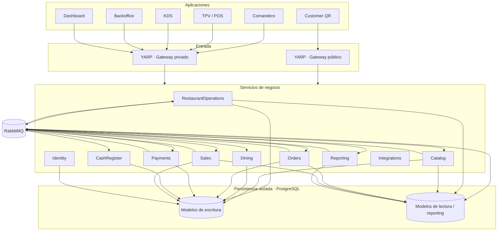
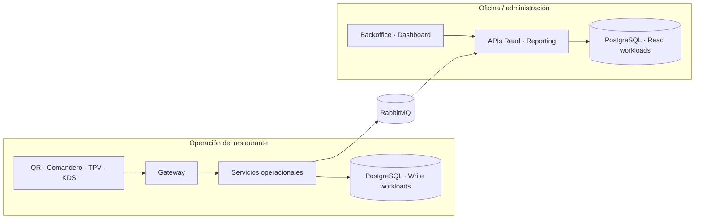
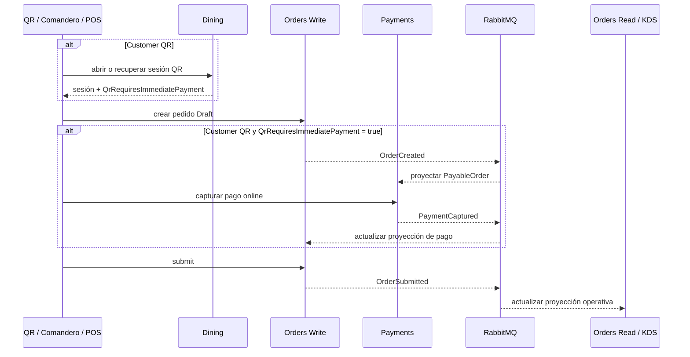

# 🍽️ Restaurantes

[](https://dotnet.microsoft.com/)
[](https://www.postgresql.org/)
[](https://www.rabbitmq.com/)
[](https://microsoft.github.io/reverse-proxy/)
[](https://www.docker.com/)

**Restaurantes** es una plataforma distribuida para la operación y gestión de una cadena de restaurantes, construida sobre **.NET 10** y diseñada alrededor de dominios independientes, separación de lectura y escritura, mensajería asíncrona y persistencia aislada por servicio.

La solución modela distintos puntos de la operación real: configuración de restaurantes, catálogo, sala y mesas, pedidos, cocina, pagos, caja, ventas, identidad y reporting. Sobre estos servicios se apoyan aplicaciones específicas para cliente QR, camarero, TPV, KDS, backoffice y dashboard.

> [!IMPORTANT]
> El proyecto se encuentra en **desarrollo activo**. La arquitectura backend y varios flujos de negocio ya están implementados, mientras que algunas interfaces, integraciones externas, automatización de despliegue y cobertura de pruebas continúan evolucionando. El objetivo del repositorio es mostrar una arquitectura extensible y cercana a un escenario real, no presentar un producto comercial terminado.

## Objetivos de arquitectura

El diseño parte de una necesidad concreta: **la operación del restaurante no debe competir por los mismos recursos que las consultas administrativas, de oficina o de reporting**.

Un restaurante necesita seguir aceptando pedidos, enviando comandas a cocina, cobrando y operando incluso cuando desde oficina se ejecutan consultas más costosas sobre ventas, actividad histórica o indicadores agregados. Por ello, los contextos con mayor carga separan sus modelos de escritura y lectura y pueden escalarse o alojarse de forma independiente.

Los principales objetivos son:

- **Aislar la carga transaccional de la carga de consulta.**
- **Escalar lectura y escritura de forma independiente.**
- **Evitar acceso directo entre bases de datos de distintos dominios.**
- **Reducir el impacto de fallos o despliegues de un servicio sobre el resto de la plataforma.**
- **Mantener contratos explícitos entre servicios mediante HTTP y eventos.**
- **Permitir despliegue cloud sin acoplar el dominio a un proveedor concreto.**
- **Mantener aplicaciones cliente independientes para cada perfil operativo.**

## Arquitectura general



La solución no aplica CQRS de forma mecánica a todos los dominios. **RestaurantOperations, Catalog y Orders** separan explícitamente APIs y persistencia de lectura/escritura. **Sales** también mantiene modelos separados, aunque su escritura se alimenta principalmente mediante eventos. **Dining**, **Identity** y **CashRegister** están separados por capas, pero cada uno mantiene una única persistencia operacional porque no necesita un modelo Read independiente.

### YARP como punto único de entrada

Las aplicaciones cliente no conocen las direcciones físicas de las APIs ni llaman directamente a los puertos donde se alojan los demás procesos. El navegador entra por uno de los gateways YARP y utiliza ese mismo origen tanto para cargar la interfaz como para consumir `/api/*` y conectarse a `/hubs/*`.

| Gateway | Audiencia | Interfaces publicadas |
| --- | --- | --- |
| **Public Gateway** | Clientes externos | Customer QR en `/qr/{codigo}` |
| **Private Gateway** | Personal del local y oficina | Backoffice en `/backoffice/`, Comandero en `/commander/`, TPV en `/pos/`, KDS en `/kds/` y Dashboard en `/dashboard/` |

La configuración de rutas, destinos internos, mismo origen, CORS y despliegue se detalla en **[Gateways YARP](docs/Gateways.README.md)**. El comportamiento específico de Customer QR se documenta en **[Dining](docs/Dining.README.md#interfaz-customer-qr)** y el acceso único de Dashboard en **[Reporting](docs/Reporting.README.md#gateways)**.

## Separación de lectura y escritura

En los dominios que aplican CQRS, una operación de negocio se persiste primero en el modelo de escritura. Los eventos generados por esa operación se publican mediante RabbitMQ y los consumidores actualizan posteriormente las proyecciones utilizadas por las APIs de lectura.

Esto introduce **consistencia eventual**, pero permite tratar lectura y escritura como cargas diferentes.

### ¿Por qué bases separadas?

La separación no se utiliza únicamente como patrón arquitectónico. Responde al comportamiento esperado del sistema:

| Necesidad | Beneficio |
| --- | --- |
| Consultas intensivas desde oficina | El reporting y las búsquedas históricas no consumen CPU, I/O o conexiones de la base que atiende la operación del restaurante. |
| Continuidad operacional | La toma de pedidos, cocina, pagos y caja pueden mantener prioridad sobre cargas analíticas o administrativas. |
| Escalado independiente | La capacidad asignada a lectura puede aumentar sin sobredimensionar los servicios de escritura. |
| Modelos optimizados | Las proyecciones de lectura pueden diseñarse para consultar y mostrar información sin imponer el mismo modelo normalizado utilizado para escribir. |
| Aislamiento de fallos | Saturación, mantenimiento o problemas en una carga de consulta tienen menor superficie de impacto sobre la operación transaccional. |
| Evolución independiente | Los esquemas de lectura pueden cambiar para responder a nuevas necesidades de consulta sin modificar necesariamente el modelo transaccional. |
| Despliegue cloud flexible | Las bases pueden comenzar compartiendo infraestructura y separarse físicamente cuando el volumen o el coste lo justifiquen. |

En desarrollo local, todas las bases se alojan en **una misma instancia PostgreSQL** dentro de Docker para simplificar el entorno. La separación sigue siendo lógica: cada servicio utiliza su propia base y sus propias cadenas de conexión.

En un entorno productivo, esa separación puede convertirse también en **separación física**.

## Estrategia de alojamiento cloud

El proyecto está diseñado para no depender de servicios propietarios de un proveedor cloud dentro de su lógica de negocio. Actualmente, sus dependencias de infraestructura principales son **.NET, PostgreSQL, RabbitMQ, HTTP, SignalR y YARP**, lo que permite desplegar los componentes en Azure, AWS, GCP, infraestructura privada o una combinación de ellos.

El despliegue cloud todavía no forma parte del repositorio y se plantea como una etapa posterior. La estrategia prevista es mantener la separación por responsabilidad y decidir el nivel de aislamiento físico según la carga real.

### Modelo de despliegue previsto



Una primera versión productiva podría mantener varias bases lógicas dentro de uno o varios servidores PostgreSQL administrados. Cuando la carga crezca, los grupos con perfiles distintos pueden separarse:

- **Bases operacionales de escritura:** priorizadas para baja latencia y continuidad del negocio.
- **Bases de lectura:** dimensionadas para consultas frecuentes de clientes y aplicaciones operativas.
- **Reporting:** aislado de la operación para consultas agregadas, históricas y de oficina.
- **Servicios con mayor demanda:** escalables de manera independiente sin tener que desplegar toda la plataforma como una unidad.

### Ejemplos de infraestructura compatible

| Componente | Azure | Alternativas |
| --- | --- | --- |
| APIs, gateways y workers .NET | Azure Container Apps, App Service o AKS | AWS ECS/EKS, Google Cloud Run/GKE, Kubernetes o contenedores propios |
| PostgreSQL | Azure Database for PostgreSQL | Amazon RDS for PostgreSQL, Google Cloud SQL, PostgreSQL administrado o self-hosted |
| RabbitMQ | RabbitMQ en infraestructura propia o proveedor administrado | Amazon MQ for RabbitMQ, CloudAMQP, Kubernetes o VM |
| PWA | Static Web Apps, Storage + CDN | S3/CloudFront, Cloudflare Pages, hosting estático |
| Aplicaciones ASP.NET Core | App Service, Container Apps o AKS | ECS, Cloud Run, Kubernetes o VM |
| SignalR | Self-hosted o Azure SignalR Service | SignalR self-hosted detrás de infraestructura compatible con WebSockets |
| Secretos y configuración | Key Vault | AWS Secrets Manager, GCP Secret Manager, Vault |

La elección final no está fijada deliberadamente. El objetivo es que **la arquitectura pueda adaptarse al coste, volumen y disponibilidad requerida sin tener que rediseñar los dominios de negocio**.

## Comunicación entre servicios

La plataforma combina comunicación síncrona y asíncrona.

### HTTP

Se utiliza cuando una operación necesita una respuesta inmediata. Los gateways YARP enrutan las peticiones hacia el servicio correspondiente y, en los dominios CQRS, pueden dirigir el mismo recurso a una API distinta según el verbo HTTP.

Por ejemplo:

- `GET` → API de lectura.
- `POST`, `PUT`, `PATCH`, `DELETE` → API de escritura.

También existen llamadas HTTP entre servicios cuando el flujo necesita coordinación inmediata, como determinados procesos de cobro.

### RabbitMQ

RabbitMQ distribuye eventos entre bounded contexts y alimenta proyecciones sin crear acceso directo entre sus bases de datos.

La infraestructura de mensajería incluye:

- publishers y consumers independientes;
- **Transactional Outbox** para persistir cambios y eventos de forma coordinada;
- **Inbox / idempotencia** en procesos que deben evitar reprocesamiento;
- exchanges y routing keys separados por dominio;
- **dead-letter exchanges y queues** para mensajes que no pueden procesarse correctamente.

## Tiempo real

**SignalR** se utiliza para propagar cambios hacia interfaces que necesitan reaccionar sin polling continuo.

Actualmente existen hubs relacionados con:

- sala y sesiones de mesa;
- estado de pedidos y KDS;
- reporting y dashboard.

Esto permite que cocina, camareros, caja y paneles de seguimiento puedan refrescar su estado a medida que ocurren cambios en los servicios.

## Seguridad

La autenticación se basa en **ASP.NET Core Identity y JWT**.

La autorización contempla tanto roles como permisos asociados al contexto del restaurante. El objetivo es evitar que un usuario autenticado pueda operar sobre un restaurante únicamente por conocer su identificador.

Los gateways actúan como punto de entrada, pero las reglas de autorización relevantes permanecen en los servicios responsables del dominio.

## Servicios

| Servicio | Responsabilidad | Persistencia |
| --- | --- | --- |
| **[RestaurantOperations](docs/RestaurantOperations.README.md)** | Gestión e información base de restaurantes. | Write + Read |
| **[Catalog](docs/Catalog.README.md)** | Categorías, productos, precios, disponibilidad y configuración de estaciones por restaurante. | Write + Read |
| **[Orders](docs/Orders.README.md)** | Pedidos, líneas, estados de preparación y coordinación del flujo de cocina/KDS. | Write + Read |
| **[Dining](docs/Dining.README.md)** | Zonas, mesas, sesiones, QR, comensales y cuenta de mesa. | Write |
| **[Payments](docs/Payments.README.md)** | Capturas, devoluciones y estado de cobro. | Write |
| **[Sales](docs/Sales.README.md)** | Consolidación de ventas originadas en la operación. | Write + Read |
| **[CashRegister](docs/CashRegister.README.md)** | Apertura/cierre de caja, jornada operativa y conciliación de efectivo. | Write |
| **[Identity](docs/Identity.README.md)** | Usuarios, roles, autenticación y acceso por restaurante. | Write |
| **[Reporting](docs/Reporting.README.md)** | Proyecciones agregadas para actividad y ventas. | Read |
| **[Integrations](docs/Integrations.README.md)** | Punto de extensión para proveedores, webhooks, delivery y sistemas externos; actualmente expone sólo un endpoint descriptivo. | — |

Cada servicio es propietario de sus datos. Un servicio no consulta directamente las tablas de otro; la colaboración se realiza mediante contratos HTTP o eventos.

## Aplicaciones

| Perfil | Aplicación | Propósito | Tecnología |
| --- | --- | --- | --- |
| Cliente | **Customer QR** | Pedido, pago según la política del restaurante y seguimiento desde el QR asociado a una mesa/sesión. | Blazor WebAssembly PWA |
| Camarero | **Comandero** | Atención de mesas, registro y seguimiento de pedidos. | Blazor WebAssembly PWA |
| Caja | **TPV / POS** | Operación de pedidos, cuentas y caja. | Blazor WebAssembly PWA |
| Cocina | **KDS** | Preparación por estación y seguimiento del ciclo de cocina. | ASP.NET Core Web |
| Administración | **Backoffice** | Administración de restaurantes, catálogo, sala y usuarios según los permisos del perfil. | Blazor WebAssembly PWA |
| Oficina | **Dashboard** | Visualización en tiempo real de ventas, actividad operativa y estado de salud de los endpoints. | ASP.NET Core Web |

Las interfaces son todavía una de las áreas en evolución del proyecto. El foco actual está puesto en la arquitectura backend, los flujos distribuidos y la separación de responsabilidades; el diseño visual y la experiencia de usuario no se consideran definitivos.

## Flujo simplificado de una operación



En Customer QR, `QrRequiresImmediatePayment` es una política configurable por restaurante:

```text
QrRequiresImmediatePayment = true  -> Immediate -> pagar antes de submit
QrRequiresImmediatePayment = false -> OnAccount -> submit sin captura inmediata
```

Cuando está activada, Orders no permite enviar el pedido a cocina mientras su proyección de pago no indique `Paid`. Cuando está desactivada, el pedido se incorpora a la cuenta de la sesión.

La publicación y consumo de eventos introduce consistencia eventual entre servicios. Cada bounded context mantiene su propio estado y las proyecciones se actualizan después del commit del servicio que origina el cambio.

## Estructura del repositorio

```text
Restaurantes/
├── src/
│   ├── ApiGateways/
│   │   ├── Restaurantes.Gateway.Public
│   │   └── Restaurantes.Gateway.Private
│   │
│   ├── BuildingBlocks/
│   │   ├── Restaurantes.Messaging.RabbitMq
│   │   ├── Restaurantes.Security
│   │   └── Restaurantes.ServiceDefaults
│   │
│   ├── Clients/
│   │   ├── Restaurantes.Clients.Backoffice.Pwa
│   │   ├── Restaurantes.Clients.Commander.Pwa
│   │   ├── Restaurantes.Clients.CustomerQr.Pwa
│   │   ├── Restaurantes.Clients.Dashboard.Web
│   │   ├── Restaurantes.Clients.Kds.Web
│   │   ├── Restaurantes.Clients.Pos.Pwa
│   │   └── Restaurantes.Clients.Shared.Operations
│   │
│   └── Services/
│       ├── CashRegister
│       ├── Catalog
│       ├── Dining
│       ├── Identity
│       ├── Integrations
│       ├── Orders
│       ├── Payments
│       ├── Reporting
│       ├── RestaurantOperations
│       └── Sales
│
├── tools/
│   ├── pgadmin/
│   └── postgres/init/
├── docker-compose.yml
├── dotnet-tools.json
├── Restaurantes.slnLaunch
└── Restaurantes.slnx
```

Los servicios con mayor complejidad se subdividen en proyectos de **Domain, Application, Infrastructure, Contracts, API, Publisher y Consumer**, evitando que las aplicaciones externas dependan de detalles internos del dominio.

## Entorno local

### Requisitos

- .NET 10 SDK
- Docker / Docker Compose
- Visual Studio 2026 o un entorno compatible con .NET 10

### Infraestructura

El `docker-compose.yml` levanta:

- PostgreSQL 18;
- RabbitMQ con Management UI;
- pgAdmin.

Las bases de datos lógicas necesarias se crean mediante los scripts de `tools/postgres/init`.

```bash
docker compose up -d
```

Las migraciones de Entity Framework Core son aplicadas por los servicios correspondientes durante su inicialización.

### Restaurar herramientas y dependencias

```bash
dotnet tool restore
dotnet restore
dotnet build Restaurantes.slnx
```

El repositorio incluye perfiles `.slnLaunch` para levantar conjuntos de proyectos asociados a distintos escenarios, por ejemplo el flujo de Comandero o el circuito Orders/KDS. Cada escenario dispone de una variante **Con navegador** y otra **Sin navegador**; ambas levantan los mismos procesos y seleccionan perfiles de inicio diferentes. Customer QR nunca abre una ventana automáticamente porque su entrada real requiere un código QR.

Cuando se utiliza una variante sin navegador, las interfaces se abren manualmente mediante las rutas del gateway descritas en [YARP como punto único de entrada](#yarp-como-punto-único-de-entrada), no mediante los puertos internos de los proyectos cliente.

## Tooling

El manifiesto local de herramientas .NET incluye:

- `dotnet-ef`
- `csharpier`

Para aplicar formato al código:

```bash
dotnet csharpier format .
```

---

Este repositorio forma parte de mi portfolio técnico y refleja un trabajo en evolución sobre arquitectura distribuida, diseño de servicios, CQRS, mensajería fiable, persistencia aislada y aplicaciones .NET orientadas a un dominio operativo real.
