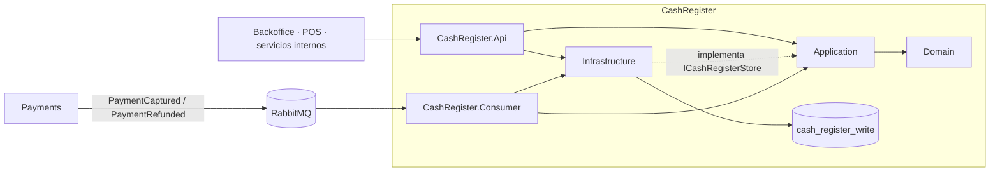
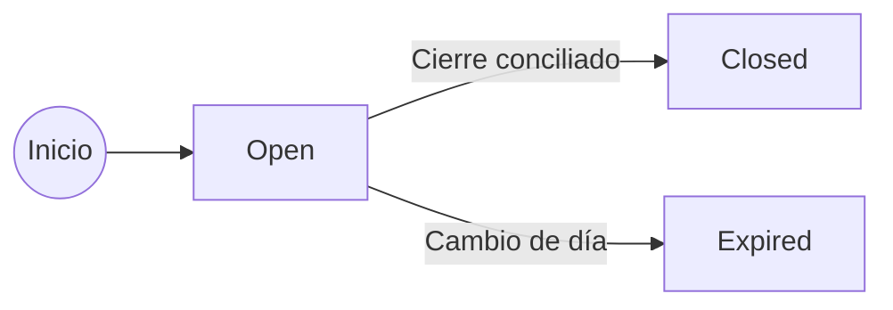
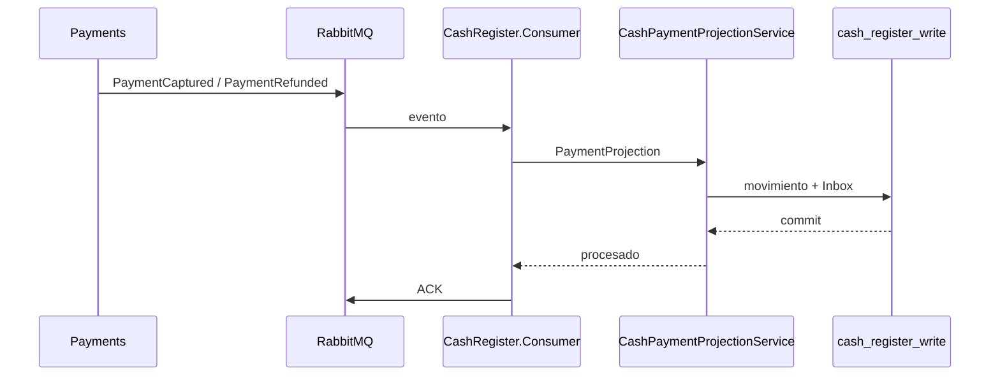
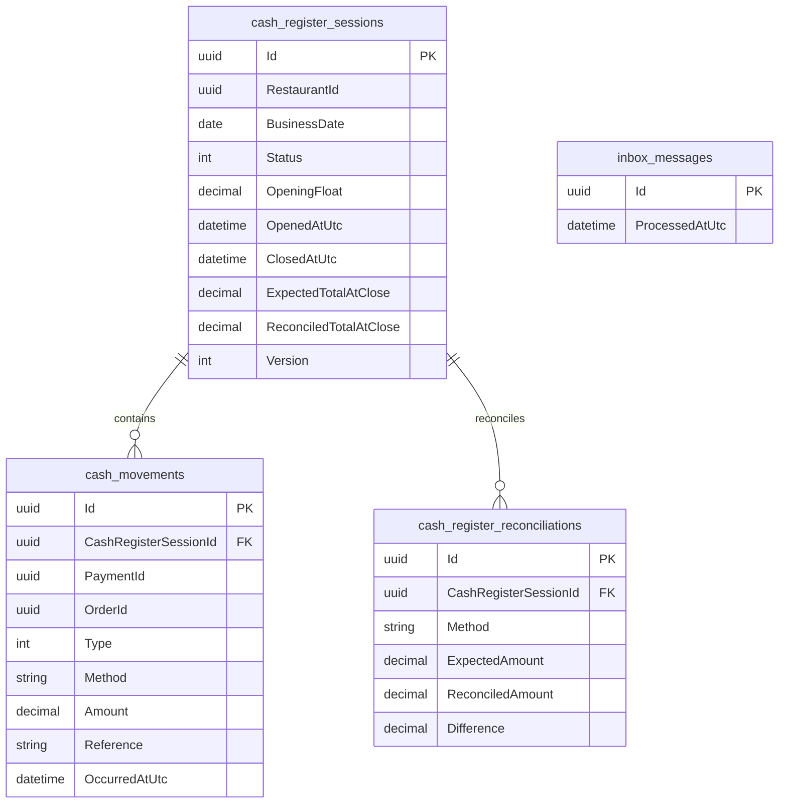

# CashRegister

El servicio **CashRegister** administra la jornada operativa de caja de cada restaurante: apertura, cierre, conciliación por medio de pago y proyección de movimientos financieros procedentes de **Payments**.

CashRegister mantiene una única base operacional PostgreSQL y está separado en **Domain, Application, Infrastructure, Api y Consumer**. La API expone las operaciones de caja y consulta del estado actual; el Consumer procesa de forma independiente los eventos `PaymentCaptured` y `PaymentRefunded` publicados por Payments.

## Responsabilidad del servicio

CashRegister es responsable de:

- abrir una caja operativa por restaurante;
- asociar la caja a una fecha de negocio calculada en la zona horaria `Europe/Madrid`;
- garantizar que exista como máximo una caja abierta por restaurante;
- mantener el fondo inicial de caja;
- proyectar ventas y devoluciones recibidas desde Payments;
- asociar cada movimiento financiero a la sesión de caja correspondiente;
- calcular ventas, devoluciones y neto por medio de pago;
- calcular el efectivo esperado incluyendo el fondo inicial;
- cerrar la caja mediante conciliación explícita de todos los medios de pago esperados;
- conservar diferencias entre importes esperados y conciliados;
- mantener historial de sesiones de caja;
- caducar automáticamente sesiones abiertas pertenecientes a días de negocio anteriores;
- admitir movimientos financieros tardíos sobre una sesión ya cerrada y reajustar su conciliación;
- evitar reprocesamiento de eventos mediante Inbox;
- proteger las operaciones administrativas mediante permisos por restaurante.

CashRegister **no captura pagos**, **no crea pedidos** y **no administra restaurantes**. Los cobros y devoluciones pertenecen a Payments, los pedidos a Orders y la identidad operativa del restaurante a RestaurantOperations.

## Proyectos

El bounded context está dividido en cinco proyectos:

```text
src/Services/CashRegister/
├── Restaurantes.CashRegister.Api
├── Restaurantes.CashRegister.Application
├── Restaurantes.CashRegister.Consumer
├── Restaurantes.CashRegister.Domain
└── Restaurantes.CashRegister.Infrastructure
```

| Proyecto | Responsabilidad |
| --- | --- |
| `Restaurantes.CashRegister.Domain` | Entidades y estados de caja, movimientos y conciliaciones. |
| `Restaurantes.CashRegister.Application` | Casos de uso, contratos utilizados por la API, abstracción de persistencia y proyección de eventos de Payments. |
| `Restaurantes.CashRegister.Infrastructure` | EF Core, PostgreSQL, `CashRegisterStore`, migraciones e Inbox. |
| `Restaurantes.CashRegister.Api` | Controllers HTTP, autenticación/autorización, composición de dependencias y migración de la base al iniciar. |
| `Restaurantes.CashRegister.Consumer` | Worker independiente que consume eventos de Payments desde RabbitMQ y actualiza la caja mediante Inbox. |

CashRegister no dispone actualmente de `Api.Read`, `Publisher` ni un proyecto `Contracts` propio. Las consultas operativas se sirven desde la misma API y el servicio no publica actualmente eventos propios mediante RabbitMQ.

## Arquitectura interna



La API y el Consumer son procesos ejecutables independientes, pero ambos trabajan sobre la misma base lógica `cash_register_write`.

## Modelo de dominio

CashRegister mantiene tres entidades principales.

### `CashRegisterSession`

Representa una sesión o turno de caja de un restaurante.

Campos relevantes:

- `Id`;
- `RestaurantId`;
- `BusinessDate`;
- `Status`;
- `OpeningFloat`;
- `OpenedAtUtc`;
- `OpenedByUserId`;
- `OpenedByName`;
- `ClosedAtUtc`;
- `ClosedByUserId`;
- `ClosedByName`;
- `CountedCash`;
- `ExpectedCashAtClose`;
- `DifferenceAtClose`;
- `ExpectedTotalAtClose`;
- `ReconciledTotalAtClose`;
- `Version`;
- `Movements`;
- `Reconciliations`.

`Version` está configurado como token de concurrencia optimista en EF Core.

### Estados de caja

```text
Open
Closed
Expired
```



`Closed` y `Expired` son estados terminales para esa sesión concreta. Una nueva jornada se representa mediante una nueva `CashRegisterSession`.

### `CashMovement`

Representa un movimiento financiero proyectado desde Payments.

Campos relevantes:

- `Id`;
- `CashRegisterSessionId`;
- `PaymentId`;
- `OrderId`;
- `Type`;
- `Method`;
- `Amount`;
- `Reference`;
- `OccurredAtUtc`.

Tipos actuales:

```text
Sale
Refund
```

El importe se almacena siempre como valor positivo. El signo operativo se obtiene a partir del tipo:

```text
Sale   -> +Amount
Refund -> -Amount
```

### `CashRegisterReconciliation`

Representa la conciliación de un medio de pago en el cierre de caja.

Campos relevantes:

- `Id`;
- `CashRegisterSessionId`;
- `Method`;
- `ExpectedAmount`;
- `ReconciledAmount`;
- `Difference`.

Existe una única conciliación por combinación:

```text
CashRegisterSessionId + Method
```

## Fecha de negocio

CashRegister distingue la fecha de negocio de la fecha UTC utilizada para persistir timestamps.

La fecha operativa se calcula con:

```text
Europe/Madrid
```

Conceptualmente:

```text
UTC actual
   ↓
convertir a Europe/Madrid
   ↓
extraer DateOnly
   ↓
BusinessDate
```

Esto permite que la jornada de caja responda al día local del restaurante mientras los timestamps continúan almacenándose en UTC.

Antes de consultar la caja actual, comprobar disponibilidad o abrir una nueva caja, el servicio busca sesiones `Open` de fechas anteriores y las cambia a `Expired`.

Si se intenta cerrar una sesión abierta cuyo `BusinessDate` ya no corresponde al día actual, la sesión se marca también como `Expired` y el cierre manual se rechaza.

## Apertura de caja

Endpoint:

```http
POST /api/cash-register/restaurants/{restaurantId}/open
Authorization: Bearer <token>
Content-Type: application/json
```

Request:

```json
{
  "openingFloat": 250.00
}
```

Reglas actuales:

- `OpeningFloat` debe estar entre `0` y `100000`;
- no puede existir otra sesión `Open` para el restaurante;
- la fecha de negocio se calcula en `Europe/Madrid`;
- la sesión comienza en estado `Open`;
- se guarda el usuario que realizó la apertura;
- una restricción única parcial en PostgreSQL protege también la unicidad de la caja abierta frente a concurrencia.

Una apertura correcta devuelve `201 Created`.

## Caja actual

Endpoint:

```http
GET /api/cash-register/restaurants/{restaurantId}/current
Authorization: Bearer <token>
```

Devuelve la caja abierta de la fecha de negocio actual, incluyendo:

- fondo inicial;
- totales de venta y devolución;
- efectivo esperado;
- total esperado;
- totales por medio de pago;
- conciliaciones existentes;
- hasta 100 movimientos recientes.

Si no existe una caja abierta para el día actual, devuelve `204 No Content`.

## Disponibilidad de caja

Endpoint:

```http
GET /api/cash-register/restaurants/{restaurantId}/is-open
```

Este endpoint está marcado actualmente como `[AllowAnonymous]` porque otros componentes operativos necesitan comprobar de forma sencilla si el restaurante tiene una sesión de caja válida.

Respuesta conceptual:

```json
{
  "restaurantId": "...",
  "isOpen": true,
  "businessDate": "2026-09-09",
  "sessionId": "..."
}
```

La consulta puede provocar la caducidad automática de sesiones abiertas pertenecientes a días anteriores antes de devolver el resultado.

## Historial

Endpoint:

```http
GET /api/cash-register/restaurants/{restaurantId}/history
Authorization: Bearer <token>
```

La implementación actual devuelve como máximo las **100 sesiones más recientes** del restaurante, ordenadas por fecha de apertura descendente.

Cada sesión incluye sus movimientos y conciliaciones.

## Cierre y conciliación

Endpoint:

```http
POST /api/cash-register/restaurants/{restaurantId}/sessions/{sessionId}/close
Authorization: Bearer <token>
Content-Type: application/json
```

Request conceptual:

```json
{
  "reconciledByMethod": {
    "Cash": 640.50,
    "Card": 1275.20,
    "Online": 285.00
  }
}
```

La conciliación se realiza por medio de pago.

Para cada método se calcula:

```text
ExpectedAmount   = ventas - devoluciones
ReconciledAmount = importe informado al cierre
Difference       = ReconciledAmount - ExpectedAmount
```

Para `Cash`, el importe esperado incluye además el fondo inicial:

```text
ExpectedCash = OpeningFloat + CashSales - CashRefunds
```

El cierre exige que se informen **todos los medios de pago esperados**. Si falta alguno, la operación se rechaza mediante validación.

Los importes conciliados admitidos actualmente deben estar entre `0` y `1000000`.

Al cerrar correctamente se almacenan:

- conciliación por medio;
- efectivo contado;
- efectivo esperado;
- total esperado;
- total conciliado;
- diferencia global;
- fecha UTC de cierre;
- usuario que realizó el cierre.

La sesión pasa a:

```text
Closed
```

## Proyección de Payments

CashRegister no registra manualmente las ventas producidas por Orders o POS. Su visión financiera se construye mediante eventos publicados por Payments.

El Consumer procesa actualmente:

```text
PaymentCaptured
PaymentRefunded
```



`CashRegister.Consumer` utiliza la topología RabbitMQ compartida definida por Payments y consume desde la cola reservada para CashRegister.

## Asociación de pagos a una sesión de caja

Al proyectar una captura, CashRegister intenta resolver la sesión mediante dos mecanismos.

### Referencia explícita

Si `ExternalReference` comienza por:

```text
CASHREGISTER:{sessionId}
```

CashRegister utiliza ese identificador para asociar el pago a la sesión correspondiente.

La referencia puede contener información adicional después de `;`.

### Resolución temporal

Si no existe un identificador explícito, el servicio busca una sesión del mismo restaurante cuyo intervalo cubra `OccurredAtUtc`:

```text
OpenedAtUtc <= OccurredAtUtc

AND

ClosedAtUtc es NULL
    o
ClosedAtUtc >= OccurredAtUtc
```

Si no puede encontrarse una sesión válida, el evento falla y se reintenta mediante RabbitMQ.

## Devoluciones proyectadas

Cuando CashRegister recibe `PaymentRefunded`, no intenta determinar la sesión por la referencia del evento de devolución.

Primero localiza el movimiento `Sale` original mediante:

```text
PaymentId
```

y reutiliza su `CashRegisterSessionId`.

Esto garantiza que una devolución quede asociada a la misma sesión de caja en la que se registró la venta original.

El hecho de que CashRegister pueda **proyectar** `PaymentRefunded` forma parte de su consistencia financiera; la decisión funcional de iniciar una devolución pertenece a Payments y al cliente administrativo que exponga ese flujo.

## Movimientos tardíos sobre una caja cerrada

La implementación permite que un evento financiero llegue después del cierre de la sesión a la que pertenece.

Si la sesión ya está `Closed`, el movimiento se registra igualmente y la conciliación se ajusta.

Para el medio de pago afectado:

```text
ExpectedAmount += movimiento firmado
Difference = ReconciledAmount - ExpectedAmount
```

Además se reajustan:

```text
ExpectedTotalAtClose
DifferenceAtClose
ExpectedCashAtClose   // cuando Method == Cash
```

Esto evita perder hechos financieros válidos únicamente porque RabbitMQ los entregue después de haberse cerrado físicamente la caja.

La implementación no reabre la sesión: continúa en estado `Closed` y actualiza su expectativa financiera histórica.

## Inbox e idempotencia

CashRegister utiliza:

```text
inbox_messages
```

Cada mensaje RabbitMQ se identifica mediante `MessageId`.

Antes de proyectar:

```text
si MessageId ya existe en Inbox
    -> ignorar

si no existe
    -> aplicar movimiento
    -> registrar MessageId
    -> SaveChanges
```

Esto protege el servicio frente a entregas duplicadas propias de una mensajería *at least once*.

Existe además una restricción única sobre:

```text
PaymentId + Type
```

por lo que una misma captura o devolución no puede materializarse dos veces como movimiento del mismo tipo.

## RabbitMQ

`CashRegister.Consumer` utiliza `Restaurantes.Messaging.RabbitMq` y la topología compartida de Payments.

Eventos soportados:

```text
PaymentCaptured
PaymentRefunded
```

El Consumer utiliza ACK manual.

Comportamiento actual:

- evento válido procesado correctamente → `ACK`;
- `MessageId` inválido, JSON inválido o tipo no soportado → `NACK` sin requeue;
- error transitorio o fallo de persistencia → `NACK` con requeue;
- desconexión de RabbitMQ → recreación de conexión después de una espera de 5 segundos.

El Consumer mantiene su propia conexión y canal RabbitMQ y se ejecuta como proceso independiente de la API.

## Persistencia

CashRegister utiliza PostgreSQL mediante EF Core + Npgsql.

Base lógica actual:

```text
cash_register_write
```

No existe actualmente `cash_register_read`.

La decisión es deliberada: las consultas disponibles son operativas y están directamente relacionadas con la sesión de caja actual o su historial reciente. No existe actualmente un caso de uso que justifique mantener una proyección Read independiente.

### Tablas

```text
cash_register_sessions
cash_movements
cash_register_reconciliations
inbox_messages
```

Relaciones principales:



### Índices relevantes

`cash_register_sessions`:

```text
INDEX (RestaurantId, BusinessDate)
UNIQUE INDEX (RestaurantId) WHERE Status = Open
```

`cash_movements`:

```text
UNIQUE INDEX (PaymentId, Type)
INDEX (CashRegisterSessionId)
```

`cash_register_reconciliations`:

```text
UNIQUE INDEX (CashRegisterSessionId, Method)
```

La restricción parcial de `RestaurantId` protege físicamente la regla de **una única caja abierta por restaurante**.

## API

URL local configurada:

```text
http://localhost:5105
```

Ruta base:

```text
/api/cash-register/restaurants/{restaurantId}
```

| Método | Ruta | Autenticación | Propósito |
| --- | --- | --- | --- |
| `GET` | `/is-open` | Anónimo | Consultar si existe una caja válida para el día actual. |
| `GET` | `/current` | JWT + `cash-register.manage` | Obtener la caja abierta actual. |
| `GET` | `/history` | JWT + `cash-register.manage` | Obtener hasta 100 sesiones recientes. |
| `POST` | `/open` | JWT + `cash-register.manage` | Abrir una caja. |
| `POST` | `/sessions/{sessionId}/close` | JWT + `cash-register.manage` | Cerrar y conciliar una caja. |

La API utiliza Controllers; no utiliza Minimal APIs para las operaciones de negocio.

## Seguridad

`CashRegister.Api` registra la seguridad compartida mediante:

```text
Restaurantes.Security
```

La configuración JWT utiliza:

```text
Issuer   = Restaurantes.Identity
Audience = Restaurantes
```

Las operaciones administrativas verifican acceso al restaurante con:

```text
cash-register.manage
```

El usuario de apertura/cierre se obtiene de:

```text
ClaimTypes.NameIdentifier
User.Identity.Name
```

Los datos quedan almacenados en la sesión como identificador y nombre del usuario que abrió o cerró la caja.

### `is-open`

`GET /is-open` es la excepción actual: utiliza `[AllowAnonymous]`.

El endpoint únicamente expone el estado operativo necesario para que otros componentes conozcan si existe una caja abierta; no permite abrir, cerrar ni consultar el detalle financiero de la sesión.

## Relación con otros servicios

### Payments → CashRegister

Payments publica hechos financieros y CashRegister los proyecta localmente:

```text
PaymentCaptured -> CashMovementType.Sale
PaymentRefunded -> CashMovementType.Refund
```

CashRegister no consulta la base de Payments y no modifica su estado.

### CashRegister ← servicios operativos

Otros bounded contexts pueden consultar:

```http
GET /api/cash-register/restaurants/{restaurantId}/is-open
```

para utilizar la existencia de una caja abierta como precondición de operaciones transaccionales.

CashRegister mantiene la fuente de verdad de la **jornada de caja**, no la fuente de verdad del pago.

### Orders

Los movimientos almacenan `OrderId` como referencia lógica recibida desde Payments. CashRegister no accede directamente a la base de Orders.

### RestaurantOperations

`RestaurantId` se conserva como identificador externo. CashRegister no mantiene una foreign key física hacia la base de RestaurantOperations.

## Configuración

### API

```json
{
  "ConnectionStrings": {
    "CashRegisterWrite": "..."
  },
  "Security": {
    "Issuer": "Restaurantes.Identity",
    "Audience": "Restaurantes",
    "SigningKey": "...",
    "AccessTokenMinutes": 480
  }
}
```

### Consumer

```json
{
  "ConnectionStrings": {
    "CashRegisterWrite": "..."
  },
  "RabbitMq": {
    "HostName": "localhost",
    "Port": 5672,
    "UserName": "...",
    "Password": "...",
    "VirtualHost": "/"
  }
}
```

Las credenciales de producción deben suministrarse mediante configuración segura del entorno o un gestor de secretos y no mediante valores versionados.

## Migraciones

`CashRegisterDbContext` mantiene las migraciones de:

```text
cash_register_write
```

Migraciones presentes actualmente:

```text
InitialCashRegister
OperationalBusinessDay
FullPaymentReconciliation
```

La evolución actual cubre:

- esquema inicial de sesiones, movimientos e Inbox;
- fecha operativa y una única caja abierta por restaurante;
- medio de pago en movimientos;
- conciliación completa por medio de pago;
- totales esperados y reconciliados al cierre.

`CashRegister.Api` ejecuta `Database.MigrateAsync()` durante el arranque mediante `MigrateCashRegisterDatabaseAsync()`.

El Consumer comparte la misma base, pero no ejecuta migraciones durante su inicialización.

## Desarrollo local

URL de la API:

```text
http://localhost:5105
```

Base PostgreSQL:

```text
cash_register_write
```

Dependencias locales principales:

```text
PostgreSQL
RabbitMQ
Restaurantes.Identity para JWT de usuarios administrativos
Payments para los eventos financieros
```

La infraestructura general de PostgreSQL y RabbitMQ se gestiona desde la raíz de la solución.

Antes de utilizar herramientas .NET locales:

```bash
dotnet tool restore
```

## Health checks

`CashRegister.Api` utiliza `Restaurantes.ServiceDefaults` y expone los endpoints comunes definidos por la solución, incluyendo los endpoints generales de salud y liveness.

`CashRegister.Consumer` es un Worker independiente y no expone actualmente endpoints HTTP de health check.

## Decisiones de diseño

### Una única caja abierta por restaurante

La regla se aplica en Application y se protege físicamente mediante un índice único parcial en PostgreSQL.

Esto evita que dos peticiones concurrentes puedan abrir dos sesiones válidas para el mismo restaurante.

### Una única persistencia operacional

CashRegister no aplica CQRS Read/Write porque sus consultas actuales no justifican una proyección independiente.

La caja actual, el historial y las conciliaciones pertenecen al mismo modelo operacional.

### Payments es la fuente de verdad del cobro

CashRegister no vuelve a ejecutar reglas de captura ni modifica pagos.

Solo materializa los hechos financieros necesarios para administrar la jornada de caja.

### Proyección financiera idempotente

Inbox protege frente a mensajes RabbitMQ duplicados y el índice `PaymentId + Type` añade una segunda barrera de consistencia a nivel de base de datos.

### Devolución asociada a la venta original

Un `PaymentRefunded` se asigna a la sesión donde se registró la captura original, incluso si la devolución llega posteriormente.

Esto evita desplazar artificialmente una devolución histórica a la caja que se encuentre abierta en el momento de recibir el evento.

### Conciliación por medio de pago

El cierre no se limita al efectivo. CashRegister conserva el esperado, conciliado y diferencia para cada medio observado durante la sesión.

El efectivo incorpora adicionalmente el fondo inicial.

### Movimientos tardíos sin reabrir la caja

Un evento válido recibido después del cierre modifica los importes esperados históricos y las diferencias correspondientes, pero no cambia la sesión de `Closed` a `Open`.

Esto preserva simultáneamente el hecho operativo del cierre y la consistencia financiera posterior.

### Caducidad por cambio de día

Una sesión `Open` de una fecha de negocio anterior no continúa operativa indefinidamente.

El servicio la cambia a `Expired` al detectar el cambio de jornada y obliga a abrir una caja nueva.

## Despliegue y escalado

CashRegister tiene actualmente dos procesos ejecutables independientes:

```text
CashRegister.Api
CashRegister.Consumer
```

Ambos utilizan:

```text
cash_register_write
```

La separación permite escalar de forma distinta:

- tráfico HTTP operacional;
- consumo asíncrono de eventos financieros.

El servicio no depende de un proveedor cloud concreto. Puede desplegarse en cualquier plataforma que proporcione ejecución .NET, PostgreSQL y conectividad con RabbitMQ.
