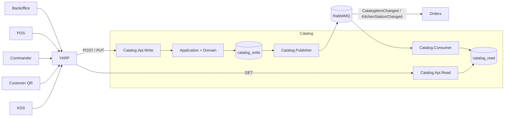
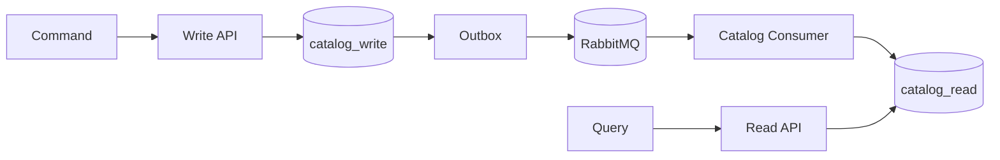
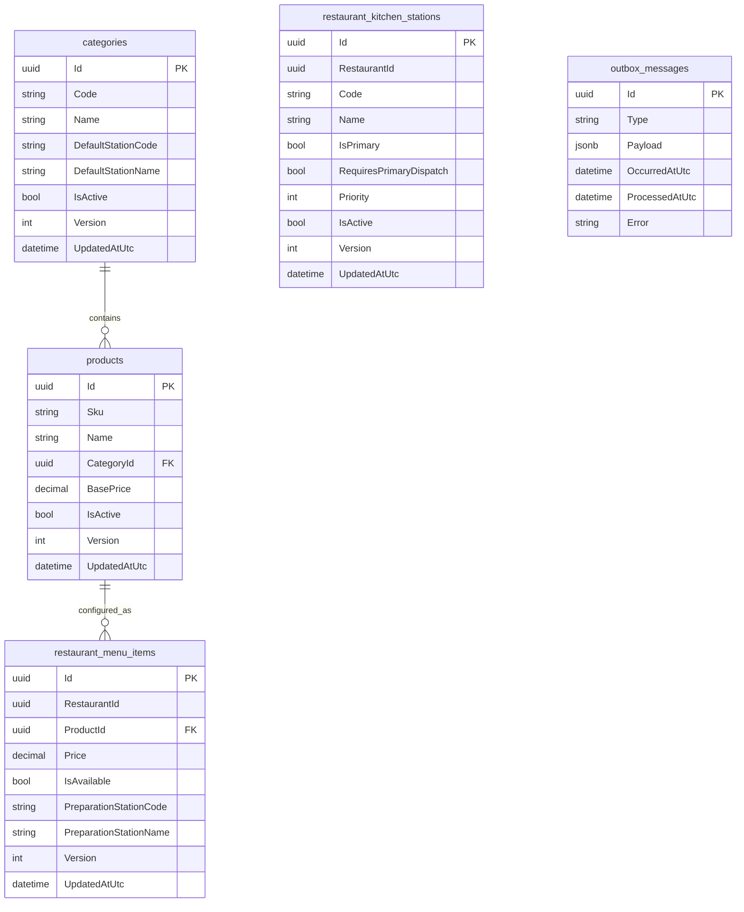
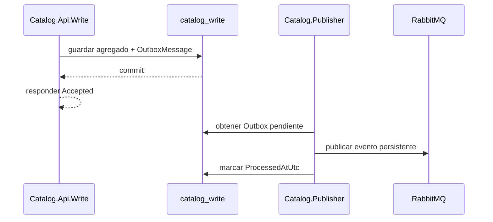
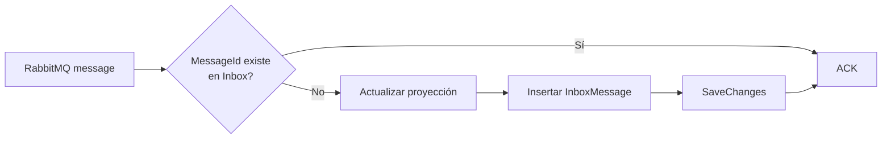
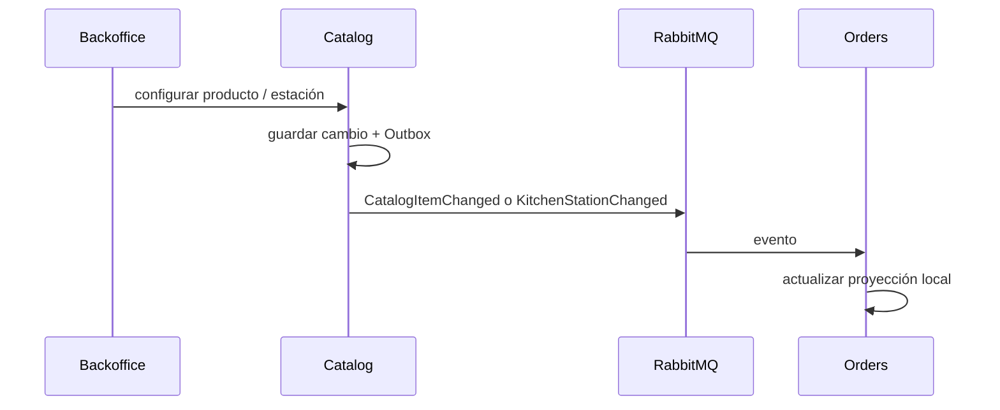
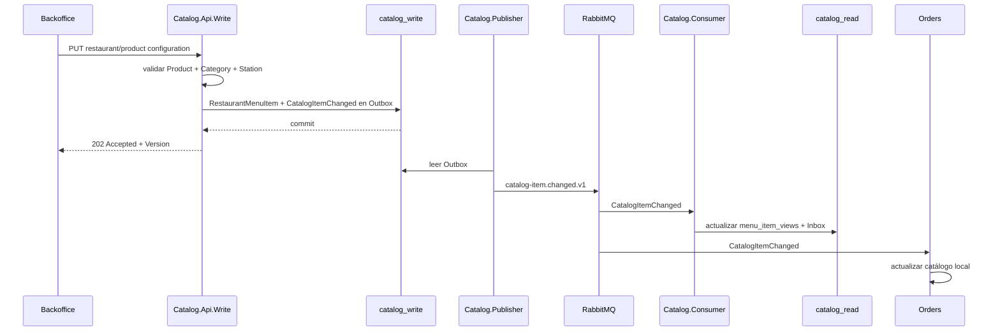

# Catalog

El servicio **Catalog** administra el catálogo comercial de la plataforma Restaurantes: categorías, productos, configuración del menú por restaurante y estaciones de preparación utilizadas por cocina/KDS.

El diseño distingue deliberadamente entre el **catálogo global** y la **configuración local de cada restaurante**. Un producto puede existir una sola vez a nivel global, mientras cada restaurante decide si lo ofrece, a qué precio y en qué estación debe prepararse.

Catalog implementa **CQRS**, persistencia Read/Write independiente, **Transactional Outbox**, proyecciones asíncronas mediante RabbitMQ, Inbox para idempotencia y publicación de eventos de integración consumidos por otros bounded contexts, especialmente **Orders**.

## Responsabilidad del servicio

Catalog es responsable de:

- mantener categorías globales de productos;
- mantener productos globales y su precio base;
- configurar disponibilidad y precio por restaurante;
- asignar cada producto del menú a una estación de preparación;
- administrar las estaciones KDS de cada restaurante;
- definir una única estación principal activa por restaurante;
- definir prioridad y reglas de despacho de las estaciones secundarias;
- mantener una proyección Read independiente optimizada para consulta;
- publicar cambios de catálogo mediante RabbitMQ;
- alimentar la proyección de catálogo utilizada internamente por Orders;
- proteger las operaciones administrativas mediante permisos globales y por restaurante.

Catalog **no crea pedidos**, **no controla el ciclo de cocina de un pedido** y **no gestiona restaurantes**. Esas responsabilidades pertenecen a Orders, KDS/Orders y RestaurantOperations respectivamente.

## Proyectos

El bounded context está dividido en ocho proyectos:

```text
src/Services/Catalog/
├── Restaurantes.Catalog.Api.Read
├── Restaurantes.Catalog.Api.Write
├── Restaurantes.Catalog.Application
├── Restaurantes.Catalog.Consumer
├── Restaurantes.Catalog.Contracts
├── Restaurantes.Catalog.Domain
├── Restaurantes.Catalog.Infrastructure
└── Restaurantes.Catalog.Publisher
```

| Proyecto | Responsabilidad |
| --- | --- |
| `Restaurantes.Catalog.Domain` | Entidades y reglas de negocio de categorías, productos, menú por restaurante y estaciones KDS. |
| `Restaurantes.Catalog.Application` | Casos de uso de escritura y abstracciones Read/Write. |
| `Restaurantes.Catalog.Contracts` | Requests, responses y eventos de integración públicos del bounded context. |
| `Restaurantes.Catalog.Infrastructure` | EF Core, PostgreSQL, stores, bases Read/Write, Outbox e Inbox. |
| `Restaurantes.Catalog.Api.Write` | Operaciones administrativas sobre catálogo, menú y estaciones. |
| `Restaurantes.Catalog.Publisher` | Publicación de mensajes pendientes desde Outbox hacia RabbitMQ. |
| `Restaurantes.Catalog.Consumer` | Construcción y actualización idempotente de la proyección Read. |
| `Restaurantes.Catalog.Api.Read` | Consultas del catálogo global y del menú de cada restaurante. |

## Arquitectura interna



La escritura nunca actualiza directamente `catalog_read`. El modelo Read se construye desde eventos publicados después de persistir los cambios en `catalog_write`.

## Catálogo global y menú por restaurante

Una de las decisiones principales del servicio es separar dos conceptos diferentes:

```text
Catálogo global
    Category
        └── Product

Configuración por restaurante
    Restaurant
        └── Product
            ├── Price
            ├── IsAvailable
            └── PreparationStation
```

### Catálogo global

Las entidades `Category` y `Product` son globales para la plataforma.

Esto permite que varios restaurantes compartan:

- el mismo SKU;
- nombre y definición del producto;
- clasificación por categoría;
- precio base de referencia.

La existencia de un producto global **no implica que esté disponible en todos los restaurantes**.

### Configuración local

`RestaurantMenuItem` representa la configuración efectiva de un producto en un restaurante concreto.

Permite definir de forma independiente:

- precio de venta;
- disponibilidad;
- estación de preparación;
- versión de configuración.

Por tanto, un mismo producto puede tener distintas configuraciones:

```text
Producto: HAMBURGUESA-CLASICA

Restaurante A
    Price: 14.50
    Station: CARNES
    Available: true

Restaurante B
    Price: 15.90
    Station: COCINA
    Available: true

Restaurante C
    Available: false
```

Esta separación evita duplicar el producto únicamente porque cambie su precio o disponibilidad según el local.

## Modelo de dominio

Catalog contiene cuatro entidades principales.

### Category

Representa una categoría global de productos.

Campos relevantes:

- `Id`;
- `Code`;
- `Name`;
- `DefaultStationCode`;
- `DefaultStationName`;
- `IsActive`;
- `Version`;
- `UpdatedAtUtc`.

El código se normaliza a mayúsculas y solo admite letras, números, `-` y `_`.

Cada categoría define además una estación de preparación predeterminada. Esa estación se utiliza como propuesta cuando un producto se incorpora al menú de un restaurante, aunque la configuración final debe resolver una estación activa existente en ese restaurante.

### Product

Representa un producto global.

Campos relevantes:

- `Id`;
- `Sku`;
- `Name`;
- `CategoryId`;
- `BasePrice`;
- `IsActive`;
- `Version`;
- `UpdatedAtUtc`.

Reglas relevantes:

- el SKU es único;
- se normaliza a mayúsculas;
- debe pertenecer a una categoría existente;
- el precio base no puede ser negativo;
- las actualizaciones incrementan `Version`.

### RestaurantMenuItem

Representa la configuración de un producto para un restaurante.

Campos relevantes:

- `RestaurantId`;
- `ProductId`;
- `Price`;
- `IsAvailable`;
- `PreparationStationCode`;
- `PreparationStationName`;
- `Version`;
- `UpdatedAtUtc`.

Existe una única configuración por combinación:

```text
RestaurantId + ProductId
```

Antes de configurar un producto, el servicio valida que:

1. el producto exista y esté activo;
2. su categoría exista y esté activa;
3. la estación seleccionada exista para ese restaurante;
4. la estación esté activa.

### RestaurantKitchenStation

Representa una estación lógica de preparación/KDS de un restaurante.

Campos relevantes:

- `RestaurantId`;
- `Code`;
- `Name`;
- `IsPrimary`;
- `RequiresPrimaryDispatch`;
- `Priority`;
- `IsActive`;
- `Version`;
- `UpdatedAtUtc`.

Un restaurante puede tener varias estaciones secundarias, pero solo **una estación principal activa**.

La restricción está protegida tanto por lógica de aplicación como por un índice único parcial en PostgreSQL.

## Estaciones KDS y despacho

Las estaciones permiten dividir el trabajo de cocina según la naturaleza del producto.

Catalog incluye actualmente una configuración inicial opcional:

| Código | Nombre | Principal | Requiere despacho principal | Prioridad |
| --- | --- | ---: | ---: | ---: |
| `CHEF` | Vista completa | Sí | No | 0 |
| `ENTRANTES` | Entrantes | No | Sí | 1 |
| `BEBIDAS` | Bebidas | No | No | 1 |
| `PASTAS` | Pastas | No | Sí | 2 |
| `CARNES` | Carnes | No | Sí | 2 |
| `POSTRES` | Postres | No | No | 3 |

Estas estaciones se crean mediante una operación idempotente: las existentes se conservan y solo se crean las que falten.

### Estación principal

Una estación marcada como `IsPrimary` se normaliza automáticamente a:

```text
IsPrimary = true
RequiresPrimaryDispatch = false
Priority = 0
```

### Estaciones secundarias

Para una estación secundaria:

- `Priority` debe estar entre `1` y `99`;
- puede requerir o no despacho desde la estación principal;
- puede activarse o desactivarse independientemente.

La configuración es publicada a Orders mediante `KitchenStationChanged`, permitiendo que Orders mantenga una copia local de las reglas necesarias para su operación.

## Persistencia

Catalog utiliza dos bases de datos PostgreSQL lógicamente independientes:

```text
catalog_write
catalog_read
```



La separación permite escalar consultas y escritura de forma independiente.

En este dominio es especialmente útil porque el menú puede ser consultado continuamente desde:

- POS;
- Commander;
- Customer QR;
- Backoffice;
- KDS;
- otros consumidores futuros.

Las consultas frecuentes sobre el catálogo no necesitan competir directamente con las operaciones administrativas de escritura.

### `catalog_write`

`CatalogWriteDbContext` mantiene las tablas transaccionales:

```text
categories
products
restaurant_menu_items
restaurant_kitchen_stations
outbox_messages
```

### Relaciones principales



`RestaurantId` se conserva como identificador externo del bounded context. Catalog no introduce una FK hacia la base de RestaurantOperations, evitando acoplamiento físico entre servicios.

### Restricciones e índices relevantes

- `categories.Code` es único;
- `products.Sku` es único;
- `restaurant_menu_items(RestaurantId, ProductId)` es único;
- `restaurant_kitchen_stations(RestaurantId, Code)` es único;
- existe como máximo una estación con `IsPrimary = true` e `IsActive = true` por restaurante;
- `Version` funciona como concurrency token en las entidades Write;
- la relación Product → Category utiliza `DeleteBehavior.Restrict`;
- la relación RestaurantMenuItem → Product utiliza `DeleteBehavior.Restrict`.

### `catalog_read`

`Catalog.Consumer` consume todos los eventos del dominio desde:

```text
catalog.read-model
```

y mantiene:

```text
category_views
product_views
menu_item_views
kitchen_station_views
inbox_messages
```

## Concurrencia optimista

Las entidades de escritura mantienen un campo `Version` configurado como **concurrency token** por EF Core.

Cada actualización del dominio incrementa la versión:

```text
Version 1
   ↓ update
Version 2
   ↓ update
Version 3
```

Además de proteger modificaciones concurrentes en la base Write, la versión permite a los consumidores descartar eventos antiguos durante la construcción de proyecciones.

## Transactional Outbox

Las modificaciones del agregado y el evento correspondiente se guardan mediante una única llamada a `SaveChangesAsync`.

Ejemplo conceptual:

```text
actualizar Product
      +
insertar ProductChanged en outbox_messages
      ↓
SaveChanges
```

El API no publica directamente en RabbitMQ. `Catalog.Publisher` procesa posteriormente los mensajes pendientes.



Esto evita el fallo clásico:

```text
BD actualizada
RabbitMQ no disponible
=> cambio perdido para otros servicios
```

## Inbox e idempotencia

El consumidor utiliza `MessageId` como clave de Inbox.



Además de la idempotencia por mensaje, cada proyección compara `Version` para evitar que un evento antiguo sobrescriba un estado más reciente.

## Proyección Read

### Proyecciones desnormalizadas

`menu_item_views` contiene información ya preparada para consumo:

- SKU;
- nombre del producto;
- categoría;
- precio local;
- disponibilidad;
- estación de preparación.

Esto evita reconstruir el menú con múltiples joins o llamadas entre servicios durante cada consulta.

Cuando cambia una categoría o un producto, el consumidor actualiza también los campos relacionados dentro de `menu_item_views`.

## Eventos de integración

### Eventos publicados

Catalog publica cuatro contratos principales:

| Evento | Propósito |
| --- | --- |
| `CategoryChanged` | Creación o modificación de una categoría. |
| `ProductChanged` | Creación o modificación de un producto global. |
| `CatalogItemChanged` | Cambio en precio, disponibilidad o estación de un producto para un restaurante. |
| `KitchenStationChanged` | Cambio en la configuración de una estación KDS. |

Los routing keys actuales son:

```text
category.changed.v1
product.changed.v1
catalog-item.changed.v1
kitchen-station.changed.v1
```

Exchange:

```text
catalog.events
```

Los mensajes se publican como persistentes y utilizan el identificador del Outbox como `MessageId`.

### Eventos consumidos

El propio `Catalog.Consumer` consume los eventos publicados por Catalog desde la queue:

```text
catalog.read-model
```

para construir `catalog_read`.

Además, `Orders` consume desde `catalog.orders-integration` únicamente:

```text
CatalogItemChanged
KitchenStationChanged
```

Catalog no necesita consultar ni escribir en la base de datos de Orders para propagar estos cambios.

## RabbitMQ

Topología principal:

```text
Exchange
    catalog.events

Queues
    catalog.read-model
    catalog.orders-integration

Dead letter
    catalog.dead-letter
    catalog.dead-letter.messages
```

`catalog.read-model` recibe los cuatro tipos de evento.

`catalog.orders-integration` recibe únicamente:

- `catalog-item.changed.v1`;
- `kitchen-station.changed.v1`.

Los consumidores utilizan ACK manual.

Comportamiento actual:

- mensaje válido procesado → `ACK`;
- JSON inválido o tipo no soportado → `NACK` sin requeue → DLQ;
- error transitorio → `NACK` con requeue;
- desconexión RabbitMQ → reintento de conexión.

## Menú público y menú de configuración

Catalog distingue entre dos consultas diferentes.

### Menú operativo

```http
GET /api/catalog/restaurants/{restaurantId}/menu
```

Solo devuelve elementos que cumplen simultáneamente:

```text
MenuItem.IsAvailable = true
Product.IsActive = true
Category.IsActive = true
```

Esta consulta es la utilizada por clientes operativos como POS, Commander y Customer QR.

### Configuración completa

```http
GET /api/catalog/restaurants/{restaurantId}/menu/configuration
```

Devuelve la configuración completa del restaurante, incluyendo elementos no disponibles, y requiere permiso administrativo sobre el catálogo del restaurante.

Esta separación evita que una aplicación de venta tenga que conocer las reglas internas de activación del catálogo.

## API Write

Ruta base:

```text
/api/catalog
```

| Método | Ruta | Propósito |
| --- | --- | --- |
| `POST` | `/categories` | Crear categoría global. |
| `PUT` | `/categories/{id}` | Actualizar categoría global. |
| `POST` | `/products` | Crear producto global. |
| `PUT` | `/products/{id}` | Actualizar producto global. |
| `PUT` | `/restaurants/{restaurantId}/products/{productId}` | Configurar producto en el menú del restaurante. |
| `POST` | `/restaurants/{restaurantId}/stations/defaults` | Crear estaciones KDS predeterminadas que falten. |
| `POST` | `/restaurants/{restaurantId}/stations` | Crear una estación. |
| `PUT` | `/restaurants/{restaurantId}/stations/{stationId}` | Modificar una estación. |

Las escrituras devuelven actualmente `202 Accepted`, coherente con que la proyección Read se actualiza de forma asíncrona.

## API Read

| Método | Ruta | Propósito |
| --- | --- | --- |
| `GET` | `/api/catalog/categories` | Listar categorías. |
| `GET` | `/api/catalog/products` | Listar productos. |
| `GET` | `/api/catalog/restaurants/{restaurantId}/menu` | Obtener menú operativo disponible. |
| `GET` | `/api/catalog/restaurants/{restaurantId}/menu/configuration` | Obtener configuración completa del menú. |
| `GET` | `/api/catalog/restaurants/{restaurantId}/stations` | Obtener estaciones KDS del restaurante. |

Las consultas del menú deshabilitan cache HTTP mediante `NoStore` para evitar servir una disponibilidad obsoleta desde caches intermedias.

## Gateways

El gateway privado separa las rutas según verbo HTTP:

```text
GET
    -> Catalog.Api.Read

POST / PUT / PATCH / DELETE
    -> Catalog.Api.Write
```

Destinos locales actuales:

```text
Catalog.Api.Write -> localhost:5131
Catalog.Api.Read  -> localhost:5132
```

El gateway público expone únicamente la ruta GET de Catalog. Las restricciones adicionales de endpoints administrativos siguen siendo aplicadas por la API Read.

## Seguridad

La API Write requiere autenticación.

Se diferencian dos niveles de administración.

### Catálogo global

Crear o modificar categorías y productos requiere:

```text
catalog.global.manage
```

El permiso puede existir en cualquiera de los restaurantes accesibles por el usuario mediante `HasAnyRestaurantPermission`.

### Configuración local

Configurar menú o estaciones requiere acceso al restaurante y:

```text
catalog.manage
```

La consulta de estaciones utilizada por KDS requiere:

```text
kds.use
```

La autorización se realiza en el propio servicio, no únicamente en el gateway.

## Relación con otros servicios

### Orders

Orders mantiene una proyección local de la información de Catalog que necesita para crear y enrutar pedidos.

La queue utilizada es:

```text
catalog.orders-integration
```

Consume únicamente:

```text
CatalogItemChanged
KitchenStationChanged
```



Orders mantiene así la información necesaria para operar sin consultar Catalog sincrónicamente al crear cada pedido.

Esto reduce acoplamiento temporal entre servicios: una caída momentánea de Catalog no obliga a detener pedidos que pueden resolverse usando la última proyección disponible en Orders.

### RestaurantOperations

`RestaurantId` se conserva como identificador externo del bounded context. Catalog no introduce una FK hacia la base de RestaurantOperations, evitando acoplamiento físico entre servicios.

## Clientes actuales

Catalog es consumido por varios clientes de la solución.

| Cliente | Uso principal |
| --- | --- |
| **Customer QR** | Obtener el menú disponible del restaurante. |
| **Commander** | Consultar productos disponibles para toma de pedidos. |
| **POS** | Consultar menú y precios durante la operación. |
| **Backoffice** | Administrar categorías, productos, menú local y estaciones. |
| **KDS** | Consultar configuración de estaciones del restaurante. |

Backoffice contempla explícitamente la consistencia eventual: después de determinadas escrituras espera y verifica que la versión aceptada haya llegado a la proyección Read.

## Consistencia eventual

Una escritura puede confirmarse antes de que el cambio sea visible en la API Read:

```text
Write API
   ↓
catalog_write actualizado
   ↓
202 Accepted
   ↓
Publisher
   ↓
RabbitMQ
   ↓
Consumer
   ↓
catalog_read actualizado
```

Esto es intencionado.

Los clientes administrativos que necesiten confirmar visualmente la proyección pueden comparar el campo `Version` hasta observar una versión igual o superior a la aceptada por la operación Write.

## Configuración

### API Write

```text
ConnectionStrings:CatalogWrite
```

### API Read

```text
ConnectionStrings:CatalogRead
```

### Consumer

```text
ConnectionStrings:CatalogRead
RabbitMq:HostName
RabbitMq:Port
RabbitMq:UserName
RabbitMq:Password
RabbitMq:VirtualHost
```

### Publisher

```text
ConnectionStrings:CatalogWrite
RabbitMq:HostName
RabbitMq:Port
RabbitMq:UserName
RabbitMq:Password
RabbitMq:VirtualHost
```

Las credenciales de producción deben suministrarse mediante la configuración segura del entorno o el gestor de secretos del proveedor utilizado, no desde archivos versionados.

## Migraciones

`CatalogWriteDbContext` y `CatalogReadDbContext` mantienen migraciones independientes para `catalog_write` y `catalog_read`.

En la implementación actual, `Catalog.Api.Write` y `Catalog.Api.Read` ejecutan `Database.MigrateAsync()` durante el arranque de cada API.

## Desarrollo local

URLs configuradas actualmente:

| Componente | URL |
| --- | --- |
| Catalog Write API | `http://localhost:5131` |
| Catalog Read API | `http://localhost:5132` |

Bases locales:

```text
catalog_write
catalog_read
```

La infraestructura local utiliza PostgreSQL y RabbitMQ definidos en el `docker-compose.yml` de la raíz del repositorio.

Antes de utilizar las herramientas locales:

```bash
dotnet tool restore
```

## Health checks

`Catalog.Api.Write` y `Catalog.Api.Read` utilizan `Restaurantes.ServiceDefaults`.

Ambas APIs exponen:

```text
/health
/alive
```

`/health` representa el endpoint general de salud y `/alive` permite comprobar que el proceso está activo.

## Flujo completo de configuración de un producto



## Decisiones de diseño

### Producto global, precio local

El producto se define una sola vez y el precio operativo pertenece a la configuración del restaurante.

Esto evita duplicar entidades globales por diferencias comerciales locales.

### Orders no consulta Catalog para cada pedido

Orders mantiene su propia proyección de `CatalogItemChanged` y `KitchenStationChanged`.

La toma de pedidos no depende de una llamada síncrona a Catalog en cada operación.

### Read model desnormalizado

La vista de menú conserva nombres de producto, categoría y estación junto con la configuración local.

Las consultas operativas son simples y no necesitan reconstruir el catálogo completo en cada request.

### Una única estación principal activa

La regla se valida en aplicación y también mediante restricción física de PostgreSQL, reduciendo el riesgo de carreras concurrentes.

### Versionado de entidades y eventos

`Version` se utiliza tanto para optimistic concurrency en Write como para impedir regresiones de estado en las proyecciones Read.

### Disponibilidad efectiva calculada en lectura

El menú público no se limita a `RestaurantMenuItem.IsAvailable`: también verifica que Product y Category continúen activos.

Esto permite desactivar globalmente un producto o categoría sin tener que modificar individualmente cada menú de restaurante.

## Despliegue y escalado

### Bases de datos

En desarrollo, `catalog_write` y `catalog_read` pueden residir en la misma instancia PostgreSQL manteniendo aislamiento lógico.

En cloud pueden desplegarse independientemente cuando el volumen lo justifique:

```text
Catalog Write
    -> PostgreSQL orientado a transacciones

Catalog Read
    -> PostgreSQL orientado a consultas
```

Esto permite:

- dimensionar CPU/memoria según el patrón de uso de cada lado;
- escalar consultas sin aumentar necesariamente la capacidad de escritura;
- aislar picos de lectura generados por clientes y oficina;
- reducir el impacto de reporting o navegación intensiva sobre operaciones administrativas;
- aplicar políticas de backup y mantenimiento diferentes;
- mover cada base a infraestructura distinta sin modificar los contratos del servicio.

### Alojamiento cloud

La arquitectura no depende de un proveedor cloud concreto. Puede desplegarse sobre PostgreSQL administrado en Azure, AWS, GCP u otro proveedor compatible.

En una instalación pequeña, `catalog_write` y `catalog_read` pueden compartir una misma instancia PostgreSQL manteniendo aislamiento lógico. Cuando la carga lo justifique, pueden alojarse en recursos distintos para aislar CPU, memoria, conexiones e I/O entre escritura y consultas.
