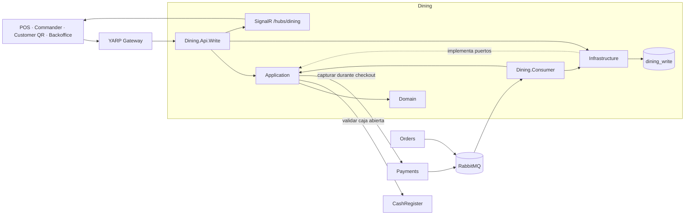
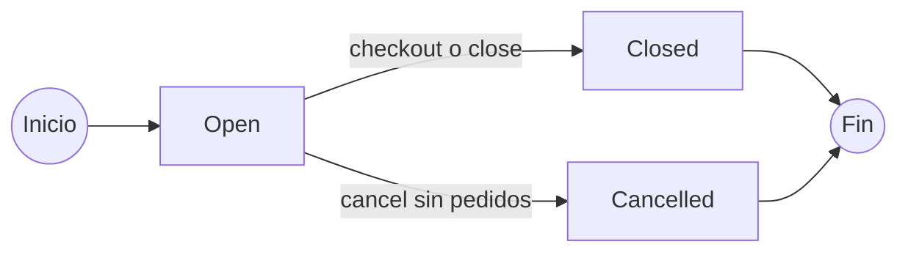
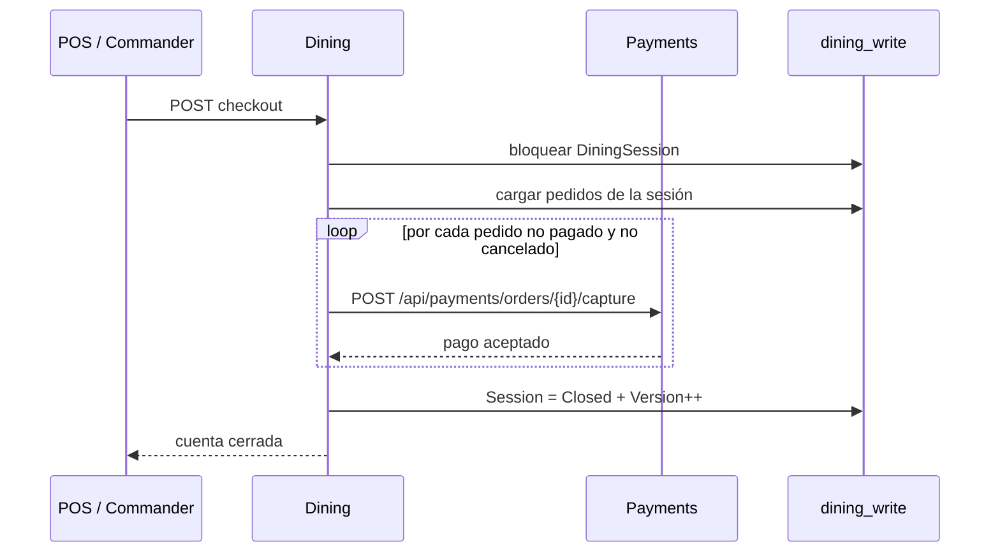
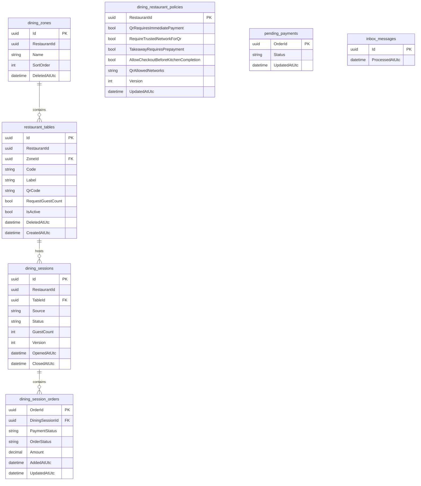
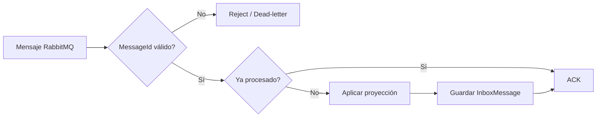

# Dining

El servicio **Dining** administra la ocupación y configuración operativa de sala dentro de la plataforma Restaurantes: zonas, ubicaciones, sesiones de mesa, comensales, acceso mediante QR y cierre de cuentas asociadas a una sesión.

Dining mantiene una única base operacional PostgreSQL, pero su implementación ya está separada por responsabilidades en **Domain, Application, Infrastructure, Api.Write y Consumer**. La API expone las operaciones HTTP y SignalR, mientras que el Consumer procesa de forma independiente los eventos procedentes de **Orders** y **Payments**.

## Responsabilidad del servicio

Dining es responsable de:

- administrar zonas de sala por restaurante;
- administrar ubicaciones operativas y su asociación a una zona;
- abrir una única sesión activa por ubicación;
- registrar opcionalmente el número de comensales de una sesión;
- mantener el estado de los pedidos pertenecientes a una sesión;
- mantener el estado de pago proyectado de esos pedidos;
- calcular la cuenta consolidada de una sesión;
- coordinar el checkout multipedido con Payments;
- cerrar o cancelar sesiones según sus reglas de negocio;
- generar y rotar códigos QR por ubicación;
- proteger sesiones Customer QR mediante un token específico de sesión;
- aplicar políticas de acceso QR y de checkout por restaurante;
- validar sesiones de Dining para otros bounded contexts;
- consumir eventos de Orders y Payments mediante un worker RabbitMQ independiente;
- evitar reprocesamiento mediante Inbox;
- notificar cambios de ocupación en tiempo real mediante SignalR.

Dining **no crea pedidos**, **no captura pagos directamente**, **no administra la caja** y **no mantiene el catálogo comercial**. Esas responsabilidades pertenecen respectivamente a Orders, Payments, CashRegister y Catalog.

## Proyectos

El bounded context está dividido en cinco proyectos:

```text
src/Services/Dining/
├── Restaurantes.Dining.Api.Write
├── Restaurantes.Dining.Application
├── Restaurantes.Dining.Consumer
├── Restaurantes.Dining.Domain
└── Restaurantes.Dining.Infrastructure
```

| Proyecto | Responsabilidad |
| --- | --- |
| `Restaurantes.Dining.Domain` | Entidades y reglas del dominio de sala: zonas, ubicaciones, sesiones, políticas y proyecciones operativas de pedidos/pagos. |
| `Restaurantes.Dining.Application` | Casos de uso, contratos HTTP internos del bounded context, puertos de infraestructura, validación QR/red y procesamiento de eventos de integración. |
| `Restaurantes.Dining.Infrastructure` | EF Core, PostgreSQL, `DiningStore`, migraciones e integraciones HTTP con Payments y CashRegister. |
| `Restaurantes.Dining.Api.Write` | API HTTP, autenticación/autorización, contexto de petición, SignalR y composición de dependencias. |
| `Restaurantes.Dining.Consumer` | Worker independiente que consume eventos de Orders y Payments desde RabbitMQ y mantiene las proyecciones locales mediante Inbox. |

Dining no dispone actualmente de `Api.Read`, `Publisher` ni un proyecto `Contracts` propio. Los requests y resultados utilizados por la API se encuentran en Application, mientras que los contratos de eventos consumidos proceden de `Orders.Contracts` y `Payments.Contracts`.

## Arquitectura interna



La API y el Consumer son procesos ejecutables independientes, pero ambos trabajan sobre la misma base lógica `dining_write`. Dining no dispone actualmente de una API Read ni de una base `dining_read`.

## Modelo de dominio

Dining mantiene cuatro conceptos principales de negocio y dos estructuras auxiliares de proyección e integración.

### `DiningZone`

Representa una agrupación lógica de ubicaciones dentro de un restaurante.

Campos relevantes:

- `Id`;
- `RestaurantId`;
- `Name`;
- `SortOrder`;
- `DeletedAtUtc`.

El nombre debe ser único dentro del restaurante entre las zonas no eliminadas.

### `RestaurantTable`

Representa una ubicación operativa sobre la que puede abrirse una sesión de Dining.

Campos relevantes:

- `Id`;
- `RestaurantId`;
- `ZoneId`;
- `Code`;
- `Label`;
- `QrCode`;
- `RequestGuestCount`;
- `IsActive`;
- `DeletedAtUtc`;
- `CreatedAtUtc`.

`Code` se normaliza a mayúsculas al crear la ubicación, es único dentro del restaurante entre ubicaciones no eliminadas y no se modifica mediante el contrato de actualización actual.

El estado visible de una ubicación no se almacena como una columna independiente. Se deriva de la existencia de una sesión abierta:

```text
sin DiningSession Open  -> Available
con DiningSession Open  -> Occupied
```

### `DiningRestaurantPolicy`

Conserva reglas configurables por restaurante:

| Campo | Propósito |
| --- | --- |
| `QrRequiresImmediatePayment` | Indica al flujo Customer QR que el pago debe realizarse de forma inmediata. |
| `RequireTrustedNetworkForQr` | Exige que el cliente QR proceda de una red autorizada. |
| `QrAllowedNetworks` | Lista normalizada de direcciones IP o redes CIDR permitidas. |
| `TakeawayRequiresPrepayment` | Política de prepago utilizada por clientes operativos para takeaway. |
| `AllowCheckoutBeforeKitchenCompletion` | Permite checkout antes de que todos los pedidos estén `Ready`, `Delivered` o `Cancelled`. |
| `Version` | Token de concurrencia de la política. |
| `UpdatedAtUtc` | Última modificación UTC. |

### `DiningSession`

Representa la ocupación operativa de una ubicación.

Campos relevantes:

- `Id`;
- `RestaurantId`;
- `TableId`;
- `Source`;
- `Status`;
- `RequestGuestCount`;
- `GuestCount`;
- `Version`;
- `OpenedAtUtc`;
- `ClosedAtUtc`;
- `CheckoutIdempotencyKey`;
- `PaymentMethod`;
- `PaidAtUtc`;
- `CustomerAccessToken`;
- datos de cancelación;
- pedidos asociados.

Existe como máximo una sesión `Open` por ubicación mediante un índice único parcial en PostgreSQL.

### Estados



`Closed` y `Cancelled` son estados terminales de la sesión actual.

La cancelación solo está permitida cuando la sesión sigue `Open` y todavía no contiene pedidos.

### `DiningSessionOrder`

Es una proyección local del pedido dentro de una sesión de Dining.

Conserva:

- `OrderId`;
- `DiningSessionId`;
- `OrderStatus`;
- `PaymentStatus`;
- `Amount`;
- `AddedAtUtc`;
- `UpdatedAtUtc`.

Dining no reconstruye el agregado de Orders. Mantiene únicamente el estado necesario para determinar la cuenta, el checkout y la liberación de la ubicación.

### `DiningPendingPayment`

Permite conservar un estado de pago recibido antes de que el `OrderCreated` correspondiente haya sido proyectado en Dining.

Cuando llega posteriormente el pedido, el estado pendiente se incorpora al `DiningSessionOrder` y se elimina de `pending_payments`.

## Zonas y ubicaciones

Las zonas sirven para ordenar y agrupar ubicaciones dentro del restaurante.

Una ubicación:

- pertenece obligatoriamente a una zona del mismo restaurante;
- puede exigir número de comensales;
- puede activarse o desactivarse;
- dispone de un `QrCode` único y persistente, que puede rotarse cuando sea necesario reemplazar el QR físico;
- puede tener una única sesión abierta.

### Eliminación lógica

Zonas y ubicaciones utilizan eliminación lógica mediante `DeletedAtUtc`.

Una ubicación no puede eliminarse mientras mantenga una sesión `Open`.

Una zona no puede eliminarse mientras contenga ubicaciones no eliminadas, incluso si esas ubicaciones están inactivas.

Las operaciones de asignación y eliminación utilizan bloqueos de fila `FOR UPDATE` en los puntos donde es necesario serializar cambios concurrentes.

## Apertura de sesión

Una sesión iniciada por personal utiliza:

```http
POST /api/dining/tables/{tableId}/sessions
```

El origen admitido por el contrato es:

```text
CustomerQr
WaiterMobile
Pos
```

Antes de abrirla, Dining comprueba:

1. que la ubicación exista y no esté eliminada;
2. que el usuario tenga `orders.create` para el restaurante;
3. que la ubicación esté activa;
4. que CashRegister confirme una caja abierta;
5. que no exista ya otra sesión `Open` para la misma ubicación.

Cuando la sesión se crea correctamente, Dining notifica mediante SignalR que la ubicación pasa a `Occupied`.

## Número de comensales

Una ubicación puede configurarse con:

```text
RequestGuestCount = true
```

En ese caso la sesión necesita un `GuestCount` válido antes de ser utilizada para crear pedidos.

El valor admitido actualmente es:

```text
1..999
```

El número puede establecerlo:

- personal autenticado con permiso `orders.create`; o
- el cliente Customer QR que presente el `X-Customer-Session-Token` correcto.

Una vez registrado un valor diferente de `null`, el endpoint no permite sustituirlo por otro número mediante el mismo flujo.

## Customer QR

Cada ubicación dispone de un `QrCode` único generado mediante un generador criptográfico. El valor permanece estable mientras no se solicite una rotación, por lo que puede utilizarse en un QR físico pegado a la ubicación.

El QR puede rotarse mediante:

```http
POST /api/dining/tables/{tableId}/qr/rotate
```

La vista previa pública utiliza:

```http
GET /api/dining/qr/{qrCode}
```

La apertura de sesión utiliza:

```http
POST /api/dining/qr/{qrCode}/sessions
```

Ambos endpoints son anónimos a nivel de autenticación general, pero el flujo aplica controles propios.

### Token de sesión

Una sesión abierta desde Customer QR recibe un `CustomerAccessToken` aleatorio.

El cliente debe enviarlo posteriormente mediante:

```text
X-Customer-Session-Token
```

Dining compara el token utilizando una comparación en tiempo constante.

Si ya existe una sesión Customer QR para la ubicación, solo el cliente que presente el token correcto puede recuperar esa sesión privada.

Si la sesión existente fue abierta por personal del restaurante, el QR no puede apropiarse de ella.

### Restricción por red

La política puede activar:

```text
RequireTrustedNetworkForQr = true
```

En ese caso, el cliente debe proceder de alguna dirección IP o red CIDR incluida en `QrAllowedNetworks`.

Se admiten como máximo 20 redes configuradas. Dining normaliza IPv4, IPv6 y CIDR antes de persistir la configuración.

La aplicación utiliza `X-Forwarded-For` y `X-Forwarded-Proto` únicamente a través de proxies configurados en `QrAccess:TrustedProxyAddresses`.

### Política de pago Customer QR

El comportamiento de pago se configura por restaurante mediante:

```text
QrRequiresImmediatePayment
```

El flag es deliberadamente configurable y Customer QR admite dos flujos:

```text
QrRequiresImmediatePayment = true
    -> PaymentTiming = Immediate
    -> crear pedido Draft
    -> capturar pago online
    -> PaymentCaptured
    -> submit
    -> cocina / KDS

QrRequiresImmediatePayment = false
    -> PaymentTiming = OnAccount
    -> crear pedido Draft
    -> submit
    -> cocina / KDS
    -> el pedido permanece en la cuenta de la sesión
```

Dining es propietario de esta política y la devuelve al cliente Customer QR al abrir o recuperar la sesión. El PWA utiliza el valor para seleccionar `Immediate` u `OnAccount`.

Dining no captura el pago ni envía directamente la comanda a cocina. **Payments** captura el cobro online y publica `PaymentCaptured`; **Orders** impide el `submit` de cualquier pedido `Immediate` mientras su proyección de pago no indique `Paid`.

El QR físico permanece asociado a la ubicación mientras no se rote su `QrCode`. Si se deteriora, se pierde o necesita reemplazarse, Backoffice puede rotar el identificador e imprimir un nuevo QR, invalidando el anterior.

## Validación de sesión

Otros flujos pueden comprobar que una sesión continúa siendo válida mediante:

```http
GET /api/dining/sessions/{sessionId}/validate
```

La validación comprueba:

- `DiningSessionId`;
- `RestaurantId`;
- `TableId`;
- que la sesión esté `Open`;
- que el modo de servicio sea `DineIn` o `Bar`;
- número de comensales cuando sea obligatorio;
- token Customer QR cuando el origen es `CustomerQr`.

Cuando existe `GuestCount`, Dining lo devuelve además mediante:

```text
X-Dining-Guest-Count
```

## Cuenta de sesión

La cuenta se consulta mediante:

```http
GET /api/dining/sessions/{sessionId}/bill
```

Se calcula desde los pedidos proyectados asociados a la sesión.

La respuesta incluye, entre otros datos:

```text
total
outstanding
canCheckout
orders[]
```

`total` corresponde a la suma de los importes proyectados.

`outstanding` corresponde a los importes cuyo `PaymentStatus` todavía no es `Paid`.

`canCheckout` exige:

- sesión `Open`;
- al menos un pedido;
- y, salvo que la política lo permita expresamente, todos los pedidos en `Ready`, `Delivered` o `Cancelled`.

## Checkout multipedido

El checkout se ejecuta mediante:

```http
POST /api/dining/sessions/{sessionId}/checkout
```

El contrato exige:

- `IdempotencyKey` distinto de `Guid.Empty`;
- método `Card` o `Cash`;
- referencia externa opcional.



Dining utiliza la **misma `IdempotencyKey`** para todas las capturas de una misma operación y envía `TransactionOrderCount` con la cantidad de pedidos que deben cobrarse.

Si no se proporciona `ExternalReference`, se utiliza:

```text
DINING-{sessionId}
```

Cuando todos los cobros necesarios han sido aceptados:

- la sesión pasa a `Closed`;
- se registra `CheckoutIdempotencyKey`;
- se registra el método de pago;
- se establece `PaidAtUtc` y `ClosedAtUtc`;
- se incrementa `Version`;
- la ubicación se notifica como `Available`.

### Idempotencia del checkout

Si la sesión ya está `Closed`:

- la misma `IdempotencyKey` devuelve el resultado existente;
- una clave distinta devuelve `409 Conflict`.

## Cierre sin captura

Existe además:

```http
POST /api/dining/sessions/{sessionId}/close
```

Este flujo se utiliza cuando los pedidos activos de la sesión ya aparecen pagados en la proyección local.

Requiere:

- permiso `tables.release`;
- sesión `Open`;
- al menos un pedido;
- ningún pedido activo pendiente de pago.

Los pedidos `Cancelled` no bloquean el cierre.

## Cancelación de sesión

```http
POST /api/dining/sessions/{sessionId}/cancel
```

La cancelación requiere:

- permiso `tables.release`;
- sesión `Open`;
- cero pedidos asociados;
- motivo de entre 3 y 200 caracteres;
- identificador de usuario válido en los claims.

El servicio conserva:

- `CancelledAtUtc`;
- `CancelledByUserId`;
- `CancellationReason`;
- `ClosedAtUtc`;
- incremento de `Version`.

## Persistencia

Dining utiliza una única base PostgreSQL:

```text
dining_write
```

Es la fuente de verdad operativa del bounded context.

Tablas principales:

| Tabla | Función |
| --- | --- |
| `dining_zones` | Zonas operativas del restaurante. |
| `restaurant_tables` | Ubicaciones y configuración QR. |
| `dining_restaurant_policies` | Políticas QR, takeaway y checkout por restaurante. |
| `dining_sessions` | Sesiones de ocupación. |
| `dining_session_orders` | Proyección local de pedidos asociados a cada sesión. |
| `pending_payments` | Pagos recibidos antes de la proyección del pedido. |
| `inbox_messages` | Mensajes RabbitMQ ya procesados. |

Relaciones principales:



### Restricciones e índices relevantes

- `dining_zones(RestaurantId, Name)` es único para zonas no eliminadas;
- `restaurant_tables(RestaurantId, Code)` es único para ubicaciones no eliminadas;
- `restaurant_tables.QrCode` es único;
- una ubicación pertenece a una zona del mismo restaurante mediante clave compuesta;
- `dining_sessions` permite como máximo una sesión `Open` por `TableId`;
- `DiningRestaurantPolicy.Version` es concurrency token;
- `DiningSession.Version` es concurrency token;
- `DiningZone.DeletedAtUtc` se utiliza como concurrency token en la eliminación lógica.

## Transactional Outbox

Dining **no implementa Transactional Outbox actualmente** porque no publica eventos de integración propios mediante RabbitMQ.

Los cambios de ocupación se notifican directamente mediante SignalR después de persistir el estado correspondiente.

## Inbox e idempotencia

`DiningIntegrationWorker` exige un `MessageId` GUID para cada mensaje recibido desde RabbitMQ.

El flujo es:



Un mensaje repetido cuyo `MessageId` ya existe en `inbox_messages` se confirma sin aplicar nuevamente la proyección.

Los errores permanentes de formato o tipo se rechazan sin requeue. Los errores de procesamiento restantes se rechazan con requeue para permitir un nuevo intento.

## Eventos de integración

### Eventos publicados

Dining no publica actualmente contratos de integración propios mediante RabbitMQ.

La notificación `DiningTableChanged` pertenece al canal SignalR del servicio y no al bus de eventos de integración.

### Eventos consumidos

Dining consume eventos procedentes de Orders y Payments.

#### Orders

| Evento | Uso |
| --- | --- |
| `OrderCreated` | Incorpora el pedido a la sesión y calcula su importe inicial. |
| `OrderSubmitted` | Actualiza `OrderStatus` a `Submitted` y recalcula el importe vigente. |
| `OrderReady` | Actualiza `OrderStatus` a `Ready`. |
| `OrderDelivered` | Actualiza `OrderStatus` a `Delivered`. |
| `OrderLineCancelled` | Actualiza estado e importe después de una cancelación de línea. |

Los pedidos `Takeaway` se ignoran porque no pertenecen a una sesión de mesa de Dining.

#### Payments

| Evento | Uso |
| --- | --- |
| `PaymentCaptured` | Actualiza `PaymentStatus` a `Paid`. |
| `PaymentRefunded` | Actualiza `PaymentStatus` a `Refunded`. |

Si el evento financiero llega antes del `OrderCreated`, se conserva temporalmente en `pending_payments`.

## RabbitMQ

Queue propia:

```text
dining.table-sessions
```

Bindings actuales:

```text
orders.events
├── order.created.v1
├── order.submitted.v1
├── order.ready.v1
├── order.delivered.v1
└── order.line-cancelled.v1

payments.events
├── payment.captured.v1
└── payment.refunded.v1
```

Dead-letter:

```text
dining.dead-letter
dining.dead-letter.messages
```

`DiningIntegrationWorker` utiliza ACK manual y mantiene una conexión RabbitMQ propia dentro del proceso `Restaurantes.Dining.Consumer`.

## SignalR

Dining expone:

```text
/hubs/dining
```

El Hub requiere autenticación.

Los clientes pueden unirse al grupo de un restaurante mediante:

```text
JoinRestaurant(Guid restaurantId)
```

Antes de incorporar la conexión, el servidor verifica el permiso:

```text
tables.read
```

Los grupos utilizan el formato:

```text
restaurant:{RestaurantId}:dining
```

La notificación enviada al cliente es:

```text
DiningTableChanged
├── RestaurantId
├── TableId
├── Status
├── ActiveSessionId
├── Source
└── OccurredAtUtc
```

Los valores operativos principales de `Status` son:

```text
Occupied
Available
```

## API Write

Ruta base:

```text
/api/dining
```

### Zonas

| Método | Endpoint | Operación |
| --- | --- | --- |
| `GET` | `/restaurants/{restaurantId}/zones` | Listar zonas. |
| `POST` | `/restaurants/{restaurantId}/zones` | Crear zona. |
| `PUT` | `/restaurants/{restaurantId}/zones/{zoneId}` | Actualizar zona. |
| `DELETE` | `/restaurants/{restaurantId}/zones/{zoneId}` | Eliminar lógicamente una zona. |

### Ubicaciones y política

| Método | Endpoint | Operación |
| --- | --- | --- |
| `GET` | `/restaurants/{restaurantId}/tables` | Listar ubicaciones y ocupación actual. |
| `POST` | `/restaurants/{restaurantId}/tables` | Crear ubicación. |
| `PUT` | `/tables/{tableId}` | Actualizar ubicación. |
| `DELETE` | `/tables/{tableId}` | Eliminar lógicamente una ubicación. |
| `GET` | `/restaurants/{restaurantId}/policy` | Consultar política Dining. |
| `PUT` | `/restaurants/{restaurantId}/policy` | Actualizar política Dining. |
| `POST` | `/tables/{tableId}/qr/rotate` | Rotar QR de una ubicación. |

### Sesiones

| Método | Endpoint | Operación |
| --- | --- | --- |
| `POST` | `/tables/{tableId}/sessions` | Abrir sesión. |
| `GET` | `/tables/{tableId}/active-session` | Obtener sesión activa. |
| `GET` | `/sessions/{sessionId}` | Consultar sesión. |
| `PUT` | `/sessions/{sessionId}/guests` | Registrar número de comensales. |
| `GET` | `/sessions/{sessionId}/bill` | Consultar cuenta. |
| `POST` | `/sessions/{sessionId}/checkout` | Ejecutar checkout. |
| `GET` | `/sessions/{sessionId}/validate` | Validar sesión para otros flujos. |
| `POST` | `/sessions/{sessionId}/close` | Cerrar sesión ya pagada. |
| `POST` | `/sessions/{sessionId}/cancel` | Cancelar sesión sin pedidos. |

### Customer QR

| Método | Endpoint | Operación |
| --- | --- | --- |
| `GET` | `/qr/{qrCode}` | Obtener contexto público del QR. |
| `POST` | `/qr/{qrCode}/sessions` | Abrir o recuperar sesión Customer QR. |

La restricción de red se aplica actualmente al consultar el QR y al abrir o recuperar una sesión Customer QR. La validación posterior de sesión comprueba identidad de sesión, restaurante, ubicación, estado, modalidad, comensales y `CustomerAccessToken`; no vuelve a evaluar la red autorizada.

## Gateways

Dining se publica a través de YARP.

### Private Gateway

Enruta:

```text
/api/dining/*
/hubs/dining/*
```

hacia:

```text
http://localhost:5102
```

### Public Gateway

Enruta:

```text
/api/dining/*
```

hacia el mismo proceso.

La autorización funcional continúa aplicándose dentro de Dining. La existencia de una ruta en el gateway público no elimina las restricciones de autenticación, permisos, token QR o red configurada en cada endpoint.

### Interfaz Customer QR

Las rutas `/api/dining/qr/*` anteriores pertenecen a la API de Dining. La interfaz que abre el navegador se publica por separado en `/qr/{qrCode}` y YARP la reenvía al PWA Customer QR.

En desarrollo existen dos accesos intencionados a esa misma interfaz:

| Uso | URL |
| --- | --- |
| QR escaneado por el cliente | `http://localhost:5000/qr/{qrCode}` mediante el Public Gateway |
| Previsualización desde Backoffice | `http://localhost:5001/qr/{qrCode}` mediante el Private Gateway |

No son dos aplicaciones distintas. El Private Gateway publica la segunda ruta únicamente para la previsualización interna; la URL codificada en un QR real debe utilizar siempre el origen público. En producción se reemplaza `http://localhost:5000` por el dominio HTTPS del Public Gateway y se conserva `/qr/{qrCode}`.

## Seguridad

La ruta `/api/dining` requiere autenticación por defecto. Los endpoints de vista previa QR, apertura de sesión QR, registro de comensales y validación de sesión declaran `AllowAnonymous` explícitamente y aplican sus controles funcionales dentro del servicio.

Permisos utilizados:

| Permiso | Uso principal |
| --- | --- |
| `tables.read` | Listar zonas/ubicaciones, consultar sesiones y unirse al Hub. |
| `tables.manage` | Crear, actualizar o eliminar zonas/ubicaciones y modificar política/QR. |
| `tables.release` | Cerrar o cancelar sesiones. |
| `orders.create` | Abrir una sesión operativa y registrar comensales como personal. |
| `payments.capture` | Ejecutar checkout de una sesión. |

### Customer QR

La seguridad específica del flujo QR combina:

- un QR físico estable por ubicación; su valor `QrCode` se genera de forma criptográficamente fuerte al crear o rotar el QR;
- `CustomerAccessToken` por sesión Customer QR;
- comparación del token en tiempo constante;
- validación opcional de IP/CIDR al consultar el QR y al abrir o recuperar la sesión;
- proxies confiables configurados explícitamente;
- validación de restaurante, ubicación, sesión y token antes de aceptar operaciones Customer QR.

## Relación con otros servicios

| Servicio | Relación |
| --- | --- |
| `Orders` | Publica eventos que Dining utiliza para mantener el estado e importe de los pedidos de cada sesión. Orders puede validar de forma síncrona la sesión antes de aceptar pedidos de sala. |
| `Payments` | Publica estados de pago hacia Dining y recibe llamadas HTTP de captura durante el checkout multipedido. |
| `CashRegister` | Dining valida de forma síncrona que la caja esté abierta antes de abrir una sesión. |
| `Identity` | Proporciona identidad, roles y permisos utilizados por los endpoints y SignalR. |
| `POS` / `Commander` | Administran y operan sesiones, cuentas y checkout. |
| `Customer QR` | Abre y utiliza sesiones asociadas a una ubicación mediante QR. |
| `Backoffice` | Administra zonas, ubicaciones, QR y políticas del restaurante. |

Dining no consulta directamente las bases de datos de Orders, Payments ni CashRegister.

## Configuración

### API Write

Base de datos:

```text
ConnectionStrings:DiningWrite
```

Dependencias HTTP:

```text
Payments:BaseAddress
CashRegister:BaseAddress
```

QR y proxies:

```text
QrAccess:TrustedProxyAddresses
```

Seguridad:

```text
Security:Issuer
Security:Audience
Security:SigningKey
```

### Consumer

Base de datos:

```text
ConnectionStrings:DiningWrite
```

RabbitMQ:

```text
RabbitMq:HostName
RabbitMq:Port
RabbitMq:UserName
RabbitMq:Password
RabbitMq:VirtualHost
```

## Migraciones

`DiningDbContext` dispone de migraciones EF Core propias para `dining_write`.

`Restaurantes.Dining.Api.Write` ejecuta actualmente:

```text
Database.MigrateAsync()
```

al iniciar la API. El proceso `Restaurantes.Dining.Consumer` utiliza la misma persistencia, pero no ejecuta las migraciones por su cuenta.

Las migraciones existentes cubren, entre otros cambios ya implementados:

- checkout de sesión;
- QR y políticas Dining;
- redes confiables para QR;
- token de acceso Customer QR;
- cancelación de sesión;
- política de prepago takeaway;
- checkout antes de finalización de cocina;
- zonas;
- eliminación lógica de ubicaciones y zonas;
- número de comensales.

## Desarrollo local

URL configurada actualmente:

```text
http://localhost:5102
```

Base local:

```text
dining_write
```

Procesos y dependencias locales principales:

```text
Dining.Api.Write     -> http://localhost:5102
Dining.Consumer      -> RabbitMQ + dining_write
PostgreSQL
RabbitMQ
Payments.Api.Write   -> http://localhost:5151
CashRegister         -> http://localhost:5105
```

La infraestructura compartida se levanta desde el `docker-compose.yml` de la raíz del repositorio.

Antes de utilizar herramientas .NET locales:

```bash
dotnet tool restore
```

## Health checks

`Restaurantes.Dining.Api.Write` utiliza `ServiceDefaults` y expone:

```text
/health
/alive
```

`/health` representa el endpoint general de salud de la API y `/alive` la comprobación básica de liveness configurada por la solución. El Consumer es un worker independiente y no expone endpoints HTTP propios en la implementación actual.

## Decisiones de diseño

### Una única sesión abierta por ubicación

La regla se protege físicamente mediante un índice único parcial sobre `TableId` cuando `Status = Open`.

### Orders y Payments se proyectan localmente

Dining conserva únicamente el estado de pedido y pago necesario para gestionar una sesión y calcular su cuenta. No accede a las bases transaccionales de esos bounded contexts.

### Eventos financieros fuera de orden

`pending_payments` permite aceptar `PaymentCaptured` o `PaymentRefunded` antes de que Dining haya recibido el `OrderCreated` correspondiente.

### Checkout coordinado desde Dining

Dining representa la cuenta de mesa y conoce qué pedidos forman parte de la sesión. Por eso coordina las capturas individuales contra Payments utilizando una clave de idempotencia común.

### QR protegido por sesión

El código QR identifica la ubicación, mientras que `CustomerAccessToken` identifica el acceso privado a una sesión Customer QR concreta. Ambos conceptos se mantienen separados.

### Eliminación lógica de configuración de sala

Zonas y ubicaciones se eliminan mediante `DeletedAtUtc`, preservando las referencias históricas de sesiones existentes.

### Sin separación Read / Write actual

Dining utiliza una única base operacional porque sus consultas actuales forman parte directa de la operación de sala. No existe `Dining.Api.Read` ni `dining_read` en la implementación actual. La separación de procesos entre Api.Write y Consumer responde a responsabilidades de ejecución, no a una separación CQRS de persistencia.

### Sin Outbox propio

Dining consume eventos de integración pero no publica actualmente contratos de RabbitMQ propios. La actualización en tiempo real de ocupación se realiza mediante SignalR.

## Despliegue y escalado

Dining dispone actualmente de dos procesos ejecutables independientes:

```text
Restaurantes.Dining.Api.Write
Restaurantes.Dining.Consumer
```

`Api.Write` contiene:

- API HTTP;
- SignalR;
- autenticación y autorización;
- acceso EF Core a PostgreSQL;
- integraciones HTTP con Payments y CashRegister.

`Consumer` contiene:

- conexión RabbitMQ;
- consumo de eventos de Orders y Payments;
- actualización de proyecciones locales;
- Inbox e idempotencia.

Esta separación permite desplegar y reiniciar el consumidor sin reiniciar la API, aunque ambos continúan compartiendo el mismo modelo de persistencia.

### Bases de datos

Dining utiliza una única base lógica:

```text
dining_write
```

Puede alojarse en la misma infraestructura PostgreSQL administrada que otras bases de la plataforma mientras la carga sea pequeña, manteniendo una cadena de conexión y propiedad de datos independientes.

### Alojamiento cloud

La implementación no depende de un proveedor cloud concreto. Los procesos pueden alojarse en infraestructura compatible con:

- .NET;
- PostgreSQL;
- RabbitMQ;
- HTTP privado entre servicios;
- WebSockets para SignalR;
- forwarding de IP confiable para los controles QR cuando exista reverse proxy.
