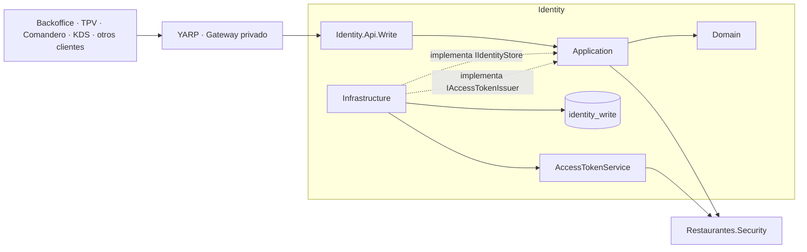
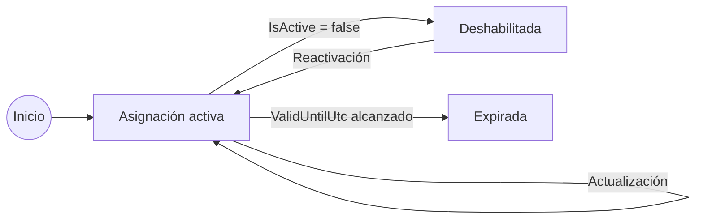
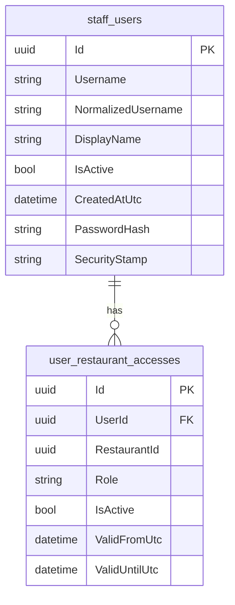
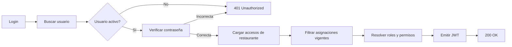
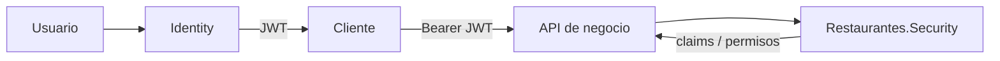

# Identity

El servicio **Identity** administra la identidad del personal de la plataforma Restaurantes: usuarios, credenciales, roles, asignaciones por restaurante y emisión de tokens JWT utilizados por el resto de los servicios protegidos.

Identity utiliza **ASP.NET Core Identity** sobre PostgreSQL y mantiene una única base operacional `identity_write`. El bounded context está separado en **Domain, Application, Infrastructure y Api.Write**. No utiliza actualmente CQRS, RabbitMQ, Outbox ni una proyección Read independiente.

## Responsabilidad del servicio

Identity es responsable de:

- autenticar usuarios mediante nombre de usuario y contraseña;
- emitir tokens JWT para usuarios autenticados;
- mantener usuarios del personal mediante ASP.NET Core Identity;
- mantener roles globales y asignaciones por restaurante;
- controlar la vigencia temporal de cada asignación;
- construir los claims de restaurante, rol y permisos incluidos en el token;
- crear usuarios de personal;
- asignar, modificar y deshabilitar accesos a restaurantes;
- mantener sincronizados los roles globales de ASP.NET Identity con las asignaciones activas;
- actualizar el `SecurityStamp` cuando cambia el acceso de un usuario;
- aplicar bloqueo temporal ante intentos fallidos de autenticación;
- inicializar roles y usuarios de desarrollo mediante seed;
- servir como emisor de identidad para los demás bounded contexts.

Identity **no administra restaurantes**, **no gestiona mesas**, **no crea pedidos**, **no captura pagos** y **no mantiene permisos funcionales propios de esos dominios**. Los permisos se definen en el building block `Restaurantes.Security` y se materializan como claims durante la emisión del token.

## Proyectos

El bounded context está dividido en cuatro proyectos:

```text
src/Services/Identity/
├── Restaurantes.Identity.Api.Write
├── Restaurantes.Identity.Application
├── Restaurantes.Identity.Domain
└── Restaurantes.Identity.Infrastructure
```

| Proyecto | Responsabilidad |
| --- | --- |
| `Restaurantes.Identity.Domain` | Entidades de usuario y asignación de acceso por restaurante. |
| `Restaurantes.Identity.Application` | Casos de uso de autenticación y administración de usuarios, contratos internos y abstracciones de persistencia/emisión de tokens. |
| `Restaurantes.Identity.Infrastructure` | ASP.NET Core Identity, EF Core, PostgreSQL, stores, JWT, migraciones y seed de desarrollo. |
| `Restaurantes.Identity.Api.Write` | Controller HTTP, autenticación/autorización, composición de dependencias e inicialización de la base. |

Identity no dispone actualmente de `Api.Read`, `Consumer`, `Publisher` ni un proyecto `Contracts` independiente.

Las consultas de identidad y las operaciones administrativas se sirven desde la misma API porque el servicio mantiene un único modelo operacional y no existe un caso de uso actual que justifique una proyección Read separada.

## Arquitectura interna



La dependencia principal sigue esta dirección:

```text
Domain
   ↑
Application
   ↑
Infrastructure
   ↑
Api.Write
```

`Application` utiliza además `Restaurantes.Security` para resolver permisos por rol. `Infrastructure` utiliza el mismo building block para la configuración de emisión JWT.

## Modelo de dominio

Identity mantiene dos tipos de dominio propios.

### `ApplicationUser`

`ApplicationUser` hereda de:

```text
IdentityUser<Guid>
```

y añade información operacional de la plataforma.

Campos propios relevantes:

- `DisplayName`;
- `IsActive`;
- `CreatedAtUtc`;
- `RestaurantAccesses`.

ASP.NET Core Identity mantiene además los datos técnicos de autenticación, entre ellos:

- `Id`;
- `UserName`;
- `NormalizedUserName`;
- `PasswordHash`;
- `SecurityStamp`;
- información de bloqueo;
- roles globales asociados al usuario.

Un usuario con `IsActive = false` no puede iniciar sesión aunque sus credenciales sean correctas.

### `UserRestaurantAssignment`

Representa el acceso de un usuario a un restaurante concreto.

Campos relevantes:

- `Id`;
- `UserId`;
- `RestaurantId`;
- `Role`;
- `IsActive`;
- `ValidFromUtc`;
- `ValidUntilUtc`.

La asignación se considera vigente cuando se cumple simultáneamente:

```text
IsActive = true
AND ValidFromUtc <= utcNow
AND (ValidUntilUtc IS NULL OR ValidUntilUtc > utcNow)
```



La deshabilitación no elimina físicamente la asignación. Una actualización posterior puede volver a activarla si las reglas del servicio lo permiten.

## Roles

Los roles aceptados actualmente son:

```text
Admin
Gerente
Contabilidad
Oficina
Manager
PosComandero
Kds
```

Identity distingue entre roles globales y roles operativos por restaurante.

### Roles globales

```text
Admin
Gerente
Contabilidad
Oficina
```

Estos roles se mantienen también mediante `RoleManager` / `UserManager` de ASP.NET Core Identity y aparecen como `ClaimTypes.Role` en el token.

Cuando se modifica o deshabilita una asignación, Identity recalcula qué roles globales deberían permanecer asociados al usuario según sus asignaciones activas.

### Roles de restaurante

Cada `UserRestaurantAssignment` conserva un `Role` para el restaurante asociado.

La implementación actual impide que un usuario mantenga simultáneamente roles diferentes entre sus asignaciones activas. Conceptualmente:

```text
Restaurante A -> Manager
Restaurante B -> Manager      válido

Restaurante A -> Manager
Restaurante B -> Kds          conflicto
```

Los roles:

```text
PosComandero
Kds
```

están limitados actualmente a **un único restaurante activo por usuario**.

`Manager`, `Admin`, `Gerente`, `Contabilidad` y `Oficina` pueden mantener asignaciones en más de un restaurante, respetando la regla de un único rol activo por usuario.

## Permisos por rol

Identity no codifica directamente la matriz de permisos. La obtiene de:

```text
Restaurantes.Security.RestaurantPermissions
```

Durante el login, cada asignación activa se transforma en los permisos definidos para su rol.

La matriz actual del building block incluye, entre otros:

| Rol | Alcance principal |
| --- | --- |
| `Admin` | Administración completa, identidad, sala, pedidos, pagos, caja, catálogo, KDS, dashboard e informes. |
| `Gerente` | Backoffice, dashboard, informes financieros y devoluciones. |
| `Contabilidad` | Backoffice, dashboard, informes financieros y devoluciones. |
| `Oficina` | Backoffice, dashboard e informes financieros/marketing. |
| `Manager` | Operación y administración local del restaurante, incluyendo sala, pedidos, captura de pagos, caja, catálogo y KDS. |
| `PosComandero` | Operación de sala/pedidos, pagos y caja. |
| `Kds` | Uso del KDS. |

La autorización efectiva de cada bounded context continúa realizándose en el propio servicio mediante los claims incluidos en el JWT.

## Persistencia

Identity utiliza PostgreSQL mediante EF Core y ASP.NET Core Identity.

Base lógica:

```text
identity_write
```

DbContext:

```text
IdentityWriteDbContext
```

El contexto deriva de:

```text
IdentityDbContext<ApplicationUser, IdentityRole<Guid>, Guid>
```

### Tablas

Las tablas principales utilizadas actualmente son:

```text
staff_users
identity_roles
identity_user_roles
identity_user_claims
identity_role_claims
identity_user_logins
identity_user_tokens
user_restaurant_accesses
```

`staff_users` sustituye el nombre convencional de la tabla de usuarios de ASP.NET Core Identity.

`user_restaurant_accesses` contiene las asignaciones funcionales de cada usuario a restaurantes.

### Relación principal



Existe una restricción única sobre:

```text
UserId + RestaurantId
```

Por tanto, un usuario puede mantener como máximo una asignación persistida por restaurante. Los cambios posteriores actualizan esa misma asignación.

También existe unicidad sobre el nombre de usuario normalizado.

### `RestaurantId`

`RestaurantId` es una referencia lógica hacia RestaurantOperations.

Identity no mantiene una foreign key hacia la base de datos de RestaurantOperations y no comparte su esquema. Esto evita acoplamiento físico entre bounded contexts.

## Store de identidad

`IdentityStore` implementa:

```text
IIdentityStore
```

y encapsula el acceso de Application a:

- `UserManager<ApplicationUser>`;
- `SignInManager<ApplicationUser>`;
- `RoleManager<IdentityRole<Guid>>`;
- `IdentityWriteDbContext`.

Entre sus responsabilidades están:

- localizar usuarios por nombre o identificador;
- verificar contraseñas;
- cargar asignaciones de restaurante;
- consultar y modificar roles;
- crear usuarios;
- consultar y mantener asignaciones;
- sincronizar cambios mediante EF Core;
- actualizar `SecurityStamp`;
- abrir transacciones explícitas para operaciones compuestas.

Application no depende directamente de EF Core ni de ASP.NET Core Identity.

## Autenticación

Endpoint:

```http
POST /api/identity/login
Content-Type: application/json
```

Request:

```json
{
  "username": "usuario",
  "password": "contraseña"
}
```

El endpoint está marcado como `[AllowAnonymous]`.

El flujo actual es:



Se rechaza el login cuando:

- `Username` está vacío;
- `Password` está vacío;
- el usuario no existe;
- `IsActive` es `false`;
- la contraseña es incorrecta;
- ASP.NET Core Identity mantiene al usuario bloqueado.

Los errores de credenciales no distinguen públicamente entre usuario inexistente y contraseña incorrecta.

## JWT

La emisión se realiza mediante:

```text
IAccessTokenIssuer
    ↓
AccessTokenService
```

El token utiliza firma simétrica:

```text
HMAC SHA-256
```

Configuración principal:

```text
Security:Issuer
Security:Audience
Security:SigningKey
Security:AccessTokenMinutes
```

El tiempo de expiración configurado actualmente en desarrollo es:

```text
480 minutos
```

### Claims base

Cada token incluye:

```text
sub
ClaimTypes.NameIdentifier
ClaimTypes.Name
preferred_username
jti
security_stamp
```

Los roles globales se añaden mediante:

```text
ClaimTypes.Role
```

### Claims por restaurante

Para cada asignación vigente se añaden:

```text
restaurant_id
restaurant_role
restaurant_permission
```

El formato utilizado para el rol de restaurante es:

```text
{restaurantId:N}:{role}
```

Los permisos se representan como:

```text
{restaurantId:N}:{permission}
```

Ejemplo conceptual:

```text
restaurant_id         = 1111...
restaurant_role       = 1111...:Manager
restaurant_permission = 1111...:orders.create
restaurant_permission = 1111...:payments.capture
```

De esta forma cada API puede resolver autorización localmente a partir del JWT sin consultar Identity en cada request.

## SecurityStamp y vigencia de tokens

Cuando se modifica o deshabilita una asignación, Identity ejecuta:

```text
UpdateSecurityStampAsync
```

El nuevo `SecurityStamp` se incluye en los tokens emitidos posteriormente.

La validación JWT compartida comprueba actualmente:

- firma;
- issuer;
- audience;
- expiración.

La validación normal de cada request **no consulta `identity_write` para comparar el `security_stamp` del token con el valor actual del usuario**. Por tanto, un JWT ya emitido continúa siendo criptográficamente válido hasta su expiración aunque una asignación haya cambiado después de su emisión.

## Consulta del usuario actual

Endpoint:

```http
GET /api/identity/me
Authorization: Bearer <token>
```

Devuelve información obtenida directamente de los claims del token:

```text
id
display name
globalRoles
restaurants
```

No realiza una consulta adicional a `identity_write`.

## Administración de usuarios

Las operaciones administrativas se concentran en:

```text
IdentityController
```

La API completa utiliza:

```text
[Authorize]
```

salvo el endpoint de login.

### Listar usuarios

```http
GET /api/identity/users
Authorization: Bearer <token>
```

La implementación actual exige un actor `Admin`.

La respuesta incluye:

- identificador;
- username;
- display name;
- estado activo;
- fecha de creación;
- asignaciones visibles por restaurante.

### Crear usuario

```http
POST /api/identity/users
Authorization: Bearer <token>
Content-Type: application/json
```

Request conceptual:

```json
{
  "username": "usuario",
  "displayName": "Nombre visible",
  "password": "contraseña-segura",
  "restaurantId": "00000000-0000-0000-0000-000000000000",
  "role": "Manager"
}
```

Validaciones de Application:

```text
Username    -> 3..80 caracteres
DisplayName -> 1..120 caracteres
Password    -> mínimo 10 caracteres
Role        -> debe pertenecer a AllowedRoles
```

Además:

- el actor debe poder administrar el restaurante objetivo;
- el username no puede existir previamente;
- la creación del usuario y su asignación inicial se ejecutan dentro de una transacción;
- si corresponde a un rol global, se crea/asigna también el rol de ASP.NET Core Identity;
- la asignación comienza activa;
- `ValidFromUtc` comienza con la hora UTC actual.

La operación correcta devuelve `201 Created`.

La respuesta utiliza actualmente como `Location`:

```text
/api/identity/users/{userId}
```

El controller actual no expone un endpoint `GET` individual por esa misma ruta.

## Asignar un restaurante

```http
POST /api/identity/users/{userId}/restaurants
Authorization: Bearer <token>
Content-Type: application/json
```

Request:

```json
{
  "restaurantId": "00000000-0000-0000-0000-000000000000",
  "role": "Manager",
  "validFromUtc": null,
  "validUntilUtc": null
}
```

Internamente reutiliza el mismo flujo utilizado para actualizar una asignación.

Si ya existe una asignación para ese usuario/restaurante, la implementación actual actualiza la asignación existente en lugar de crear una segunda fila.

## Actualizar una asignación

```http
PUT /api/identity/users/{userId}/restaurants/{restaurantId}
Authorization: Bearer <token>
Content-Type: application/json
```

Request:

```json
{
  "role": "Manager",
  "isActive": true,
  "validFromUtc": null,
  "validUntilUtc": null
}
```

Reglas principales:

- el actor debe poder administrar el restaurante;
- el rol debe ser válido;
- `ValidUntilUtc`, cuando existe, debe ser posterior a `ValidFromUtc`;
- el usuario debe existir;
- las asignaciones activas de un mismo usuario no pueden utilizar roles diferentes;
- `PosComandero` y `Kds` no pueden mantenerse activos en más de un restaurante;
- si la asignación no existe, se crea;
- si ya existe, se actualiza;
- los roles globales se sincronizan después del cambio;
- se actualiza el `SecurityStamp` del usuario.

## Deshabilitar una asignación

```http
DELETE /api/identity/users/{userId}/restaurants/{restaurantId}
Authorization: Bearer <token>
```

La operación realiza una deshabilitación lógica:

```text
IsActive = false
```

No elimina la fila de `user_restaurant_accesses`.

Después del cambio:

- se sincronizan los roles globales;
- se actualiza el `SecurityStamp`;
- la respuesta correcta es `204 No Content`.

## Autorización administrativa

`IdentityController` construye un `IdentityActor` a partir del usuario autenticado.

El actor mantiene:

```text
IsAdmin
ManageableRestaurantIds
```

Los `ManageableRestaurantIds` se obtienen de los claims `restaurant_id` para los que el usuario puede resolver:

```text
identity.manage
```

La implementación actual de `IdentityActor.CanManage` exige además:

```text
IsAdmin = true
```

Por tanto, las operaciones de creación y mantenimiento de usuarios están restringidas actualmente a administradores y al conjunto de restaurantes presentes en su contexto administrable.

## ASP.NET Core Identity

Infrastructure configura:

```text
AddIdentityCore<ApplicationUser>()
AddRoles<IdentityRole<Guid>>()
AddEntityFrameworkStores<IdentityWriteDbContext>()
AddSignInManager()
AddDefaultTokenProviders()
```

Configuración explícita relevante:

```text
RequireUniqueEmail = false
Password.RequiredLength = 10
Lockout.MaxFailedAccessAttempts = 5
Lockout.DefaultLockoutTimeSpan = 15 minutos
```

La comprobación de contraseña utiliza:

```text
CheckPasswordSignInAsync(..., lockoutOnFailure: true)
```

por lo que los intentos fallidos participan en la política de bloqueo de ASP.NET Core Identity.

## API Write

URL local:

```text
http://localhost:5106
```

Ruta base:

```text
/api/identity
```

| Método | Ruta | Autenticación | Propósito |
| --- | --- | --- | --- |
| `POST` | `/api/identity/login` | Anónimo | Autenticar y emitir JWT. |
| `GET` | `/api/identity/me` | JWT | Consultar identidad y restaurantes presentes en el token. |
| `GET` | `/api/identity/users` | JWT / Admin | Listar usuarios. |
| `POST` | `/api/identity/users` | JWT / Admin | Crear usuario y asignación inicial. |
| `POST` | `/api/identity/users/{userId}/restaurants` | JWT / Admin | Crear o actualizar acceso a un restaurante. |
| `PUT` | `/api/identity/users/{userId}/restaurants/{restaurantId}` | JWT / Admin | Modificar rol, estado o vigencia. |
| `DELETE` | `/api/identity/users/{userId}/restaurants/{restaurantId}` | JWT / Admin | Deshabilitar acceso al restaurante. |

`IdentityController` delega la lógica funcional en `IdentityService`. El controller se limita principalmente a resolver el actor autenticado y traducir `IdentityResult` a respuestas HTTP.

## Gateways

El gateway privado mantiene una ruta YARP para:

```text
/api/identity/{**catch-all}
```

con destino local:

```text
http://localhost:5106
```

El gateway público actual no expone una ruta general hacia Identity.

Por tanto, las operaciones de Identity forman parte principalmente de la superficie privada de la plataforma.

## Seguridad

La API registra:

```text
Restaurantes.Security
```

mediante:

```text
AddRestaurantSecurity(configuration)
```

La validación JWT compartida exige:

```text
ValidateIssuer = true
ValidateAudience = true
ValidateIssuerSigningKey = true
ValidateLifetime = true
ClockSkew = 30 segundos
```

La clave de firma debe contener al menos 32 bytes según la validación del building block de seguridad.

### Contraseñas

Las contraseñas no se almacenan directamente por Identity. ASP.NET Core Identity mantiene `PasswordHash` y realiza la verificación mediante `UserManager` / `SignInManager`.

Los requests de login no deben registrarse con su contraseña en logs.

### Signing key

El entorno de desarrollo contiene una clave de firma específica para desarrollo en `appsettings.Development.json`.

En entornos productivos `Security:SigningKey` debe suministrarse mediante configuración segura del entorno o un gestor de secretos, no mediante secretos reales versionados en el repositorio.

### Refresh tokens

La implementación actual emite únicamente un access token JWT.

No existe actualmente:

```text
refresh token
refresh endpoint
token rotation
```

La renovación se realiza mediante un nuevo login.

## Seed de desarrollo

Durante el arranque se ejecuta siempre:

```text
Database.MigrateAsync()
```

El seed se ejecuta únicamente cuando:

```text
ASPNETCORE_ENVIRONMENT = Development
```

`IdentitySeed` crea, cuando faltan:

- los roles soportados por la aplicación;
- usuarios de administración/oficina;
- managers por restaurante;
- usuarios de camarero/TPV-Comandero;
- usuarios compartidos de KDS;
- asignaciones hacia los restaurantes de desarrollo predefinidos.

Las credenciales del seed son únicamente datos de desarrollo y no forman parte del mecanismo de aprovisionamiento productivo.

## Relación con otros servicios

### Identity → resto de APIs

Identity emite el JWT que los demás servicios validan mediante `Restaurantes.Security`.



Las APIs de negocio no necesitan consultar `identity_write` para autorizar cada request.

### RestaurantOperations

Identity conserva `RestaurantId` como identificador externo, pero no accede a la base de RestaurantOperations y no mantiene foreign keys entre bases.

La API actual tampoco realiza una consulta HTTP a RestaurantOperations durante la creación o modificación de una asignación.

### Backoffice

Backoffice es el consumidor natural de las operaciones administrativas de usuarios y asignaciones.

Los demás clientes utilizan principalmente el login y el JWT resultante para operar contra sus respectivos servicios.

## Configuración

### Base de datos

```text
ConnectionStrings:IdentityWrite
```

Configuración local actual:

```text
Host=localhost
Port=5432
Database=identity_write
```

### Seguridad

```json
{
  "Security": {
    "Issuer": "Restaurantes.Identity",
    "Audience": "Restaurantes",
    "SigningKey": "...",
    "AccessTokenMinutes": 480
  }
}
```

La configuración `Security` debe coincidir con la utilizada por las APIs consumidoras para validar issuer, audience y firma.

## Migraciones

Las migraciones EF Core pertenecen a:

```text
Restaurantes.Identity.Infrastructure/Persistence/Migrations
```

El contexto de diseño es:

```text
IdentityWriteDbContextFactory
```

La evolución actual incluye migraciones para:

```text
InitialIdentityWrite
MigrateToAspNetCoreIdentity
BackfillIdentityUserStamps
```

La API ejecuta actualmente las migraciones automáticamente durante el arranque.

Ejemplo de creación de una migración desde la raíz de la solución:

```bash
dotnet ef migrations add NombreMigracion \
  --project src/Services/Identity/Restaurantes.Identity.Infrastructure \
  --startup-project src/Services/Identity/Restaurantes.Identity.Api.Write \
  --context IdentityWriteDbContext
```

## Desarrollo local

URL configurada:

```text
http://localhost:5106
```

Base local:

```text
identity_write
```

Dependencias principales:

```text
PostgreSQL
Restaurantes.Security
Restaurantes.ServiceDefaults
```

Identity no depende actualmente de RabbitMQ para su funcionamiento.

Antes de utilizar herramientas .NET locales:

```bash
dotnet tool restore
```

El proyecto incluye además:

```text
Restaurantes.Identity.Api.Write.http
```

con ejemplos de login y consulta de `/api/identity/me` para desarrollo.

## Health checks

`Identity.Api.Write` utiliza `Restaurantes.ServiceDefaults`.

La API registra los endpoints de salud comunes de la solución:

```text
/health
/alive
```

`/health` representa la comprobación general configurada por la plataforma y `/alive` permite comprobar que el proceso se encuentra activo.

## Decisiones de diseño

### Un único modelo operacional

Identity no utiliza una base `identity_read` ni una API Read independiente porque las consultas actuales son pequeñas y forman parte del mismo modelo transaccional de usuarios y accesos.

Crear una segunda persistencia únicamente por simetría con Orders o Catalog añadiría consistencia eventual e infraestructura sin un caso de uso actual que lo requiera.

### ASP.NET Core Identity como infraestructura

Application no depende directamente de `UserManager`, `RoleManager`, `SignInManager` ni EF Core.

Esas dependencias quedan encapsuladas por:

```text
IIdentityStore
```

Esto evita que los casos de uso queden acoplados directamente a la implementación de persistencia/autenticación.

### JWT autocontenido

Los permisos necesarios para autorizar operaciones se incluyen en el token.

Esto favorece:

- autorización local en cada servicio;
- ausencia de llamadas síncronas a Identity en el camino crítico;
- menor acoplamiento temporal entre bounded contexts.

Como contrapartida, los cambios de permisos no invalidan instantáneamente un JWT ya emitido con la implementación actual.

### Asignaciones separadas de los roles de ASP.NET Identity

`UserRestaurantAssignment` conserva el acceso funcional por restaurante.

Los roles de ASP.NET Core Identity se utilizan especialmente para los roles globales, mientras los claims de restaurante materializan el contexto operativo que consumen los demás servicios.

Esto permite representar acceso por restaurante sin crear un sistema de roles de ASP.NET Identity diferente por cada local.

### Sin mensajería propia

Identity no publica actualmente eventos hacia RabbitMQ y tampoco consume eventos de otros bounded contexts.

Por ello no necesita:

```text
Consumer
Publisher
Outbox
Inbox
```

La integración principal con el resto de la plataforma se realiza mediante los JWT emitidos.

### Una API con Controllers

Identity utiliza Controllers ASP.NET Core y mantiene el `Program.cs` dedicado a:

- registrar `ServiceDefaults`;
- registrar Application/Infrastructure;
- registrar seguridad;
- registrar Controllers;
- inicializar la base;
- configurar autenticación/autorización;
- mapear endpoints.

La lógica funcional se mantiene fuera del archivo de arranque.

## Despliegue y escalado

Identity tiene actualmente un único proceso ejecutable:

```text
Restaurantes.Identity.Api.Write
```

Ese proceso contiene:

- API HTTP;
- autenticación;
- emisión JWT;
- acceso a PostgreSQL;
- inicialización de migraciones.

La persistencia pertenece exclusivamente a:

```text
identity_write
```

En un entorno distribuido, Identity puede desplegarse de forma independiente del resto de los servicios siempre que las APIs consumidoras compartan la configuración necesaria para validar los JWT emitidos.

La solución no depende de un proveedor cloud específico. Identity requiere fundamentalmente:

- runtime .NET;
- PostgreSQL;
- configuración segura para la clave de firma;
- conectividad HTTP desde los clientes o gateway que utilicen el servicio.
