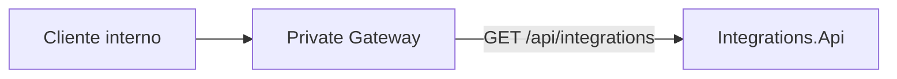

# Integrations

`Integrations` es el punto de extensión reservado para conexiones con proveedores y sistemas externos. La implementación actual es deliberadamente pequeña: expone un endpoint descriptivo y la infraestructura común de health checks, pero todavía no contiene adaptadores reales, webhooks ni persistencia.

## Responsabilidad del servicio

El servicio delimita el lugar donde podrán incorporarse integraciones como:

- proveedores externos;
- webhooks de entrada o salida;
- plataformas de delivery;
- otros sistemas que no pertenecen al núcleo de los bounded contexts.

Las capacidades devueltas actualmente por la API son etiquetas descriptivas:

```text
providers
webhooks
delivery
```

No representan integraciones productivas ya implementadas.

## Proyecto

```text
src/Services/Integrations/
└── Restaurantes.Integrations.Api
    ├── Controllers/
    │   └── IntegrationsController.cs
    ├── Properties/
    │   └── launchSettings.json
    ├── Program.cs
    └── Restaurantes.Integrations.Api.csproj
```

Integrations conserva un único proyecto porque su funcionalidad actual no justifica crear capas, contratos, persistencia, consumers o publishers vacíos. Si se añaden casos de uso y adaptadores reales, la estructura deberá evolucionar según esas necesidades.

## Arquitectura actual



`Program.cs` se limita a:

- registrar `ServiceDefaults`;
- registrar Controllers;
- configurar los endpoints compartidos;
- mapear Controllers.

La API no utiliza Minimal APIs para su endpoint de negocio.

## API

URL local:

```text
http://localhost:5107
```

Endpoint disponible:

```http
GET /api/integrations
```

Respuesta actual:

```json
{
  "service": "Integrations",
  "capabilities": [
    "providers",
    "webhooks",
    "delivery"
  ]
}
```

Este endpoint sirve únicamente para identificar el servicio y sus áreas previstas.

## Gateway

El **Private Gateway** enruta:

```text
/api/integrations/{**catch-all}
```

hacia `http://localhost:5107` en desarrollo local.

Actualmente no existe una ruta equivalente en el Public Gateway. Cualquier webhook público futuro deberá publicarse de forma explícita y aplicar sus propias medidas de autenticación, validación de firma, idempotencia y limitación de tráfico.

## Seguridad

El endpoint descriptivo actual no requiere autenticación dentro del servicio, aunque normalmente se alcanza a través del gateway privado.

Esto no define la política de seguridad de futuras integraciones. Cada proveedor deberá tener una estrategia explícita, por ejemplo:

- firma del payload;
- secreto o credencial por proveedor;
- protección frente a replay;
- idempotencia;
- validación estricta del origen y contenido.

## Persistencia y mensajería

La implementación actual:

- no tiene base de datos propia;
- no utiliza Entity Framework Core;
- no publica eventos;
- no consume RabbitMQ;
- no tiene Outbox ni Inbox.

Estas piezas solo deberían añadirse cuando una integración concreta necesite conservar estado o comunicarse de forma asíncrona. No se crean por simetría con otros servicios.

## Health checks

`Restaurantes.ServiceDefaults` expone:

```http
GET /health
GET /alive
```

En el estado actual únicamente comprueban que el proceso está disponible, ya que no existen dependencias externas registradas por Integrations.

## Desarrollo local

El servicio forma parte de `Restaurantes.slnx` y dispone de un perfil dentro de `Restaurantes.slnLaunch`.

Puede iniciarse directamente con:

```bash
dotnet run --project src/Services/Integrations/Restaurantes.Integrations.Api
```

## Decisiones de diseño

### Un único proyecto por ahora

El tamaño y las responsabilidades actuales no justifican una separación artificial en Domain, Application o Infrastructure.

### Controllers para APIs de negocio

`IntegrationsController` mantiene la misma convención de entrada HTTP utilizada por las demás APIs de negocio. `Program.cs` queda reservado para composición, middleware y mapeo de endpoints.

### Sin contratos anticipados

Los contratos, adaptadores y eventos deberán aparecer con la primera integración real. Definirlos antes de conocer los requisitos del proveedor produciría abstracciones especulativas.

### Exposición pública explícita

El servicio solo está enrutado actualmente por el gateway privado. Una integración que necesite recibir tráfico público deberá añadir una ruta específica y controles de seguridad adecuados, en lugar de publicar el servicio completo de forma implícita.
