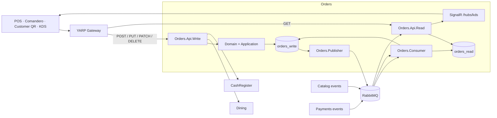
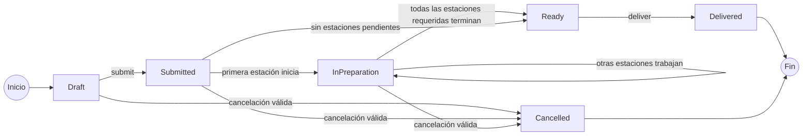
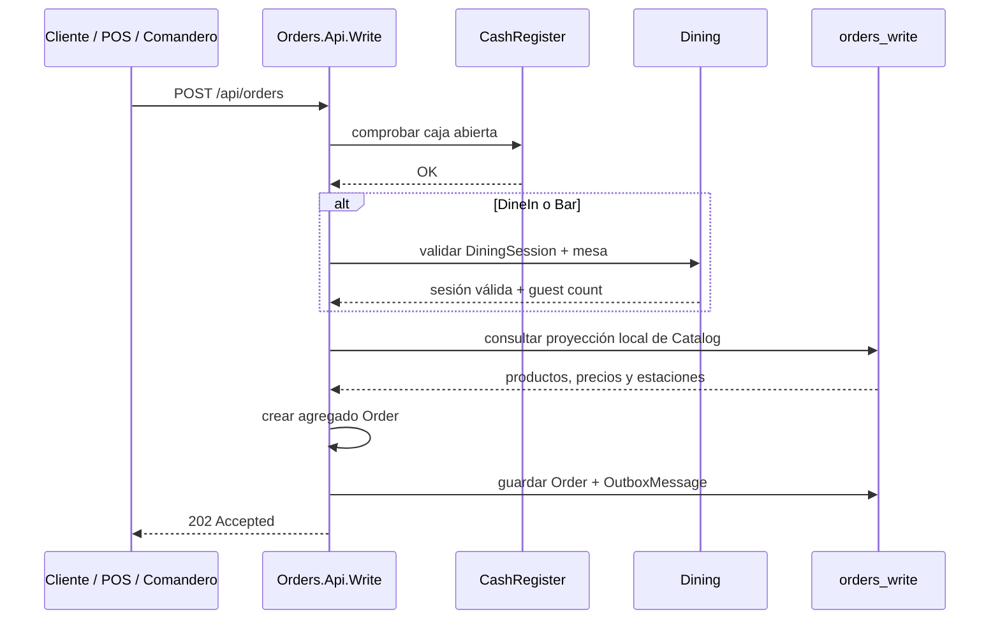
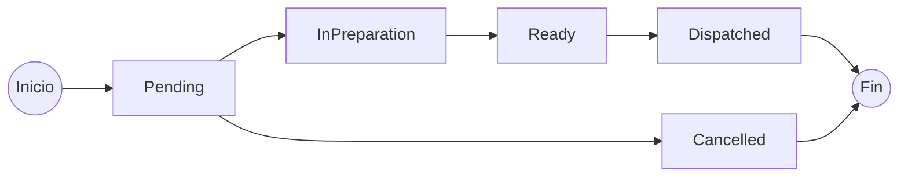
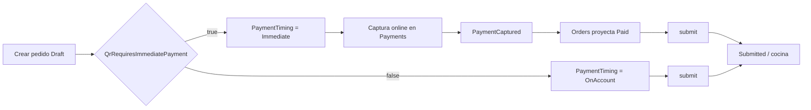
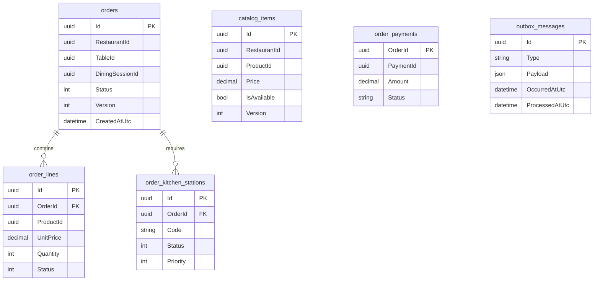
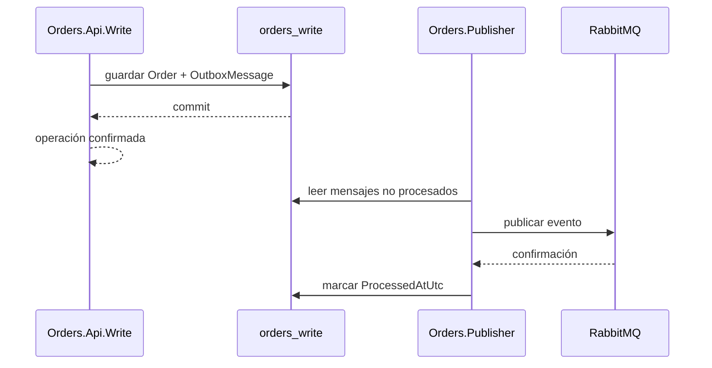

# Orders

El servicio **Orders** gestiona el ciclo de vida de los pedidos dentro de la plataforma Restaurantes: creación, validación de líneas, envío a cocina, preparación por estaciones, despacho, entrega y cancelaciones operativas.

Forma parte de los bounded contexts con separación explícita **Read / Write**. La escritura mantiene el estado transaccional del pedido y sus reglas de negocio; la lectura se alimenta de eventos y mantiene una proyección optimizada para KDS y consultas operativas.

## Responsabilidad del servicio

Orders es responsable de:

- crear pedidos a partir de productos disponibles en el catálogo del restaurante;
- validar el origen, modalidad de servicio y forma temporal de pago;
- asociar pedidos de sala a una sesión de mesa válida;
- impedir operaciones de pedido cuando la caja del restaurante está cerrada;
- mantener el agregado `Order` y sus invariantes de dominio;
- separar las líneas por estación de preparación;
- controlar el ciclo de preparación y despacho de cada estación;
- controlar el estado global del pedido;
- validar restricciones relacionadas con pagos antes de determinadas transiciones;
- publicar eventos de integración mediante Transactional Outbox;
- mantener una proyección de lectura específica para KDS;
- distribuir actualizaciones del KDS en tiempo real mediante SignalR.

Orders **no es propietario** del catálogo, de las sesiones de sala, de los pagos ni de la caja. Esos datos pertenecen a otros servicios y Orders consume únicamente la información necesaria mediante HTTP o eventos.

## Proyectos

El bounded context está dividido en ocho proyectos:

```text
src/Services/Orders/
├── Restaurantes.Orders.Api.Read
├── Restaurantes.Orders.Api.Write
├── Restaurantes.Orders.Application
├── Restaurantes.Orders.Consumer
├── Restaurantes.Orders.Contracts
├── Restaurantes.Orders.Domain
├── Restaurantes.Orders.Infrastructure
└── Restaurantes.Orders.Publisher
```

| Proyecto | Responsabilidad |
| --- | --- |
| `Restaurantes.Orders.Domain` | Agregado `Order`, líneas, estaciones de cocina, estados e invariantes. |
| `Restaurantes.Orders.Application` | Casos de uso y puertos necesarios por el dominio. |
| `Restaurantes.Orders.Contracts` | Requests, responses y eventos de integración. |
| `Restaurantes.Orders.Infrastructure` | EF Core, PostgreSQL, stores, proyecciones locales e integración HTTP con Dining. |
| `Restaurantes.Orders.Api.Write` | Comandos y transiciones del pedido. |
| `Restaurantes.Orders.Api.Read` | Consultas operativas y hub SignalR del KDS. |
| `Restaurantes.Orders.Publisher` | Publicación de eventos pendientes desde Outbox hacia RabbitMQ. |
| `Restaurantes.Orders.Consumer` | Proyecciones de Catalog, Payments y KDS. |

## Arquitectura interna



La API de escritura y la API de lectura son procesos independientes. En los gateways, las peticiones `GET` se dirigen a `Orders.Api.Read`, mientras que los métodos de modificación se dirigen a `Orders.Api.Write`.

## Modelo de dominio

El agregado principal es `Order`.

Un pedido contiene:

- restaurante;
- mesa y sesión de sala cuando corresponde;
- número de comensales obtenido desde Dining;
- origen del pedido;
- modalidad de servicio;
- modalidad temporal del pago;
- líneas de pedido;
- estaciones de preparación afectadas;
- estado global;
- versión de concurrencia;
- timestamps del ciclo de vida.

### Estados



Estados definidos:

| Estado | Significado |
| --- | --- |
| `Draft` | Pedido creado pero todavía no enviado a cocina. |
| `Submitted` | Pedido aceptado para procesamiento operativo. |
| `InPreparation` | Al menos una estación está preparando el pedido. |
| `Ready` | Las estaciones necesarias han completado su trabajo y despacho. |
| `Delivered` | Pedido entregado. |
| `Cancelled` | Pedido cancelado mediante un flujo permitido. |

El agregado mantiene un campo `Version` utilizado como **concurrency token** por EF Core. Dos KDS que intenten modificar el mismo pedido simultáneamente pueden producir un conflicto de concurrencia en lugar de sobrescribir silenciosamente el estado del otro.

## Origen, modalidad de servicio y pago

Orders no permite combinaciones arbitrarias. El dominio valida explícitamente las combinaciones actualmente soportadas.

| Origen | Servicio | Pago | Permitido |
| --- | --- | --- | :---: |
| Customer QR | Dine-in | Immediate | Sí |
| Customer QR | Dine-in | OnAccount | Sí |
| Waiter Mobile | Dine-in | OnAccount | Sí |
| POS | Dine-in | OnAccount | Sí |
| POS | Bar | OnAccount | Sí |
| POS | Takeaway | Immediate | Sí |
| POS | Takeaway | OnAccount | Sí |

Las demás combinaciones se rechazan en el dominio.

En Customer QR, `Immediate` y `OnAccount` son ambas combinaciones válidas porque la elección depende de la política de Dining para el restaurante:

```text
QrRequiresImmediatePayment = true  -> Customer QR crea el pedido como Immediate
QrRequiresImmediatePayment = false -> Customer QR crea el pedido como OnAccount
```

El PWA Customer QR obtiene ese flag al abrir o recuperar la sesión en Dining. Orders conserva ambas modalidades y aplica las reglas correspondientes al `PaymentTiming` recibido.

### Reglas de ubicación

`DineIn` y `Bar` requieren:

- `TableId`;
- `DiningSessionId`;
- `TableLabel`;
- una sesión abierta y válida en Dining.

`Takeaway`:

- no puede referenciar mesa ni sesión de Dining;
- requiere `CustomerName`;
- puede operar con pago inmediato o a cuenta según el flujo del POS.

## Creación de un pedido



### Catálogo local

Orders no consulta Catalog mediante HTTP para cada pedido.

El consumer mantiene dentro de `orders_write` una proyección local de:

- productos disponibles;
- nombre del producto;
- precio;
- categoría;
- estación de preparación;
- configuración de la estación;
- disponibilidad;
- versión del dato recibido.

Esta decisión reduce el acoplamiento temporal entre Orders y Catalog durante la creación del pedido. Catalog sigue siendo el propietario del dato; Orders conserva únicamente la información necesaria para ejecutar su propio dominio.

Los precios y nombres que se incorporan a las líneas quedan almacenados como **snapshot del momento del pedido**, por lo que un cambio posterior en Catalog no modifica retroactivamente pedidos existentes.

## Cocina multiestación

Cada línea contiene una estación de preparación. Al crear el pedido, las líneas se agrupan por `PreparationStationCode` y se generan entidades `OrderKitchenStation`.

Ejemplo conceptual:

```text
Pedido #123
├── COCINA
│   ├── Hamburguesa
│   └── Patatas
├── BAR
│   └── Cerveza
└── POSTRES
    └── Tarta
```

Cada estación mantiene su propio ciclo:



### Despacho primario

Una estación puede declarar `RequiresPrimaryDispatch`.

- Si es `false`, la estación se despacha automáticamente al marcarse como `Ready`.
- Si es `true`, necesita una transición explícita `dispatch`.
- Las estaciones con despacho explícito respetan `Priority`.
- Una estación de mayor prioridad numérica no puede despacharse antes que otra pendiente con prioridad anterior.

Esto permite modelar un **pase de cocina** donde determinados componentes deben coordinarse antes de considerar completo el pedido.

El código `CHEF` está reservado para la vista global del KDS y no puede utilizarse como estación real de preparación de productos.

## Pagos

Orders consume eventos de Payments y mantiene una proyección mínima en `order_payments`.

Estados utilizados actualmente:

- `Paid`;
- `Refunded`.

La proyección permite aplicar reglas operativas sin consultar de forma síncrona la base de Payments.

Reglas actuales:

- un pedido `Immediate` debe estar pagado antes de enviarse a cocina;
- un `Takeaway` debe estar pagado antes de entregarse al cliente;
- una línea de un pedido pagado no puede cancelarse mediante el flujo operativo normal;
- un takeaway pagado debe haber sido reembolsado antes de poder cancelarse.

Los reembolsos completos y otros procesos administrativos pertenecen al flujo de Backoffice / Payments, no al agregado Orders.

### Customer QR y pago configurable

Para pedidos `CustomerQr`, el flujo depende de `QrRequiresImmediatePayment`:



Cuando el pedido es `Immediate`, `SubmitAsync` consulta la proyección local de pagos y rechaza el envío a cocina mientras el pedido no figure como pagado. Cuando es `OnAccount`, no existe esa precondición de captura inmediata y el pedido puede incorporarse a la cuenta de la sesión.

La sesión Customer QR y su `X-Customer-Session-Token` se vuelven a validar contra Dining al ejecutar `submit`.

## Caja

La creación y el envío del pedido verifican de forma síncrona que la caja del restaurante se encuentre abierta.

Esto impide generar actividad operacional cuando el restaurante no dispone de una sesión de caja válida.

Orders no mantiene el estado maestro de caja; la comprobación se realiza contra **CashRegister**.

## Persistencia

Orders utiliza dos bases de datos PostgreSQL lógicamente independientes:

```text
orders_write
orders_read
```

En desarrollo ambas pueden ejecutarse dentro de la misma instancia PostgreSQL. La separación es lógica desde el inicio y puede convertirse en separación física en cloud cuando la carga lo justifique.

### `orders_write`

Es la fuente de verdad transaccional del servicio.

| Tabla | Función |
| --- | --- |
| `orders` | Agregado principal y estado global. |
| `order_lines` | Líneas y snapshots de producto. |
| `order_kitchen_stations` | Estado de cada estación involucrada en el pedido. |
| `catalog_items` | Proyección local de productos de Catalog. |
| `kitchen_station_configurations` | Proyección local de estaciones configuradas en Catalog. |
| `order_payments` | Proyección mínima de pagos y reembolsos. |
| `outbox_messages` | Eventos pendientes o ya publicados por Transactional Outbox. |

Relaciones principales:



### `orders_read`

Está optimizada para consultas operativas del KDS.

| Tabla | Función |
| --- | --- |
| `kitchen_order_views` | Proyección desnormalizada de pedidos, líneas y estaciones. |
| `inbox_messages` | Registro de mensajes procesados para idempotencia. |

Las líneas y estaciones se almacenan en la proyección mediante columnas JSONB, evitando reconstruir el agregado transaccional para cada consulta del KDS.

## Transactional Outbox

Cada cambio relevante del agregado se guarda junto con su evento en `outbox_messages` dentro del mismo `DbContext` y la misma operación de persistencia.



El objetivo es evitar el escenario clásico en el que el pedido se confirma en PostgreSQL pero el proceso cae antes de publicar el evento correspondiente.

`Orders.Publisher` publica lotes de hasta 50 mensajes pendientes y conserva información de error cuando una publicación falla.

## Inbox e idempotencia

La proyección KDS utiliza `inbox_messages` y el `MessageId` de RabbitMQ para detectar mensajes ya procesados.

Un evento repetido no vuelve a aplicar la mutación de la proyección si su identificador ya se encuentra registrado.

Además, `kitchen_order_views` mantiene la versión del pedido y solo aplica una proyección cuando la versión recibida es superior a la ya almacenada.

Esto combina:

- deduplicación por mensaje;
- control de versión del agregado;
- procesamiento compatible con entrega al menos una vez.

## Eventos de integración

### Eventos publicados

Orders publica los siguientes eventos de integración:

| Evento | Routing key |
| --- | --- |
| `OrderCreated` | `order.created.v1` |
| `OrderSubmitted` | `order.submitted.v1` |
| `KitchenTicketPreparationStarted` | `order.preparation-started.v1` |
| `KitchenTicketReady` | `kitchen-ticket.updated.v1` |
| `KitchenTicketDispatched` | `kitchen-ticket.updated.v1` |
| `OrderReady` | `order.ready.v1` |
| `OrderDelivered` | `order.delivered.v1` |
| `OrderLineCancelled` | `order.line-cancelled.v1` |
| `OrderCancelled` | `order.cancelled.v1` |
| `KdsOrderUpdated` | `kds.order.updated.v1` |

### Eventos consumidos

Orders mantiene proyecciones locales a partir de eventos de otros dominios:

| Servicio origen | Evento | Destino local |
| --- | --- | --- |
| Catalog | `CatalogItemChanged` | `catalog_items` |
| Catalog | `KitchenStationChanged` | `kitchen_station_configurations` |
| Payments | `PaymentCaptured` | `order_payments` |
| Payments | `PaymentRefunded` | `order_payments` |

## RabbitMQ

Exchange principal:

```text
orders.events
```

Queues propias relevantes:

| Queue | Uso |
| --- | --- |
| `orders.kds.read-model` | Construcción de la proyección KDS. |
| `orders.kds.signalr` | Notificaciones en tiempo real hacia la API Read. |
| `orders.kds.read-model.dead-letter` | Mensajes de Orders que no pueden procesarse correctamente. |

Queues de integración utilizadas para consumir eventos externos:

```text
catalog.orders-integration
payments.orders-integration
```

Los eventos publicados por Orders pueden ser consumidos por otros bounded contexts, por ejemplo Payments y Reporting.

## Proyección KDS

`KdsProjectionWorker` gestiona la conexión, el consumo y los ACK de RabbitMQ. Para cada mensaje crea un scope y delega la actualización de `kitchen_order_views` en `KdsProjectionHandler`.

La proyección contiene, entre otros:

- restaurante;
- mesa;
- comensales;
- cliente en takeaway;
- modalidad de servicio;
- origen;
- modalidad de pago;
- total;
- estado;
- versión;
- timestamps;
- líneas serializadas;
- estaciones serializadas.

Esta estructura está pensada para responder a las necesidades del KDS sin hacer joins sobre el modelo transaccional ni consultar la base `orders_write`.

## SignalR

La API de lectura expone:

```text
/hubs/kds
```

Después de actualizar la proyección, el consumer publica `KdsOrderUpdated`. `KdsSignalRWorker` consume esa notificación y la distribuye a grupos SignalR por restaurante y estación.

El KDS puede suscribirse a:

- una estación concreta;
- la vista global reservada `CHEF`.

De esta forma la interfaz no necesita hacer polling continuo para detectar cambios de pedidos.

## API Write

Ruta base:

```text
/api/orders
```

| Método | Endpoint | Operación |
| --- | --- | --- |
| `POST` | `/api/orders` | Crear pedido. |
| `POST` | `/api/orders/{id}/submit` | Enviar pedido al flujo operativo / cocina. |
| `POST` | `/api/orders/{id}/stations/{stationCode}/start-preparation` | Iniciar preparación de una estación. |
| `POST` | `/api/orders/{id}/stations/{stationCode}/ready` | Marcar estación como lista. |
| `POST` | `/api/orders/{id}/stations/{stationCode}/dispatch` | Despachar una estación que requiere pase explícito. |
| `POST` | `/api/orders/{id}/deliver` | Marcar pedido como entregado. |
| `POST` | `/api/orders/{id}/cancel` | Cancelación operacional de takeaway. |
| `POST` | `/api/orders/{id}/lines/{lineId}/cancel` | Cancelar una línea antes de iniciar su estación. |

Las operaciones de escritura devuelven `202 Accepted` cuando la transición se acepta.

## API Read

Ruta base:

```text
/api/orders
```

| Método | Endpoint | Operación |
| --- | --- | --- |
| `GET` | `/api/orders?restaurantId={id}` | Pedidos de un restaurante. |
| `GET` | `/api/orders?restaurantId={id}&stationCode={code}` | Vista filtrada por estación KDS. |
| `GET` | `/api/orders/{id}` | Obtener la proyección de un pedido. |

## Gateways

Orders se publica mediante los gateways YARP de la solución. Tanto el gateway privado como el público separan el tráfico por método HTTP:

| Métodos | Destino |
| --- | --- |
| `GET` | `Orders.Api.Read` |
| `POST`, `PUT`, `PATCH`, `DELETE` | `Orders.Api.Write` |

La ruta expuesta es `/api/orders/{**catch-all}` y la división Read / Write se mantiene también en el borde de la plataforma.

## Seguridad

La autorización se apoya en los permisos scopeados por restaurante definidos en `Restaurantes.Security`.

Permisos relacionados:

| Permiso | Uso |
| --- | --- |
| `orders.create` | Creación desde POS / Comandero. |
| `orders.manage` | Gestión general y transiciones operativas. |
| `orders.recover` | Cancelación de recuperación operacional. |
| `kds.use` | Operación de estaciones y lectura KDS. |

### Customer QR

Los pedidos originados por `CustomerQr` siguen un flujo distinto al de usuarios internos.

En lugar de exigir el mismo permiso de empleado, Orders valida la sesión del cliente mediante:

```text
X-Customer-Session-Token
```

y comprueba contra Dining que la sesión pertenezca a la mesa y restaurante solicitados.

## Relación con otros servicios

Orders mantiene dependencias síncronas únicamente cuando la precondición debe conocerse antes de aceptar una operación; el resto de integraciones se resuelve principalmente mediante eventos y proyecciones locales.

| Servicio | Integración | Motivo |
| --- | --- | --- |
| Dining | HTTP síncrono | Validar que una sesión de mesa está abierta y obtener el número de comensales. |
| CashRegister | HTTP síncrono | Comprobar que la caja del restaurante permite operar. |
| Catalog | RabbitMQ / proyección local | Mantener productos, precios, disponibilidad y estaciones necesarios para crear pedidos. |
| Payments | RabbitMQ / proyección local | Mantener el estado mínimo de cobro y reembolso requerido por las reglas de Orders. |

## Configuración

### API Write

Claves necesarias:

```text
ConnectionStrings:OrdersWrite
Dining:BaseAddress
CashRegister:BaseAddress
```

### API Read

```text
ConnectionStrings:OrdersRead
RabbitMq:HostName
RabbitMq:Port
RabbitMq:UserName
RabbitMq:Password
RabbitMq:VirtualHost
```

### Consumer

```text
ConnectionStrings:OrdersWrite
ConnectionStrings:OrdersRead
RabbitMq:*
```

### Publisher

```text
ConnectionStrings:OrdersWrite
RabbitMq:*
```

## Migraciones

Las migraciones EF Core se aplican actualmente al iniciar los procesos correspondientes mediante `Database.MigrateAsync()`.

## Desarrollo local

Puertos configurados actualmente:

| Componente | URL |
| --- | --- |
| Orders Write API | `http://localhost:5121` |
| Orders Read API | `http://localhost:5122` |

La infraestructura local utiliza PostgreSQL y RabbitMQ definidos en el `docker-compose.yml` de la raíz del repositorio.

Antes de ejecutar herramientas locales:

```bash
dotnet tool restore
```

Los perfiles de arranque de la solución pueden utilizarse para iniciar conjuntamente los procesos requeridos por el escenario que se esté probando.

## Health checks

`Orders.Api.Write` y `Orders.Api.Read` utilizan `Restaurantes.ServiceDefaults` y exponen los endpoints comunes de salud de la solución:

```text
/health
/alive
```

## Decisiones de diseño

### Read / Write separados

El estado transaccional y las consultas KDS se mantienen en almacenes diferentes. Esto permite que la carga de lectura, las conexiones SignalR y las consultas operativas puedan escalar sin competir directamente con la creación y actualización de pedidos.

### Proyecciones locales para Catalog y Payments

Orders conserva únicamente los datos de Catalog y Payments que necesita para ejecutar sus propias reglas. Esto reduce dependencias HTTP durante el camino crítico del pedido y mantiene la propiedad del dato en su bounded context de origen.

### Dependencias síncronas limitadas

Dining y CashRegister se consultan de forma síncrona porque representan precondiciones que deben validarse antes de aceptar determinadas operaciones. El resto de la coordinación se realiza preferentemente mediante eventos.

### Outbox e Inbox

Transactional Outbox evita confirmar un cambio de pedido sin conservar el evento correspondiente. Inbox, junto con `MessageId` y la versión de la proyección, protege los consumidores frente a mensajes duplicados y entregas *at least once*.

## Despliegue y escalado

Orders está dividido en procesos que pueden desplegarse y escalarse por separado:

```text
Orders.Api.Write
Orders.Publisher
Orders.Consumer
Orders.Api.Read
```

La separación permite tratar como cargas diferentes:

- comandos transaccionales;
- publicación de eventos;
- procesamiento asíncrono;
- consultas KDS;
- conexiones SignalR.

### Bases de datos

Una primera instalación puede ejecutar `orders_write` y `orders_read` dentro del mismo servidor PostgreSQL para reducir coste operacional.

En escenarios con mayor volumen pueden separarse físicamente:

```text
Orders.Api.Write ──> PostgreSQL Write

RabbitMQ ──> Orders.Consumer ──> PostgreSQL Read

Orders.Api.Read ──> PostgreSQL Read
```

La base de lectura puede recibir más CPU, memoria o réplicas según la demanda de KDS y consultas sin incrementar necesariamente los recursos dedicados al camino transaccional.

El objetivo es que una carga elevada de lectura no degrade la creación, envío o actualización de pedidos.

La solución no depende de un proveedor cloud específico. Estos componentes pueden desplegarse en Azure, AWS, GCP, Kubernetes o infraestructura propia siempre que se proporcionen servicios compatibles con .NET, PostgreSQL, RabbitMQ y WebSockets/SignalR.
