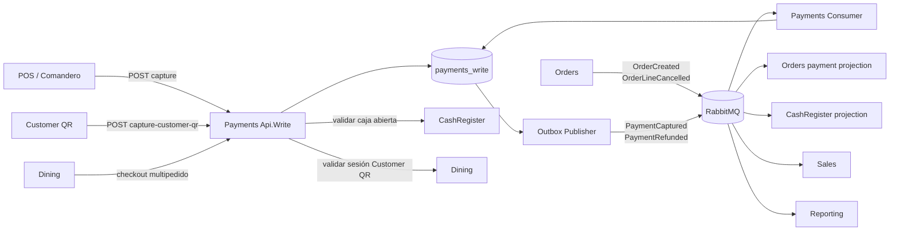
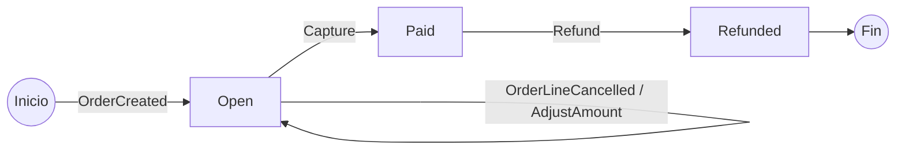
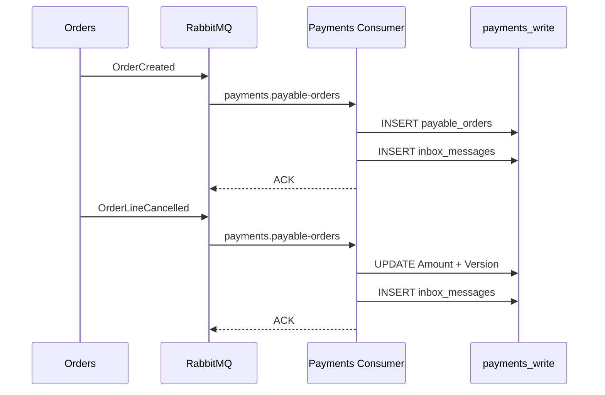
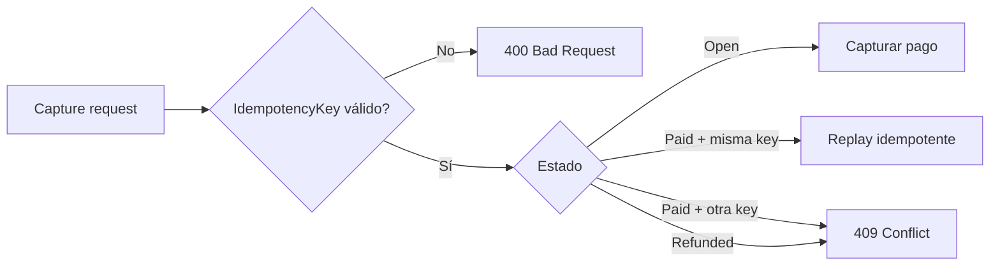
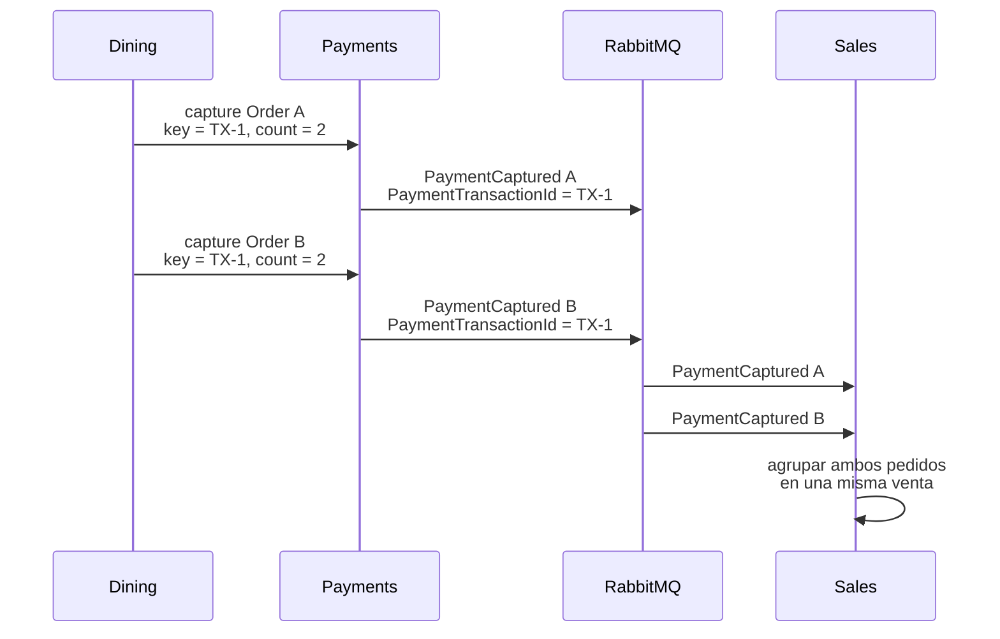
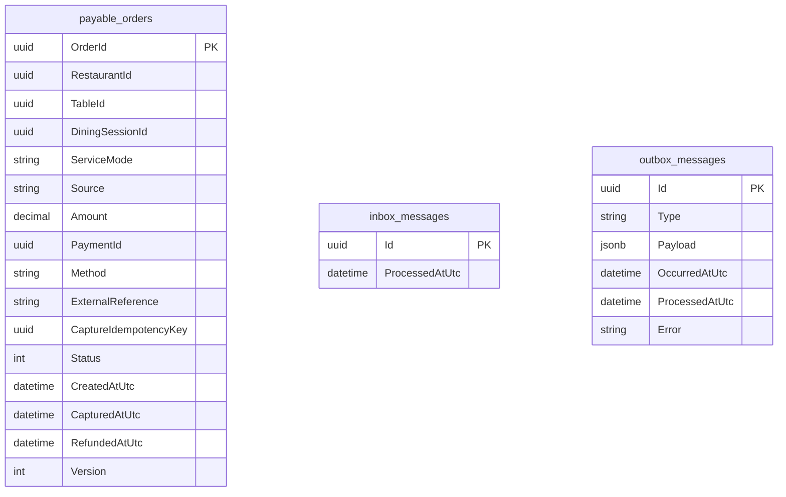
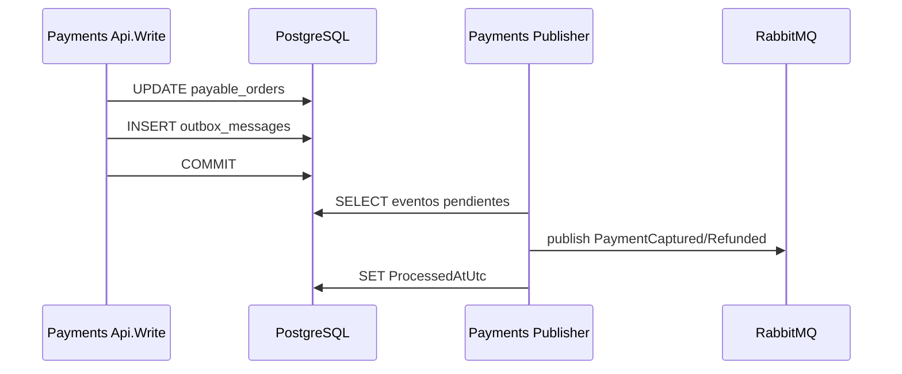
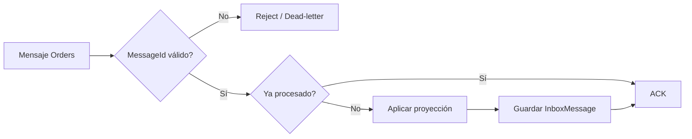
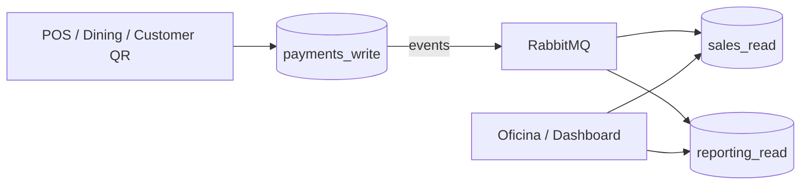

# Payments

`Payments` es el bounded context responsable de **materializar pedidos cobrables, capturar pagos y registrar devoluciones** dentro de la plataforma.

No actúa como un simple CRUD de pagos. Su estado operativo se construye a partir de eventos del dominio de `Orders`, aplica reglas de pago e idempotencia, valida precondiciones de negocio con otros servicios y publica eventos de integración para que `Orders`, `CashRegister`, `Sales` y `Reporting` reaccionen de forma desacoplada.

## Responsabilidad del servicio

`Payments` concentra las operaciones que cambian el estado financiero de un pedido:

- crear localmente un pedido cobrable a partir de `OrderCreated`;
- mantener actualizado su importe antes del cobro;
- capturar pagos manuales desde POS o flujos internos;
- capturar pagos `Online` iniciados desde Customer QR;
- impedir cobros cuando la caja del restaurante está cerrada;
- validar que un pago Customer QR pertenece a la sesión de mesa correcta;
- garantizar idempotencia en la captura;
- registrar devoluciones;
- publicar `PaymentCaptured` y `PaymentRefunded` mediante Transactional Outbox;
- propagar el resultado del pago a otros bounded contexts mediante RabbitMQ.

El servicio **no consulta directamente las tablas de Orders** para averiguar qué debe cobrarse. Mantiene su propio modelo `PayableOrder`, alimentado asíncronamente por eventos de `Orders`.

## Proyectos

El bounded context está dividido en siete proyectos:

```text
src/Services/Payments/
├── Restaurantes.Payments.Api.Write
├── Restaurantes.Payments.Application
├── Restaurantes.Payments.Consumer
├── Restaurantes.Payments.Contracts
├── Restaurantes.Payments.Domain
├── Restaurantes.Payments.Infrastructure
└── Restaurantes.Payments.Publisher
```

| Proyecto | Responsabilidad |
| --- | --- |
| `Restaurantes.Payments.Domain` | Modelo de dominio y reglas de transición del pago. |
| `Restaurantes.Payments.Contracts` | Requests, responses y eventos de integración públicos. |
| `Restaurantes.Payments.Application` | Casos de uso de captura y devolución. |
| `Restaurantes.Payments.Infrastructure` | EF Core, PostgreSQL, store, Inbox, Outbox, migraciones e integraciones HTTP con Dining y CashRegister. |
| `Restaurantes.Payments.Api.Write` | API HTTP para operaciones de pago. |
| `Restaurantes.Payments.Consumer` | Proyección de eventos de Orders hacia `payable_orders`. |
| `Restaurantes.Payments.Publisher` | Publicación fiable de eventos pendientes del Outbox a RabbitMQ. |

La dependencia principal sigue esta dirección:

```text
Domain
   ↑
Application ← Contracts
   ↑
Infrastructure
   ↑
Api.Write / Consumer / Publisher
```

`Consumer` referencia además `Orders.Contracts` porque consume eventos publicados por ese bounded context.

## Arquitectura interna



El modelo evita acoplar la operación de cobro a una base compartida. Cada dominio recibe únicamente la información que necesita mediante contratos y eventos.

## Modelo de dominio

La entidad principal es `PayableOrder`.

```text
PayableOrder
├── OrderId
├── RestaurantId
├── TableId?
├── DiningSessionId?
├── ServiceMode
├── Source
├── Amount
├── PaymentId?
├── Method
├── ExternalReference
├── CaptureIdempotencyKey?
├── Status
├── CreatedAtUtc
├── CapturedAtUtc?
├── RefundedAtUtc?
└── Version
```

El agregado está identificado por `OrderId`: actualmente existe como máximo un estado de pago principal por pedido dentro de este servicio.

### Estados



Estados definidos:

| Estado | Valor | Significado |
| --- | ---: | --- |
| `Open` | 1 | Pedido proyectado y todavía cobrable. |
| `Paid` | 2 | Pago capturado correctamente. |
| `Refunded` | 3 | Pago previamente capturado y posteriormente devuelto. |

No se permite capturar un pago que ya no esté `Open`, salvo la repetición idempotente de la misma captura.

No se permite modificar el importe después de capturar el pago.

No se permite devolver un pago que no esté previamente `Paid`.

## Cómo nace un `PayableOrder`

`Payments` no crea el pedido cobrable desde su API. El estado llega desde `Orders`.

El consumer escucha:

- `OrderCreated`;
- `OrderLineCancelled`.

### `OrderCreated`

Cuando recibe `OrderCreated`, crea el `PayableOrder` con:

- `OrderId`;
- `RestaurantId`;
- `TableId`;
- `DiningSessionId`;
- `ServiceMode`;
- `Source`;
- importe total calculado a partir de las líneas del pedido;
- `Status = Open`;
- `Version = 1`.

El importe inicial se calcula como:

```text
Σ UnitPrice × Quantity
```

Si el mismo `OrderCreated` ya produjo el `PayableOrder`, no se vuelve a insertar.

### `OrderLineCancelled`

Si Orders cancela una línea antes del pago, el evento contiene el nuevo total y `Payments` ajusta `Amount`.

El dominio solo permite este ajuste mientras el pago continúa `Open`.



## Captura de pago

La captura cambia el agregado:

```text
Open → Paid
```

Durante la transición se registran:

- nuevo `PaymentId`;
- método de pago;
- referencia externa;
- clave de idempotencia;
- `CapturedAtUtc`;
- incremento de `Version`.

La operación produce un evento `PaymentCaptured` dentro de la misma operación de persistencia mediante Outbox.

### Métodos admitidos actualmente

El contrato HTTP acepta:

| Método | Uso actual |
| --- | --- |
| `Cash` | Cobro en efectivo. |
| `Card` | Cobro con tarjeta. |
| `Online` | Pago online, incluido Customer QR. |

La validación del contrato restringe explícitamente el campo `Method` a esos tres valores.

## Idempotencia de captura

Cada captura exige un `IdempotencyKey` distinto de `Guid.Empty`.

La lógica actual es intencionadamente **por pedido**:

1. el pedido está `Open` y recibe una clave → se captura;
2. el pedido está `Paid` y vuelve a recibir **la misma clave** → se devuelve el mismo resultado sin generar otro evento;
3. el pedido está `Paid` y recibe **otra clave** → la operación se rechaza.



La columna `CaptureIdempotencyKey` está indexada pero **no es única**. Esto es importante para el checkout multipedido: varios pedidos pueden compartir una misma clave para representar una única operación de cobro a nivel de sesión.

## Transacciones multipedido

Una sesión de mesa puede contener varios pedidos. `Dining` realiza el checkout recorriendo los pedidos todavía no pagados y llama a `Payments` para cada uno utilizando:

- la misma `IdempotencyKey`;
- el mismo método;
- la misma referencia externa;
- `TransactionOrderCount` con el número total de pedidos incluidos.

En el evento `PaymentCaptured`, la implementación actual utiliza esa clave como `PaymentTransactionId`.



Esto permite que `Sales` conozca que varias capturas individuales forman parte de una misma transacción lógica, sin compartir la base de datos de Dining ni Payments.

## Customer QR

Customer QR utiliza un flujo específico:

```http
POST /api/payments/orders/{orderId}/capture-customer-qr
```

El endpoint es `[AllowAnonymous]`, pero **no significa acceso sin validación**. La autorización se basa en la sesión operativa del cliente.

Antes de capturar se comprueba:

1. `IdempotencyKey` válido;
2. `DiningSessionId` válido;
3. que la proyección `PayableOrder` ya exista;
4. que la caja del restaurante esté abierta;
5. `Source == CustomerQr`;
6. que exista `TableId`;
7. que el `DiningSessionId` coincida con el pedido;
8. que el header `X-Customer-Session-Token` sea válido para la sesión, restaurante, mesa y modalidad de servicio.

La última validación se realiza contra `Dining` mediante HTTP.

Si todo es válido, Payments fuerza:

```text
Method = Online
```

y utiliza la referencia recibida o, si viene vacía:

```text
QR-{OrderId}
```

### Relación con `QrRequiresImmediatePayment`

Payments **no decide** si un restaurante exige pago inmediato por Customer QR. Esa política pertenece a Dining y se expone mediante:

```text
QrRequiresImmediatePayment
```

El cliente Customer QR aplica la política así:

```text
true
    -> crea el pedido con PaymentTiming = Immediate
    -> llama a capture-customer-qr
    -> espera PaymentCaptured
    -> solicita submit en Orders

false
    -> crea el pedido con PaymentTiming = OnAccount
    -> no realiza captura inmediata
    -> solicita submit en Orders
```

Cuando existe captura, `PaymentCaptured` se publica mediante Outbox/RabbitMQ. Orders consume ese evento y actualiza su proyección de pago; esa proyección es la que permite posteriormente el `submit` de un pedido `Immediate`.

### Consistencia eventual y HTTP 425

Existe una ventana natural entre la creación del pedido en `Orders` y su proyección en `Payments`.

Si Customer QR intenta pagar antes de que `OrderCreated` haya sido procesado, la API devuelve:

```text
425 Too Early
```

con la indicación de reintentar.

Esto hace explícita la consistencia eventual en vez de ocultarla mediante acceso directo a la base de datos de Orders.

## Validación de caja

Tanto `capture`, `capture-customer-qr` como `refund` requieren que la caja del restaurante esté abierta.

Payments consulta síncronamente:

```http
GET /api/cash-register/restaurants/{restaurantId}/is-open
```

Si CashRegister informa que la caja está cerrada, la operación responde:

```text
409 Conflict
```

Esta regla protege la coherencia operativa: un cobro no puede registrarse fuera de una sesión de caja válida.

## Devoluciones

La devolución utiliza:

```http
POST /api/payments/orders/{orderId}/refund
```

Solo puede ejecutarse cuando el estado actual es `Paid`.

La transición es:

```text
Paid → Refunded
```

El request exige un `Reason`, que se publica en `PaymentRefunded` para los consumidores downstream.

El agregado conserva:

- `Status = Refunded`;
- `RefundedAtUtc`;
- incremento de `Version`.

El motivo no se persiste actualmente como columna de `payable_orders`; forma parte del evento de integración `PaymentRefunded`.

## Persistencia

Payments utiliza PostgreSQL mediante EF Core + Npgsql.

Base actual de desarrollo:

```text
payments_write
```

No existe actualmente `payments_read`.

Esto es deliberado: Payments no expone consultas analíticas ni un catálogo de lectura independiente. Su responsabilidad principal es mantener estado operacional de cobro y publicar hechos de pago. Las necesidades de lectura se proyectan en dominios como `Orders`, `Sales` y `Reporting`.

### Tablas



No hay foreign keys hacia bases de otros servicios. Los identificadores como `OrderId`, `RestaurantId`, `TableId` y `DiningSessionId` son referencias lógicas entre bounded contexts.

### Índices relevantes

`payable_orders`:

```text
PK (OrderId)
INDEX (DiningSessionId)
INDEX (CaptureIdempotencyKey)
INDEX (RestaurantId, Status)
```

`outbox_messages`:

```text
INDEX (ProcessedAtUtc, OccurredAtUtc)
```

### Concurrencia optimista

`Version` está configurado como concurrency token de EF Core.

Esto protege el agregado frente a escrituras concurrentes sobre el mismo pedido, por ejemplo dos intentos simultáneos de capturar o modificar el mismo estado de pago.

## Transactional Outbox

La captura o devolución y la creación del evento se guardan en la misma base de datos.

`PaymentWriteStore.SaveWithEventAsync` agrega el evento a `outbox_messages` antes de ejecutar `SaveChangesAsync`.



La ventaja es que no existe el clásico fallo:

```text
DB actualizada ✅
RabbitMQ no publicado ❌
```

El evento permanece pendiente en el Outbox y el publisher puede volver a intentarlo.

### Publisher

`Restaurantes.Payments.Publisher`:

- migra la base de datos al iniciar;
- abre una conexión RabbitMQ dedicada;
- toma hasta 50 mensajes pendientes ordenados por `OccurredAtUtc`;
- publica mensajes persistentes;
- utiliza `MessageId` como identificador del mensaje;
- marca `ProcessedAtUtc` después de publicar;
- reintenta la conexión ante desconexiones.

## Inbox e idempotencia

`Restaurantes.Payments.Consumer` usa `inbox_messages` para evitar reprocesar eventos de Orders.

El `MessageId` de RabbitMQ se interpreta como `Guid` y se comprueba antes de aplicar el evento.



Esto protege la proyección ante entregas *at least once* de RabbitMQ.

## Eventos de integración

### Eventos publicados

Payments publica dos contratos de integración.

#### `PaymentCaptured`

Contiene:

```text
PaymentId
OrderId
RestaurantId
Amount
Method
ServiceMode
Source
ExternalReference
CapturedAtUtc
PaymentTransactionId?
TransactionOrderCount
```

Principales consumidores actuales:

- `Orders`;
- `CashRegister`;
- `Sales`;
- `Reporting`.

#### `PaymentRefunded`

Contiene:

```text
PaymentId
OrderId
RestaurantId
Amount
Method
ServiceMode
Source
Reason
RefundedAtUtc
```

Permite que los dominios consumidores reviertan o ajusten sus propias proyecciones sin acceder a `payments_write`.

### Eventos consumidos

Payments mantiene su modelo cobrable a partir de eventos publicados por Orders:

| Servicio origen | Evento | Uso local |
| --- | --- | --- |
| Orders | `OrderCreated` | Crear `PayableOrder` con el importe y contexto operativo del pedido. |
| Orders | `OrderLineCancelled` | Ajustar `Amount` y `Version` mientras el pago permanece `Open`. |

## RabbitMQ

La topología de Payments utiliza:

```text
Exchange: payments.events
Type: topic
```

Routing keys:

| Evento | Routing key |
| --- | --- |
| `PaymentCaptured` | `payment.captured.v1` |
| `PaymentRefunded` | `payment.refunded.v1` |

### Colas relacionadas

| Queue | Uso |
| --- | --- |
| `payments.payable-orders` | Payments consume `OrderCreated` y `OrderLineCancelled`. |
| `payments.orders-integration` | Orders consume capturas y devoluciones. |
| `payments.cash-register` | CashRegister consume capturas y devoluciones. |
| `payments.dead-letter.messages` | Mensajes rechazados de forma no recuperable. |

Además, Sales y Reporting declaran sus propias colas enlazadas al exchange `payments.events`.

### Dead-letter

La topología declara:

```text
payments.dead-letter
payments.dead-letter.messages
```

Los errores de deserialización, tipos de evento no soportados o mensajes estructuralmente inválidos se rechazan sin requeue y pueden terminar en dead-letter.

Los errores transitorios se rechazan con requeue para volver a procesarse.

## API Write

Ruta base:

```text
/api/payments/orders/{orderId}
```

### Capturar pago interno

```http
POST /api/payments/orders/{orderId}/capture
Authorization: Bearer <token>
Content-Type: application/json
```

Ejemplo de body:

```json
{
  "idempotencyKey": "00000000-0000-0000-0000-000000000001",
  "transactionOrderCount": 1,
  "method": "Card",
  "externalReference": "POS-..."
}
```

Requiere:

```text
payments.capture
```

sobre el restaurante del pedido.

### Capturar desde Customer QR

```http
POST /api/payments/orders/{orderId}/capture-customer-qr
X-Customer-Session-Token: <token>
Content-Type: application/json
```

```json
{
  "idempotencyKey": "00000000-0000-0000-0000-000000000001",
  "diningSessionId": "00000000-0000-0000-0000-000000000002",
  "externalReference": "QR-PWA-..."
}
```

No usa JWT de empleado, pero valida el token de sesión Customer QR contra Dining.

### Devolver pago

```http
POST /api/payments/orders/{orderId}/refund
Authorization: Bearer <token>
Content-Type: application/json
```

```json
{
  "reason": "Motivo de la devolución"
}
```

La devolución es una operación administrativa y utiliza el permiso específico:

```text
payments.refund
```

Actualmente este permiso corresponde a `Admin`, `Gerente` y `Contabilidad`. El KDS, el TPV y el Comandero no inician devoluciones; el endpoint queda preparado para el flujo administrativo de Backoffice.

## Gateways

Payments está publicado en ambos gateways mediante YARP.

### Private Gateway

Enruta:

```text
POST /api/payments/{**catch-all}
```

hacia:

```text
http://localhost:5151
```

### Public Gateway

Mantiene también una ruta `POST` hacia Payments para los flujos públicos permitidos, principalmente Customer QR.

La API continúa aplicando sus propias reglas de autenticación/autorización; el hecho de estar detrás de un gateway no sustituye las validaciones del servicio.

## Seguridad

### Operaciones internas

La API usa JWT mediante `Restaurantes.Security`.

`capture` verifica que el usuario pueda acceder al restaurante con:

```text
payments.capture
```

Este permiso forma parte actualmente de:

- `Admin`;
- `Manager`;
- `PosComandero`.

`refund` utiliza un permiso independiente:

```text
payments.refund
```

Este permiso está reservado a perfiles administrativos:

- `Admin`;
- `Gerente`;
- `Contabilidad`.

### Customer QR

El endpoint QR usa una autorización distinta porque el cliente no es un empleado autenticado mediante JWT.

La seguridad se construye con:

- correlación `OrderId` / `DiningSessionId`;
- `Source = CustomerQr`;
- `TableId` obligatorio;
- token de sesión enviado en `X-Customer-Session-Token`;
- validación síncrona contra Dining.

Esto evita confiar únicamente en identificadores enviados por el navegador.

## Relación con otros servicios

### Orders → Payments

Orders publica:

```text
OrderCreated
OrderLineCancelled
```

Payments los utiliza para mantener su modelo cobrable local.

### Payments → Orders

Payments publica:

```text
PaymentCaptured
PaymentRefunded
```

Orders mantiene una proyección `order_payments` que utiliza para validar reglas como pedidos de pago inmediato, entrega de takeaway y recuperación/cancelación.

### Payments ↔ Dining

Dining:

- coordina checkout de sesiones;
- puede capturar varios pedidos dentro de una misma transacción lógica;
- es consultado para validar sesiones Customer QR.

### Payments ↔ CashRegister

Antes de capturar o devolver, Payments consulta que la caja esté abierta.

Después del cambio, CashRegister consume `PaymentCaptured` y `PaymentRefunded` para actualizar su propia visión financiera.

### Payments → Sales

Sales consolida ventas a partir de eventos de pago y utiliza `PaymentTransactionId` + `TransactionOrderCount` para agrupar transacciones multipedido.

### Payments → Reporting

Reporting consume los hechos de pago para construir métricas y proyecciones orientadas a consulta sin cargar la base operacional de Payments.

## Configuración

### API Write

```json
{
  "ConnectionStrings": {
    "PaymentsWrite": "..."
  },
  "Dining": {
    "BaseAddress": "http://localhost:5102"
  },
  "CashRegister": {
    "BaseAddress": "http://localhost:5105"
  }
}
```

La API requiere además la configuración de `Security`.

### Consumer / Publisher

Ambos utilizan:

```json
{
  "ConnectionStrings": {
    "PaymentsWrite": "..."
  },
  "RabbitMq": {
    "HostName": "localhost",
    "Port": 5672,
    "UserName": "...",
    "Password": "...",
    "VirtualHost": "/"
  }
}
```

En producción las credenciales no deberían mantenerse en archivos versionados; deben inyectarse mediante configuración segura del entorno o secret manager del proveedor utilizado.

## Migraciones

`PaymentWriteDbContext` contiene las migraciones de `payments_write`.

La evolución actual incluye, entre otras:

- esquema inicial de Payments;
- soporte de `CaptureIdempotencyKey`;
- asociación con `DiningSessionId` y `TableId`;
- `ServiceMode`.

API, Consumer y Publisher ejecutan la migración de la base al iniciar en la implementación actual.

## Desarrollo local

Puertos configurados actualmente:

| Componente | URL |
| --- | --- |
| Payments Write API | `http://localhost:5151` |

La infraestructura local utiliza PostgreSQL y RabbitMQ definidos en el `docker-compose.yml` de la raíz del repositorio.

Antes de ejecutar herramientas locales:

```bash
dotnet tool restore
```

Los perfiles de arranque de la solución pueden utilizarse para iniciar conjuntamente los procesos requeridos por el escenario que se esté probando.

## Health checks

`Payments.Api.Write` utiliza `Restaurantes.ServiceDefaults` y expone los endpoints comunes de salud de la solución:

```text
/health
/alive
```

El Dashboard puede utilizar estos endpoints para mostrar disponibilidad del servicio junto con el resto de componentes de la plataforma.

## Decisiones de diseño

### Payments mantiene una proyección cobrable propia

El servicio no necesita consultar Orders durante cada captura. Consume `OrderCreated` y mantiene únicamente la información que necesita para cobrar.

Esto reduce acoplamiento y permite que ambos servicios evolucionen y escalen por separado.

### No existe `payments_read` actualmente

No todas las áreas necesitan una separación Read/Write simétrica.

Payments es un servicio predominantemente transaccional. Las necesidades de lectura de negocio pertenecen actualmente a Orders, Sales y Reporting, por lo que crear un `payments_read` sin un caso de uso concreto añadiría infraestructura sin aportar valor.

### Idempotencia obligatoria

Las operaciones financieras pueden repetirse por retries HTTP, desconexiones o acciones del usuario. La clave idempotente impide capturar dos veces el mismo pedido por una repetición de la misma operación.

### Outbox para hechos financieros

Un pago confirmado no puede depender de que RabbitMQ esté disponible en el mismo instante. El hecho se guarda primero en PostgreSQL y se publica posteriormente de forma fiable.

### Consistencia eventual explícita

Payments acepta que exista una pequeña ventana entre `OrderCreated` y la disponibilidad del pedido cobrable. Los clientes pueden reintentar y el endpoint QR devuelve `425 Too Early` cuando esa situación es detectable.

### Caja como precondición síncrona

La disponibilidad de la caja es una condición que debe conocerse antes de aceptar el cobro. Por eso se consulta de forma síncrona en lugar de depender exclusivamente de una proyección eventualmente consistente.

### Customer QR no confía en el navegador

Aunque el endpoint es anónimo a nivel JWT, la sesión se valida contra Dining usando datos del `PayableOrder` y un token de acceso específico.

## Despliegue y escalado

Payments puede desplegar y escalar sus procesos de forma independiente:

```text
Payments.Api.Write
Payments.Consumer
Payments.Publisher
```

La separación permite tratar de forma distinta la API transaccional, el consumo de eventos y la publicación del Outbox.

Payments representa un buen ejemplo de **database-per-service** aunque actualmente no necesite una pareja Read/Write propia.

La base `payments_write` contiene exclusivamente el estado necesario para operar cobros y garantizar su publicación fiable.

Las consultas de oficina, dashboards o reporting **no deben ejecutarse sobre esta base operacional**. Esos escenarios se sirven desde las proyecciones de `Sales` y `Reporting`.



### Bases de datos

Una consulta pesada de oficina no debe competir por CPU, memoria, conexiones o I/O con una captura de pago que está ocurriendo en un restaurante.

La separación permite priorizar:

```text
operación del negocio > consultas administrativas
```

### Alojamiento cloud

La arquitectura no depende de un proveedor concreto.

En una primera fase, varias bases pueden coexistir en un mismo servidor PostgreSQL administrado para reducir costes:

```text
PostgreSQL managed instance
├── payments_write
├── orders_write
├── sales_read
├── reporting_read
└── ...
```

Si el volumen crece, las cargas pueden separarse físicamente:

```text
Operational PostgreSQL
├── payments_write
├── orders_write
└── dining

Read / Analytics PostgreSQL
├── sales_read
└── reporting_read
```

O incluso desplegar bases o clusters independientes según criticidad, volumen y SLA.

El mismo diseño puede mapearse a servicios administrados de Azure, AWS, GCP u otros proveedores sin cambiar el contrato entre bounded contexts.

Para Payments, la prioridad de despliegue debe ser:

- baja latencia de escritura;
- alta disponibilidad;
- backups y recuperación point-in-time;
- conexiones privadas entre servicios;
- secretos fuera de `appsettings`;
- métricas y alertas;
- persistencia fiable del broker;
- capacidad de escalar `Consumer` y `Publisher` independientemente de la API.
