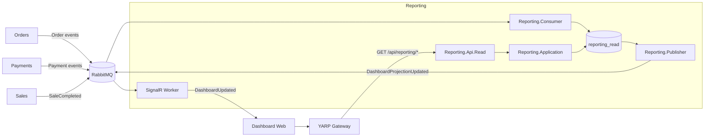
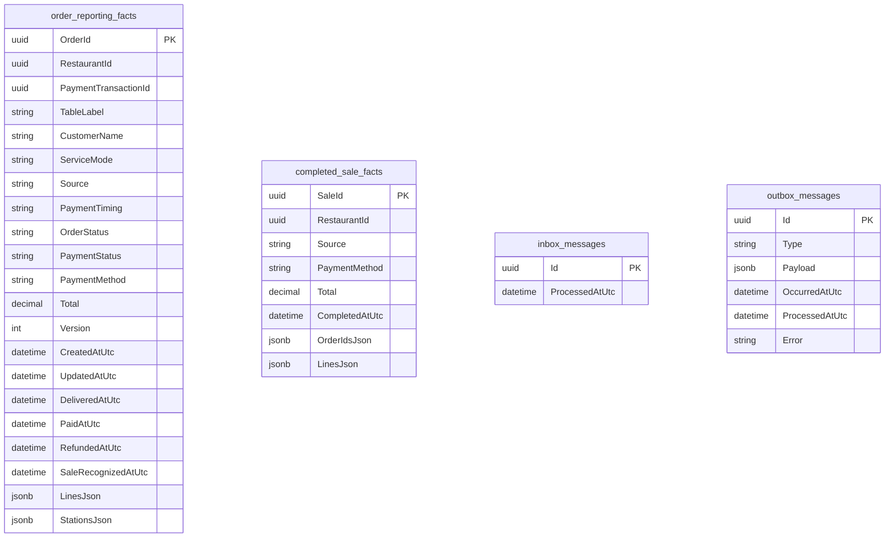
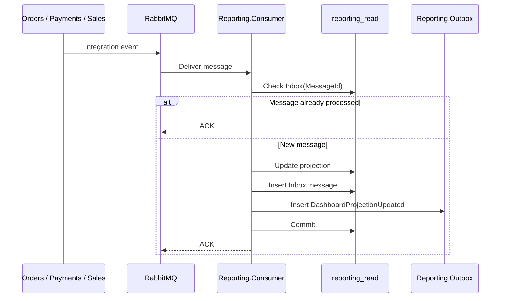
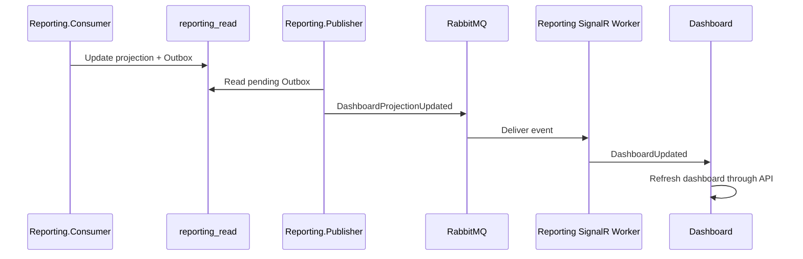
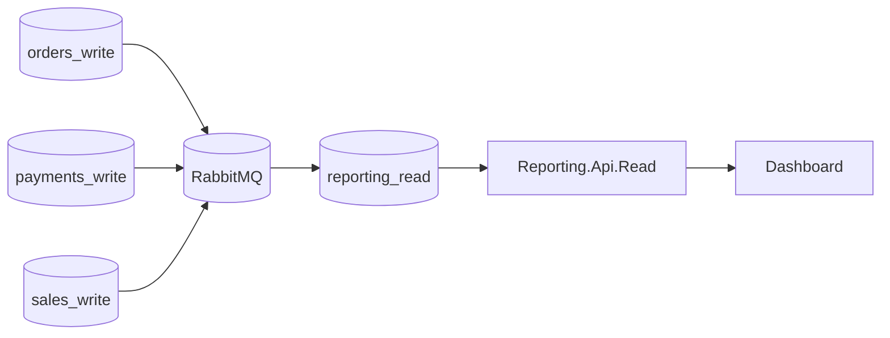

# Reporting

El servicio **Reporting** construye y expone una vista consolidada de la actividad operativa y comercial de la plataforma Restaurantes. Su objetivo principal es permitir consultas de **dashboard, ventas y estado operativo en tiempo real** sin ejecutar cargas analíticas directamente sobre las bases transaccionales que atienden la operación del restaurante.

Reporting no es la fuente de verdad de pedidos, pagos o ventas. Mantiene un **read model propio**, alimentado asíncronamente mediante eventos publicados por **Orders**, **Payments** y **Sales**.

Esta separación es deliberada: las consultas de oficina, dashboards y agregaciones pueden consumir muchos más recursos que una operación transaccional puntual. Al mantener Reporting aislado, una consulta pesada no debería degradar procesos críticos como tomar pedidos, preparar comandas o cobrar una mesa.


## Responsabilidad del servicio

Reporting es responsable de:

- construir una proyección consolidada de pedidos, pagos y ventas;
- mantener una base de datos optimizada para lectura y agregación;
- calcular las métricas del dashboard diario;
- mostrar ventas completadas por restaurante;
- calcular ticket medio;
- obtener productos más vendidos;
- clasificar restaurantes por ventas;
- agrupar ventas por canal de origen;
- agrupar ventas por método de pago;
- mantener una vista operativa de los pedidos recientes y activos;
- exponer la proyección mediante una API exclusivamente de lectura;
- notificar actualizaciones del dashboard mediante SignalR;
- comprobar el estado de salud de endpoints configurados;
- aplicar autorización por restaurante mediante `dashboard.read`;
- procesar mensajes de forma idempotente mediante Inbox;
- publicar actualizaciones de la proyección mediante Transactional Outbox.

Reporting **no crea pedidos**, **no captura pagos**, **no consolida la venta de negocio** y **no modifica los datos transaccionales** de otros bounded contexts.

La propiedad de esos datos permanece en:

| Información | Fuente de verdad |
| --- | --- |
| Pedido y estado de cocina | **Orders** |
| Captura y devolución de pagos | **Payments** |
| Venta comercial consolidada | **Sales** |
| Proyección analítica y dashboard | **Reporting** |

## Proyectos

El bounded context está dividido en seis proyectos:

```text
src/Services/Reporting/
├── Restaurantes.Reporting.Api.Read
├── Restaurantes.Reporting.Application
├── Restaurantes.Reporting.Consumer
├── Restaurantes.Reporting.Contracts
├── Restaurantes.Reporting.Infrastructure
└── Restaurantes.Reporting.Publisher
```

| Proyecto | Responsabilidad |
| --- | --- |
| `Restaurantes.Reporting.Application` | Casos de uso de consulta, modelos del dashboard, abstracción del read store y coordinación del health agregado. |
| `Restaurantes.Reporting.Contracts` | Eventos públicos emitidos por Reporting. |
| `Restaurantes.Reporting.Infrastructure` | EF Core, PostgreSQL, implementación del read store, sondas HTTP, Inbox y Outbox. |
| `Restaurantes.Reporting.Consumer` | Consume eventos de Orders, Payments y Sales y actualiza el read model. |
| `Restaurantes.Reporting.Publisher` | Publica eventos pendientes de la Outbox de Reporting hacia RabbitMQ. |
| `Restaurantes.Reporting.Api.Read` | Expone dashboard, health y actualizaciones en tiempo real mediante SignalR. |

A diferencia de otros bounded contexts de la solución, Reporting **no necesita `Api.Write` ni Domain** porque no implementa un modelo transaccional propio. Sí dispone de una capa `Application`: la API depende de sus casos de uso y abstracciones, mientras Infrastructure proporciona las implementaciones de persistencia y de las sondas HTTP.

## Arquitectura interna



El flujo de lectura está desacoplado de las bases operativas. `Reporting.Api.Read` consulta únicamente `reporting_read`; no realiza joins remotos ni consultas directas sobre las bases de Orders, Payments o Sales.

## Por qué Reporting tiene una base de datos propia

La separación de Reporting responde a un requisito de operación, no únicamente a una elección de estilo arquitectónico.

En un restaurante existen dos perfiles de carga muy diferentes:

```text
OPERACIÓN DEL NEGOCIO
────────────────────────────────────
Pedidos
Cocina / KDS
Cobros
Caja
Cambios de estado

            ≠

CONSULTA / OFICINA
────────────────────────────────────
Dashboard
Ventas del día
Rankings
Agregaciones
Históricos
Métricas
```

Las operaciones del primer grupo son sensibles a latencia y forman parte del funcionamiento diario del local. Las consultas del segundo grupo pueden recorrer muchos registros, ordenar, agrupar y calcular métricas.

Si ambas cargas compitieran por los mismos recursos de base de datos, una consulta analítica pesada podría afectar procesos críticos del restaurante.

Reporting evita esa dependencia mediante:

1. eventos asíncronos;
2. una proyección propia;
3. persistencia independiente;
4. consultas diseñadas específicamente para dashboard;
5. posibilidad de escalar la infraestructura de lectura de forma independiente.

La consecuencia buscada es sencilla:

> **La consulta de información nunca debe bloquear la operación del restaurante.**

## Modelo de datos

Reporting mantiene dos tipos principales de hechos:

- `OrderReportingFact`: estado consolidado de cada pedido;
- `CompletedSaleFact`: snapshot de cada venta completada.

Además mantiene Inbox y Outbox para garantizar un procesamiento de mensajes más robusto.



No existe una relación FK entre `order_reporting_facts` y `completed_sale_facts`. Reporting conserva snapshots desnormalizados deliberadamente para evitar depender de joins transaccionales entre entidades de distintos bounded contexts.

## `OrderReportingFact`

`OrderReportingFact` representa la vista actual consolidada de un pedido dentro de Reporting.

Incluye información procedente de distintos servicios:

### Identificación

- `OrderId`;
- `RestaurantId`;
- `PaymentTransactionId`.

### Contexto comercial

- mesa;
- cliente;
- modo de servicio;
- origen del pedido;
- modalidad temporal del pago.

### Estado operativo

- estado del pedido;
- versión del pedido;
- fecha de creación;
- última actualización;
- fecha de entrega.

### Estado financiero

- estado del pago;
- método de pago;
- fecha de cobro;
- fecha de devolución;
- fecha de reconocimiento de venta.

### Snapshot del pedido

Las líneas y estaciones de preparación se almacenan como `jsonb`:

```text
LinesJson
StationsJson
```

Esto permite conservar dentro del read model los datos necesarios para el dashboard sin volver a consultar Orders.

## `CompletedSaleFact`

`CompletedSaleFact` representa una venta ya consolidada por Sales.

Contiene:

- `SaleId`;
- `RestaurantId`;
- canal/origen;
- método de pago;
- importe total;
- fecha de finalización;
- pedidos que componen la venta;
- snapshot de las líneas vendidas.

Los pedidos y líneas se almacenan como JSON porque el objetivo de esta tabla es la consulta analítica, no reconstruir el agregado transaccional de Sales.

## Índices

La proyección incluye índices orientados a los patrones de consulta actuales.

### Pedidos

```text
RestaurantId + OrderStatus + UpdatedAtUtc
SaleRecognizedAtUtc
PaymentTransactionId
```

### Ventas

```text
RestaurantId + CompletedAtUtc
```

### Outbox

```text
ProcessedAtUtc + OccurredAtUtc
```

La intención es que las consultas del dashboard se resuelvan dentro de la base de Reporting sin trasladar esa carga a los servicios operativos.

## Construcción de la proyección

`Restaurantes.Reporting.Consumer` ejecuta `ReportingProjectionWorker`, responsable de RabbitMQ y de los ACK. El procesamiento de Orders, Payments y Sales se delega en `ReportingProjectionHandler`, que mantiene `reporting_read` a partir de los eventos de integración.



La actualización de la proyección, el registro de Inbox y la creación del mensaje Outbox se persisten mediante el mismo `ReportingReadDbContext`.

## Eventos de integración

### Eventos consumidos

Reporting consume información de tres bounded contexts.

#### Orders

Actualmente reconoce los siguientes eventos:

- `OrderCreated`;
- `OrderSubmitted`;
- `KitchenTicketPreparationStarted`;
- `KitchenTicketReady`;
- `KitchenTicketDispatched`;
- `OrderPreparationStarted`;
- `OrderReady`;
- `OrderDelivered`;
- `OrderLineCancelled`;
- `OrderCancelled`.

Los eventos actualizan el estado operativo del `OrderReportingFact`, incluyendo:

- estado;
- líneas;
- estaciones;
- total vigente;
- versión;
- timestamps operativos.

El total se recalcula excluyendo líneas con estado `Cancelled`.

#### Payments

Reporting consume:

- `PaymentCaptured`;
- `PaymentRefunded`.

`PaymentCaptured` actualiza:

- `PaymentTransactionId`;
- `PaymentStatus = Paid`;
- método de pago;
- `PaidAtUtc`;
- reconocimiento de la venta.

Cuando el evento no contiene un `PaymentTransactionId` válido, se utiliza `PaymentId` como identificador de transacción para la proyección.

`PaymentRefunded` cambia el estado a:

```text
Refunded
```

y elimina `SaleRecognizedAtUtc` del hecho del pedido.

En la implementación actual, una venta de un único pedido deja de computar en las métricas cuando ese pedido aparece como reembolsado.

#### Sales

Reporting consume:

```text
SaleCompleted
```

Este evento crea o actualiza `CompletedSaleFact`.

Antes de construir el snapshot de líneas, Reporting exige que los pedidos incluidos en la venta ya existan en su proyección. Esto evita construir una venta incompleta cuando los eventos todavía no han llegado en el orden esperado.

### Eventos publicados

#### `DashboardProjectionUpdated`

El contrato actual es:

```text
DashboardProjectionUpdated
├── OrderId
├── RestaurantId
└── ProjectionUpdatedAtUtc
```

El evento no contiene el dashboard completo. Actúa como una **señal de invalidación/actualización** para indicar que la proyección de un restaurante ha cambiado.

El cliente puede entonces volver a consultar la API para obtener los valores consolidados actuales.

Esta decisión evita publicar por SignalR todo el conjunto de datos del dashboard en cada cambio.

## Control de versiones de Orders

Los eventos procedentes de Orders incluyen una versión del agregado.

Reporting solo reemplaza la información operacional del pedido cuando:

```text
IncomingVersion > CurrentVersion
```

Esto protege la proyección frente a la llegada tardía de eventos antiguos.

El control de versión se combina con Inbox: la versión protege el estado del agregado y el Inbox protege el procesamiento del mensaje concreto.

## Inbox e idempotencia

RabbitMQ puede entregar nuevamente un mensaje si no existe confirmación o se produce una interrupción durante el procesamiento.

Reporting utiliza el `MessageId` del mensaje como clave de `inbox_messages`.

Antes de procesar:

```text
MessageId
    │
    ▼
¿Existe en inbox_messages?
    │
    ├── Sí ──> ACK
    │
    └── No ──> procesar + registrar Inbox
```

Esto evita aplicar dos veces el mismo evento cuando el broker realiza una redelivery.

## Transactional Outbox

Cada vez que la proyección procesa un mensaje nuevo, genera:

```text
DashboardProjectionUpdated
```

El evento no se publica directamente durante la actualización de la proyección. Primero se almacena en `outbox_messages`.

```text
Evento externo
     │
     ▼
Actualizar read model
     │
     ├── Inbox
     └── Reporting Outbox
             │
             ▼
      Reporting.Publisher
             │
             ▼
          RabbitMQ
```

De esta forma, la modificación de la proyección y la intención de notificar su actualización quedan persistidas conjuntamente antes de interactuar con RabbitMQ.

## RabbitMQ

Reporting utiliza el exchange:

```text
reporting.events
```

Routing key emitida:

```text
dashboard.projection-updated.v1
```

Queues propias:

```text
reporting.dashboard.read-model
reporting.dashboard.signalr.projection-updated
```

Dead-letter infrastructure:

```text
reporting.dead-letter
reporting.dead-letter.messages
```

La queue de construcción del read model está vinculada además a los exchanges de:

- Orders;
- Payments;
- Sales.

### Tratamiento de errores

Los consumers distinguen entre errores permanentes y errores potencialmente transitorios.

Mensajes inválidos o tipos no soportados se rechazan sin requeue, por lo que terminan en la infraestructura de dead-letter configurada para la queue.

Errores transitorios se rechazan con requeue para permitir un nuevo intento.

## Dashboard diario

La consulta principal es:

```http
GET /api/reporting/dashboard/daily
```

También existe el alias:

```http
GET /api/reporting/dashboard
```

Parámetros actuales:

| Parámetro | Descripción |
| --- | --- |
| `date` | Día comercial a consultar. Si se omite, utiliza el día local actual del servidor. |
| `restaurantId` | Limita la consulta a un restaurante autorizado. |
| `orderLimit` | Número máximo de pedidos operativos mostrados. Los valores efectivos actuales son `10`, `20` o `100`. |

La fecha de negocio se calcula actualmente utilizando la zona horaria local del proceso que ejecuta Reporting.

## Métricas devueltas

`DailyDashboard` contiene:

```text
BusinessDate
TotalSales
CompletedSales
AverageTicket
TopProducts
RestaurantRanking
Channels
PaymentMethods
OperationalOrders
GeneratedAtUtc
```

### Total de ventas

```text
TotalSales = Σ CompletedSaleFact.Total
```

para las ventas completadas durante el día seleccionado y dentro del ámbito de restaurantes autorizado.

### Ventas completadas

```text
CompletedSales = número de CompletedSaleFact
```

### Ticket medio

```text
AverageTicket = TotalSales / CompletedSales
```

Si no existen ventas, el ticket medio es `0`.

### Top Products

Agrupa las líneas de venta por:

```text
ProductId + ProductName
```

y calcula:

- cantidad vendida;
- importe vendido.

La implementación actual devuelve los **10 productos con mayor cantidad vendida**.

### Ranking de restaurantes

Agrupa las ventas por `RestaurantId` y devuelve:

- número de tickets;
- importe de ventas.

El ranking se ordena por ventas descendentes.

### Canales

Agrupa por `Source`, permitiendo distinguir el origen comercial de las ventas.

Por ejemplo, según los valores utilizados por los servicios productores, la proyección puede separar ventas generadas por distintos clientes o flujos de entrada.

### Métodos de pago

Agrupa por `PaymentMethod` y calcula:

- tickets;
- ventas.

Si el método no está informado, Reporting utiliza `Unknown` en la agregación.

## Pedidos operativos

El dashboard no muestra únicamente ventas ya consolidadas. También mantiene una vista de la operación actual.

`OperationalOrders` incluye pedidos:

- creados durante el día seleccionado; o
- actualmente en `Submitted`;
- actualmente en `InPreparation`;
- actualmente en `Ready`.

Esto permite que un pedido activo continúe visible aunque haya cruzado el límite temporal del día mientras siga requiriendo atención operacional.

Cada elemento incluye:

- restaurante;
- mesa;
- cliente;
- modo de servicio;
- origen;
- estado del pedido;
- estado y método de pago;
- total;
- última actualización;
- estaciones;
- líneas.

## Reporting en tiempo real

La actualización del dashboard utiliza **SignalR**.

Endpoint:

```text
/hubs/reporting
```

Flujo:



El Hub utiliza grupos independientes por restaurante:

```text
restaurant:{RestaurantId}
```

El cliente solicita unirse mediante:

```text
JoinRestaurants(Guid[] restaurantIds)
```

Antes de añadir la conexión al grupo, el servidor valida individualmente que el usuario tenga permiso `dashboard.read` para el restaurante solicitado.

## Cliente Dashboard

La solución contiene:

```text
Restaurantes.Clients.Dashboard.Web
```

El cliente consulta actualmente:

```text
/api/reporting/dashboard/daily
/api/reporting/health
```

y establece una conexión con:

```text
/hubs/reporting
```

Cuando recibe `DashboardUpdated`, puede refrescar la información visible sin realizar polling continuo de toda la proyección.

La interfaz actual es deliberadamente sencilla y utiliza la API de Reporting y SignalR como fuentes de información.

## Health checks

Reporting expone:

```http
GET /api/reporting/health
```

Este endpoint consulta una colección configurable de URLs definidas en:

```text
MonitoredEndpoints
```

La configuración de desarrollo incluye actualmente comprobaciones para componentes como:

- Public Gateway;
- Orders Write;
- Orders Read;
- Catalog Write;
- Catalog Read;
- Dining;
- Payments Write;
- Sales Read;
- RabbitMQ Management.

La respuesta informa por endpoint:

```text
service
url
healthy
status
```

Una respuesta HTTP satisfactoria se considera saludable. Si la conexión falla, el estado se devuelve como no saludable.

Esta funcionalidad está orientada al dashboard operativo y es independiente de los endpoints `/health` y `/alive` que cada servicio expone mediante `ServiceDefaults`.

## Seguridad

Toda la API de Reporting requiere autenticación.

El permiso funcional utilizado es:

```text
dashboard.read
```

### Consulta de un restaurante concreto

Cuando se proporciona:

```text
restaurantId
```

se valida:

```text
User.CanAccessRestaurant(restaurantId, dashboard.read)
```

### Consulta multi-restaurante

Si el usuario no especifica restaurante:

- un `Admin` puede consultar el conjunto completo;
- los demás usuarios quedan limitados a los restaurantes presentes en sus claims autorizados.

### SignalR

La conexión al Hub también requiere autenticación y cada `JoinRestaurants` vuelve a comprobar el permiso correspondiente.

El token JWT puede ser recibido mediante `access_token` en la conexión del Hub, según la configuración común de seguridad de la solución.

## API Read

### Dashboard

```http
GET /api/reporting/dashboard
GET /api/reporting/dashboard/daily
```

Ejemplos conceptuales:

```text
/api/reporting/dashboard/daily
/api/reporting/dashboard/daily?date=2026-09-08
/api/reporting/dashboard/daily?restaurantId={id}
/api/reporting/dashboard/daily?restaurantId={id}&orderLimit=20
```

### Health agregado

```http
GET /api/reporting/health
```

### SignalR

```text
/hubs/reporting
```

Método del Hub:

```text
JoinRestaurants(Guid[] restaurantIds)
```

Evento enviado al cliente:

```text
DashboardUpdated
```

## Gateways

Reporting se publica a través de YARP.

El **Public Gateway** enruta:

```text
/api/reporting/*
/hubs/reporting/*
```

El **Private Gateway** también enruta:

```text
/api/reporting/*
/hubs/reporting/*
/dashboard/*
```

El cliente Dashboard no se publica mediante el Public Gateway. En desarrollo, el Private Gateway lo publica desde `http://localhost:5001` bajo un único prefijo: `/dashboard/*`. El formulario de acceso y el panel comparten la URL `/dashboard/`, y YARP redirige internamente la interfaz a `Dashboard.Web` en `http://localhost:5600`. En producción debe exponerse únicamente dentro de la red de oficina.

En producción se conserva `/dashboard/` y se reemplaza el origen local por el dominio HTTPS privado de oficina. El puerto `5600` es sólo el destino interno de desarrollo; el destino real se proporciona mediante la configuración YARP del ambiente y no requiere modificar el cliente Dashboard.

De esta forma, la API y el canal en tiempo real pueden mantenerse detrás de los gateways sin que los clientes necesiten conocer directamente la ubicación física de `Reporting.Api.Read`.


## Relación con otros servicios

| Servicio | Relación |
| --- | --- |
| `Orders` | Publica los eventos operativos utilizados para mantener el estado, líneas, estaciones y versión de cada pedido. |
| `Payments` | Publica `PaymentCaptured` y `PaymentRefunded`, utilizados para mantener el estado financiero de los pedidos. |
| `Sales` | Publica `SaleCompleted`, utilizado para construir `CompletedSaleFact` y las métricas comerciales consolidadas. |
| `Dashboard` | Consulta `Reporting.Api.Read` y recibe notificaciones `DashboardUpdated` mediante SignalR. |

Reporting no consulta directamente las bases de datos de Orders, Payments o Sales. La integración se realiza mediante eventos y contratos propios de cada bounded context.

## Configuración

La configuración documentada actualmente incluye:

```text
ReportingRead
MonitoredEndpoints
```

`ReportingRead` identifica la conexión lógica a `reporting_read`. `MonitoredEndpoints` contiene las URLs utilizadas por el health agregado del dashboard.

## Persistencia

La base de datos de Reporting es:

```text
reporting_read
```

Los proyectos `Api.Read`, `Consumer` y `Publisher` utilizan la misma proyección porque representan tres procesos diferentes alrededor del mismo read model:

```text
Consumer  -> construye la proyección
Api.Read  -> consulta la proyección
Publisher -> publica cambios pendientes de la proyección
```

Los tres pueden desplegarse como procesos separados aunque compartan la misma base lógica de Reporting.

## Migraciones

`ReportingReadDbContext` dispone de migraciones EF Core propias.

Los procesos que requieren la base ejecutan las migraciones al inicio en la implementación actual.

El historial muestra la evolución de la proyección, incluyendo incorporación de:

- dashboard diario;
- Outbox de Reporting;
- modo de servicio;
- nombre del cliente;
- transacción de pago;
- hechos de venta completada.


## Desarrollo local

URL configurada actualmente para la API:

| Componente | URL |
| --- | --- |
| Reporting Read API | `http://localhost:5142` |

Base local:

```text
reporting_read
```

Los procesos `Reporting.Api.Read`, `Reporting.Consumer` y `Reporting.Publisher` trabajan sobre la misma base lógica de Reporting durante el desarrollo.

## Despliegue y escalado

Reporting puede evolucionar y escalar sin modificar la topología de los servicios transaccionales.



El diagrama es conceptual: la comunicación real se realiza mediante publishers, consumers y eventos. La propiedad importante es que las consultas del Dashboard terminan en `reporting_read`, no en las bases de escritura.

### Bases de datos

En una instalación pequeña, varias bases lógicas PostgreSQL pueden residir en una misma instancia administrada:

```text
PostgreSQL Server / Cluster
├── orders_write
├── orders_read
├── payments_write
├── sales_write
└── reporting_read
```

Aunque compartan infraestructura física, cada bounded context conserva una conexión y migraciones propias y puede separarse posteriormente.

Si la carga de Reporting aumenta, `reporting_read` puede alojarse en infraestructura independiente:

```text
Operational PostgreSQL
├── orders_write
├── payments_write
└── sales_write

Reporting PostgreSQL
└── reporting_read
```

Esto permite asignar CPU, memoria, IOPS y almacenamiento a Reporting sin competir con las operaciones transaccionales.

Los procesos también pueden escalarse de forma independiente:

```text
Reporting.Consumer   -> según volumen de eventos
Reporting.Api.Read   -> según tráfico HTTP del dashboard
Reporting.Publisher  -> según volumen de cambios de proyección
```

### Alojamiento cloud

La arquitectura no está ligada a un proveedor cloud concreto. Reporting puede desplegarse sobre Azure, AWS, Google Cloud, Kubernetes u otra plataforma que proporcione servicios compatibles con .NET, PostgreSQL, RabbitMQ o mensajería equivalente, networking privado, secretos y observabilidad.

Una topología posible en Azure, sin convertirla en requisito, es:

```text
Azure Container Apps / App Service
├── Reporting.Api.Read
├── Reporting.Consumer
└── Reporting.Publisher

Azure Database for PostgreSQL
└── reporting_read

RabbitMQ administrado / desplegado independientemente

Azure Key Vault
└── credenciales y secretos

Application Insights / Azure Monitor
└── telemetría y observabilidad
```

La misma arquitectura puede mapearse a servicios equivalentes de otro proveedor.

## Disponibilidad y consistencia

Reporting utiliza **consistencia eventual**.

Esto significa que un cambio transaccional puede tardar un intervalo breve en aparecer en el dashboard:

```text
Operación
   │
   ▼
Commit del servicio origen
   │
   ▼
Outbox / RabbitMQ
   │
   ▼
Reporting.Consumer
   │
   ▼
reporting_read
   │
   ▼
Dashboard
```

Para un dashboard esta compensación es intencionada: se prioriza que la consulta no interfiera con el flujo operacional a cambio de aceptar una pequeña latencia de propagación.

Una interrupción temporal de Reporting tampoco debería impedir que Orders o Payments continúen procesando su trabajo, siempre que la infraestructura de mensajería permita recuperar los eventos posteriormente.

## Decisiones de diseño

### Reporting no consulta directamente otros servicios para construir métricas

La proyección se alimenta con eventos. Esto reduce el acoplamiento temporal y evita convertir el dashboard en una cadena de llamadas síncronas a múltiples APIs.

### No existe `Reporting.Api.Write`

Reporting no posee operaciones de negocio transaccionales que deban ser iniciadas por un usuario. Su estado se deriva de eventos.

### Se conservan snapshots desnormalizados

Líneas, estaciones y pedidos de una venta se almacenan como JSON dentro del read model cuando resulta útil para la consulta.

El objetivo no es obtener un modelo normalizado perfecto, sino un modelo eficiente para las consultas del dashboard.

### `SaleCompleted` es la fuente de las ventas consolidadas

Las métricas comerciales principales utilizan `CompletedSaleFact`, generado desde el evento `SaleCompleted` de Sales.

`PaymentCaptured` sigue siendo relevante para reflejar el estado financiero del pedido, pero no sustituye al concepto de venta consolidada.

### SignalR transporta una notificación, no el dashboard completo

`DashboardProjectionUpdated` informa de qué restaurante cambió. El estado completo continúa perteneciendo a la API/read model.

Esto mantiene pequeño el evento realtime y evita duplicar lógica de composición del dashboard en el canal SignalR.
