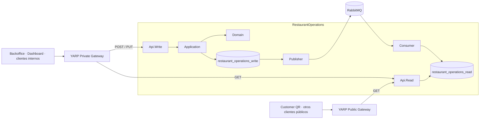
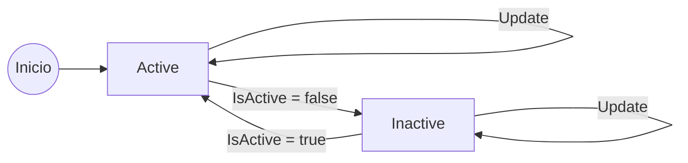
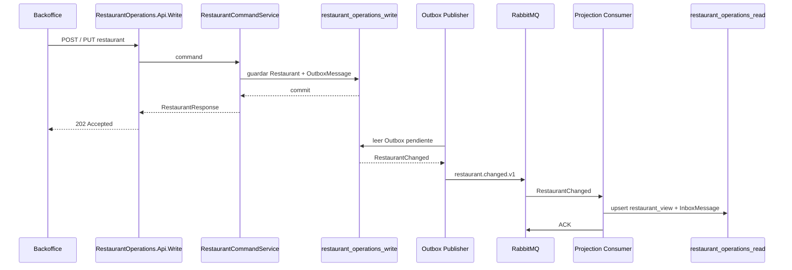
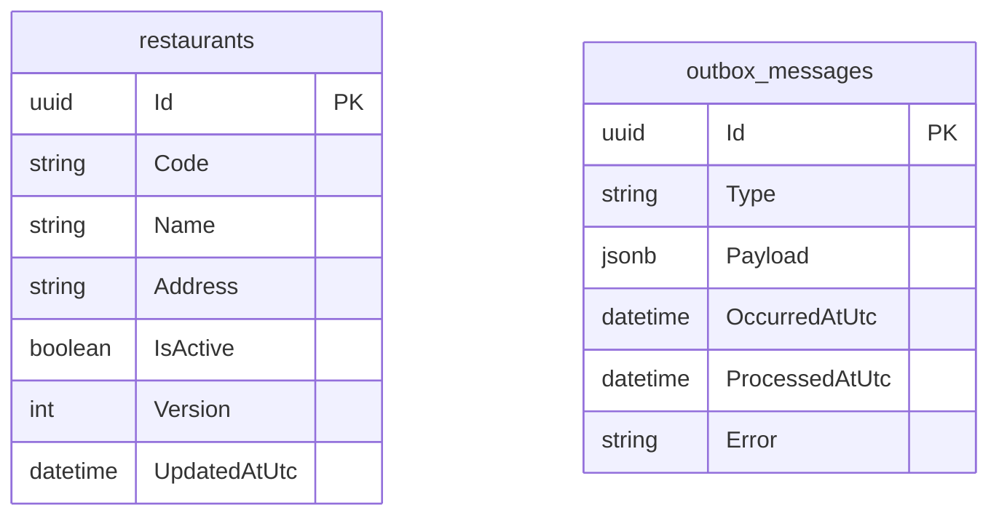
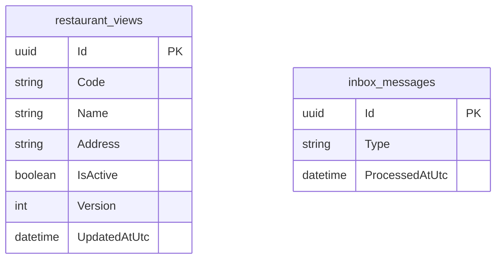
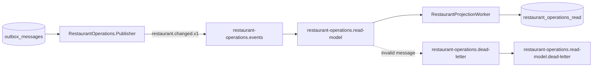
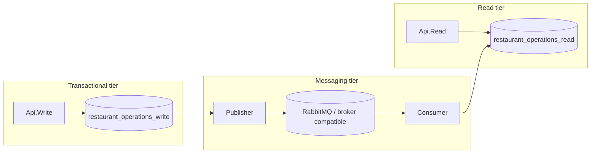

# RestaurantOperations

El servicio **RestaurantOperations** administra la identidad operativa de cada restaurante dentro de la plataforma: su código, nombre, dirección, estado activo y versión de configuración.

Es uno de los bounded contexts con separación explícita **Read / Write**. La escritura conserva el estado transaccional y las reglas del restaurante, mientras que la lectura se mantiene como una proyección independiente actualizada mediante eventos RabbitMQ.

## Responsabilidad del servicio

RestaurantOperations es responsable de:

- crear restaurantes dentro de la plataforma;
- asignar un identificador estable (`Guid`) a cada restaurante;
- mantener un código único e inmutable para identificar cada local;
- mantener nombre y dirección;
- activar o desactivar un restaurante sin eliminar su identidad histórica;
- controlar la versión del agregado para detectar escrituras concurrentes;
- persistir cambios junto con su evento de integración mediante Transactional Outbox;
- publicar `RestaurantChanged` hacia RabbitMQ;
- mantener una proyección de lectura independiente;
- evitar reprocesamiento de eventos mediante Inbox;
- exponer consultas de restaurantes desde la API Read.

RestaurantOperations **no gestiona** mesas, pedidos, catálogo, caja, pagos ni usuarios. Cada una de esas responsabilidades pertenece a su bounded context correspondiente. Este servicio mantiene únicamente la información maestra necesaria para identificar y habilitar un restaurante dentro del ecosistema.

## Proyectos

El bounded context está dividido en ocho proyectos:

```text
src/Services/RestaurantOperations/
├── Restaurantes.RestaurantOperations.Api.Read
├── Restaurantes.RestaurantOperations.Api.Write
├── Restaurantes.RestaurantOperations.Application
├── Restaurantes.RestaurantOperations.Consumer
├── Restaurantes.RestaurantOperations.Contracts
├── Restaurantes.RestaurantOperations.Domain
├── Restaurantes.RestaurantOperations.Infrastructure
└── Restaurantes.RestaurantOperations.Publisher
```

| Proyecto | Responsabilidad |
| --- | --- |
| `Restaurantes.RestaurantOperations.Domain` | Entidad `Restaurant`, normalización e invariantes del dominio. |
| `Restaurantes.RestaurantOperations.Application` | Casos de uso de creación/actualización y puertos de persistencia. |
| `Restaurantes.RestaurantOperations.Contracts` | Requests, responses y evento `RestaurantChanged`. |
| `Restaurantes.RestaurantOperations.Infrastructure` | EF Core, PostgreSQL, stores, Outbox, Inbox y modelos Read/Write. |
| `Restaurantes.RestaurantOperations.Api.Write` | Comandos autenticados de creación y actualización. |
| `Restaurantes.RestaurantOperations.Api.Read` | Consultas de restaurantes desde la proyección Read. |
| `Restaurantes.RestaurantOperations.Publisher` | Publicación de eventos pendientes desde Outbox hacia RabbitMQ. |
| `Restaurantes.RestaurantOperations.Consumer` | Consumo de `RestaurantChanged` y actualización de la proyección Read. |

## Arquitectura interna



La separación Read / Write es visible también en los gateways:

- el **Private Gateway** dirige `GET` a `Api.Read` y operaciones de modificación a `Api.Write`;
- el **Public Gateway** expone únicamente las consultas `GET` de RestaurantOperations;
- las dos APIs son procesos independientes y utilizan bases de datos PostgreSQL lógicamente independientes.

## Modelo de dominio

El agregado principal es `Restaurant`.

Actualmente mantiene:

| Campo | Descripción |
| --- | --- |
| `Id` | Identificador global del restaurante. |
| `Code` | Código único, normalizado a mayúsculas e inmutable después de la creación. |
| `Name` | Nombre del restaurante. |
| `Address` | Dirección operativa. |
| `IsActive` | Indica si el restaurante está habilitado para operar. |
| `Version` | Versión incremental del agregado y token de concurrencia. |
| `UpdatedAtUtc` | Fecha UTC de la última modificación. |

### Estados

El estado operativo del restaurante se controla mediante `IsActive`.



No se representa un estado final porque `Active` e `Inactive` son estados operativos reversibles.

### Creación

Al crear un restaurante:

1. el código se recorta y normaliza a mayúsculas;
2. se comprueba que no exista otro restaurante con el mismo código;
3. se genera un nuevo `Guid`;
4. `IsActive` comienza en `true`;
5. `Version` comienza en `1`;
6. se almacena el restaurante;
7. en la misma transacción se registra un `RestaurantChanged` en Outbox.

El código tiene una longitud máxima de **40 caracteres**. Nombre y dirección también son obligatorios y se normalizan eliminando espacios externos.

### Actualización

La actualización permite modificar:

- `Name`;
- `Address`;
- `IsActive`.

El código **no puede modificarse** mediante el contrato actual. Esto evita cambiar una identidad funcional que puede ser utilizada como referencia estable fuera del agregado.

Cada actualización incrementa `Version` y actualiza `UpdatedAtUtc`.

No existe actualmente un endpoint de eliminación física. La baja operativa se representa mediante `IsActive = false`, conservando el identificador y las referencias históricas del restaurante.

## Concurrencia

`Version` está configurado en EF Core como **concurrency token**.

```text
Restaurant.Version = concurrency token
```

Esto permite detectar que dos procesos han leído la misma versión del restaurante y posteriormente intentan persistir cambios incompatibles. En lugar de sobrescribir silenciosamente el estado más reciente, EF Core puede producir un conflicto de concurrencia.

Actualmente `UpdateRestaurantRequest` no recibe una versión ni utiliza `ETag` / `If-Match`.

## Flujo de escritura



La API responde **`202 Accepted`** porque el estado de escritura ya fue aceptado, pero la proyección Read se actualiza de forma asíncrona.

Esto introduce una ventana pequeña de **consistencia eventual**: inmediatamente después de una escritura, una consulta Read podría seguir viendo la versión anterior hasta que el evento sea procesado.

## Persistencia

RestaurantOperations utiliza dos bases de datos PostgreSQL lógicamente independientes:

### `restaurant_operations_write`

Contiene el estado autoritativo del dominio.



Restricciones e índices relevantes:

- `restaurants.Id` es PK;
- `restaurants.Code` tiene índice **unique**;
- `Version` es concurrency token;
- `outbox_messages.Payload` utiliza `jsonb`;
- Outbox tiene índice compuesto sobre `ProcessedAtUtc` + `OccurredAtUtc`.

### `restaurant_operations_read`

Contiene únicamente la vista optimizada para consulta y el Inbox del consumidor.



Restricciones e índices relevantes:

- `restaurant_views.Id` es PK;
- `restaurant_views.Code` tiene índice **unique**;
- `inbox_messages.Id` identifica de forma única cada evento procesado;
- `inbox_messages.ProcessedAtUtc` está indexado.

No existe una FK entre Read y Write porque son **dos almacenes independientes**.

## Transactional Outbox

La persistencia de escritura guarda el agregado y su evento en una única operación de base de datos:

```text
restaurants
    +
outbox_messages
    -> SaveChanges()
```

Esto evita el problema clásico de:

```text
1. guardar Restaurant en PostgreSQL
2. intentar publicar RabbitMQ
3. RabbitMQ falla
4. la base queda modificada pero el evento nunca se publica
```

Con Outbox, el cambio y el mensaje pendiente quedan confirmados juntos. Un worker independiente publica posteriormente los mensajes.

### Publisher

`Restaurantes.RestaurantOperations.Publisher`:

- migra `restaurant_operations_write` al iniciar;
- mantiene una conexión independiente con RabbitMQ;
- declara la topología del servicio;
- procesa hasta **50 mensajes pendientes por lote**;
- publica mensajes persistentes;
- utiliza `MessageId` con el identificador del Outbox;
- utiliza publisher confirmations;
- marca `ProcessedAtUtc` después de publicar correctamente;
- conserva en `Error` el último error de publicación;
- reintenta la conexión al broker cuando existe una desconexión.

## Inbox e idempotencia

Cada mensaje RabbitMQ utiliza como `MessageId` el identificador del Outbox original.

El consumer consulta `inbox_messages` antes de aplicar el evento:

```text
MessageId ya procesado
    -> no volver a ejecutar la proyección
    -> ACK

MessageId nuevo
    -> aplicar proyección
    -> registrar InboxMessage
    -> SaveChanges
    -> ACK
```

La actualización de la proyección y el registro Inbox se persisten en el mismo `SaveChanges`, reduciendo el riesgo de aplicar dos veces el mismo mensaje después de una redelivery.

### Tratamiento de errores

El consumer utiliza ACK manual y `prefetchCount = 10`.

| Tipo de error | Acción |
| --- | --- |
| JSON inválido | `NACK`, sin requeue → DLQ |
| Tipo de evento no soportado | `NACK`, sin requeue → DLQ |
| Error transitorio de procesamiento | `NACK`, con requeue → reintento |
| Procesamiento correcto | `ACK` |

## Eventos de integración

### Eventos publicados

#### `RestaurantChanged`

El evento transporta el snapshot necesario para actualizar la proyección:

```text
RestaurantId
Code
Name
Address
IsActive
Version
OccurredAtUtc
```

`RestaurantChanged` se publica en RabbitMQ como contrato de integración desacoplado del modelo de persistencia y se utiliza para construir `restaurant_operations_read`.

### Eventos consumidos

`Restaurantes.RestaurantOperations.Consumer` consume `RestaurantChanged` desde RabbitMQ y actualiza la proyección `restaurant_operations_read`.

RestaurantOperations no consume actualmente eventos publicados por otros bounded contexts.

## RabbitMQ

Topología actual:

| Elemento | Valor |
| --- | --- |
| Exchange | `restaurant-operations.events` |
| Tipo | `topic` |
| Routing key | `restaurant.changed.v1` |
| Read model queue | `restaurant-operations.read-model` |
| Dead-letter exchange | `restaurant-operations.dead-letter` |
| Dead-letter queue | `restaurant-operations.read-model.dead-letter` |



## Proyección Read

El consumer procesa `RestaurantChanged` mediante `RestaurantProjectionWorker`.

La proyección se comporta como un **upsert versionado**:

```text
si restaurant_view no existe
    -> insert

si event.Version > restaurant_view.Version
    -> update

si event.Version <= restaurant_view.Version
    -> ignorar estado antiguo o duplicado
```

La comparación de versiones impide que un evento antiguo sobrescriba una proyección más reciente.

## API Write

Base local:

```text
http://localhost:5111
```

Ruta base:

```text
/api/restaurant-operations/restaurants
```

### Crear restaurante

```http
POST /api/restaurant-operations/restaurants
```

Request:

```json
{
  "code": "MAD-01",
  "name": "Restaurante Madrid Centro",
  "address": "Calle de ejemplo 1"
}
```

Comportamiento actual:

- requiere usuario autenticado;
- requiere rol global **`Admin`**;
- devuelve `202 Accepted` al crear correctamente;
- devuelve `409 Conflict` cuando el código ya existe.

### Actualizar restaurante

```http
PUT /api/restaurant-operations/restaurants/{id}
```

Request:

```json
{
  "name": "Restaurante Madrid Centro",
  "address": "Calle de ejemplo 2",
  "isActive": true
}
```

Comportamiento actual:

- requiere usuario autenticado;
- requiere acceso al restaurante con permiso `tables.manage` en el modelo de permisos actual;
- devuelve `202 Accepted` al actualizar correctamente;
- devuelve `404 Not Found` si el restaurante no existe.

## API Read

Base local:

```text
http://localhost:5112
```

### Listar restaurantes

```http
GET /api/restaurant-operations/restaurants
```

Devuelve la proyección ordenada por nombre.

### Obtener restaurante

```http
GET /api/restaurant-operations/restaurants/{id}
```

Devuelve:

- `200 OK` cuando existe;
- `404 Not Found` cuando no existe.

Las consultas utilizan `AsNoTracking()` porque la API Read no modifica las entidades consultadas.

## Gateways

### Private Gateway

El gateway privado separa el tráfico por método HTTP:

```text
GET
    -> RestaurantOperations.Api.Read :5112

POST / PUT / PATCH / DELETE
    -> RestaurantOperations.Api.Write :5111
```

Esto permite desplegar, escalar o reiniciar la API de lectura y la de escritura de manera independiente.

### Public Gateway

El gateway público expone únicamente:

```text
GET /api/restaurant-operations/**
    -> RestaurantOperations.Api.Read :5112
```

De esta forma los clientes públicos pueden resolver información de un restaurante sin exponer las operaciones administrativas de escritura.

## Clientes actuales

La información de RestaurantOperations es utilizada actualmente por distintos clientes de la solución.

| Cliente | Uso principal |
| --- | --- |
| **Backoffice PWA** | Lista, creación y actualización de restaurantes. |
| **Customer QR PWA** | Resolución del restaurante asociado al contexto del cliente. |
| **Dashboard Web** | Obtención de restaurantes conocidos para seleccionar o agregar métricas. |
| **POS / Comandero** | El restaurante actúa como contexto operativo para el resto de servicios. |

La propiedad funcional de mesas, pedidos, pagos o catálogo continúa perteneciendo a sus servicios respectivos.

## Seguridad

`Api.Write` utiliza JWT emitido por `Restaurantes.Identity` y el building block `Restaurantes.Security`.

Configuración relevante:

```text
Issuer   = Restaurantes.Identity
Audience = Restaurantes
```

El modelo combina:

- roles globales;
- permisos asociados a un restaurante concreto;
- claims de autorización con formato `restaurantId:permission`.

La API Read no registra autenticación directamente y está disponible a través del Public Gateway únicamente para operaciones `GET`.

## Relación con otros servicios

RestaurantOperations no mantiene dependencias HTTP síncronas con otros bounded contexts para ejecutar sus operaciones principales.

Su responsabilidad es actuar como fuente de verdad de la identidad operativa del restaurante. Los demás dominios conservan únicamente las referencias que necesitan, como `RestaurantId`, sin acceder directamente a `restaurant_operations_write`.

`RestaurantChanged` se utiliza actualmente para mantener la proyección Read propia del servicio.

## Configuración

### API Write

Claves principales:

```text
ConnectionStrings:RestaurantOperationsWrite
```

La API Write utiliza además la configuración compartida de `Restaurantes.Security`.

### API Read

```text
ConnectionStrings:RestaurantOperationsRead
```

### Consumer

```text
ConnectionStrings:RestaurantOperationsRead
RabbitMq:HostName
RabbitMq:Port
RabbitMq:UserName
RabbitMq:Password
RabbitMq:VirtualHost
```

### Publisher

```text
ConnectionStrings:RestaurantOperationsWrite
RabbitMq:HostName
RabbitMq:Port
RabbitMq:UserName
RabbitMq:Password
RabbitMq:VirtualHost
```

## Migraciones

Cada lado mantiene sus propias migraciones EF Core:

```text
Infrastructure/
└── Persistence/
    ├── Write/
    │   └── Migrations/
    └── Read/
        └── Migrations/
```

`Api.Write` y `Publisher` aplican migraciones de Write al iniciar. `Api.Read` y `Consumer` hacen lo mismo sobre Read.

Esto mantiene separados los ciclos de evolución de ambos modelos.

## Desarrollo local

Puertos configurados actualmente:

| Componente | URL |
| --- | --- |
| RestaurantOperations Write API | `http://localhost:5111` |
| RestaurantOperations Read API | `http://localhost:5112` |

La infraestructura local utiliza PostgreSQL y RabbitMQ definidos en el `docker-compose.yml` de la raíz del repositorio.

Los procesos `Consumer` y `Publisher` se ejecutan como workers y no exponen una URL HTTP de negocio.

## Health checks

Las APIs utilizan `Restaurantes.ServiceDefaults`, que centraliza configuración compartida como:

- `ProblemDetails`;
- manejo común de excepciones;
- health checks;
- endpoint `/health`;
- endpoint `/alive`.

Esto permite que la infraestructura de despliegue compruebe el estado de cada proceso de forma independiente.

## Decisiones de diseño

### Un código estable por restaurante

`Code` se define al crear el restaurante y no forma parte del contrato de actualización. Esto permite utilizarlo como identificador funcional estable sin sustituir el `Guid` como clave técnica.

### Desactivación antes que eliminación

`IsActive` permite retirar temporal o definitivamente un restaurante de la operación sin destruir referencias históricas existentes en pedidos, ventas, pagos o reporting.

### Lecturas fuera del modelo transaccional

Las consultas se sirven desde `restaurant_operations_read`. Incluso en un dominio pequeño, mantener este límite hace consistente el modelo de despliegue de la plataforma y evita que clientes de lectura dependan directamente de la base autoritativa.

### Consistencia eventual explícita

La API Write no intenta actualizar sincrónicamente la base Read. El cambio se persiste primero de forma segura y la proyección se actualiza posteriormente mediante RabbitMQ.

### Mensajería fiable

Outbox protege la escritura frente a fallos entre PostgreSQL y RabbitMQ. Inbox protege la proyección frente a redeliveries. La versión del restaurante protege además frente a eventos recibidos fuera de orden.

## Despliegue y escalado

### Bases de datos

La separación de bases no implica que cada una deba vivir desde el primer día en una máquina distinta.

En desarrollo local ambas son bases lógicas independientes dentro de PostgreSQL:

```text
PostgreSQL
├── restaurant_operations_write
└── restaurant_operations_read
```

En cloud pueden mantenerse sobre la misma infraestructura administrada mientras la carga sea pequeña, o separarse físicamente cuando exista una necesidad operativa real.



Para RestaurantOperations la carga actual es pequeña, pero el patrón mantiene las mismas ventajas arquitectónicas que el resto de la plataforma:

- las consultas públicas no compiten directamente con las escrituras administrativas;
- Read y Write pueden escalar de forma independiente;
- una incidencia o mantenimiento del plano de lectura no necesita modificar el modelo transaccional;
- la base Read puede utilizar una capacidad diferente a la base Write;
- el modelo de lectura puede evolucionar sin introducir joins o índices específicos dentro del almacenamiento transaccional;
- la solución no queda ligada a un proveedor cloud concreto.

### Alojamiento cloud

La implementación utiliza **PostgreSQL + EF Core + RabbitMQ**, por lo que puede desplegarse con servicios administrados equivalentes, por ejemplo:

```text
Azure
├── Azure App Service / Container Apps / AKS
├── Azure Database for PostgreSQL
└── RabbitMQ administrado o broker compatible según estrategia

AWS
├── ECS / EKS / App Runner
├── Amazon RDS for PostgreSQL
└── RabbitMQ administrado / Amazon MQ según estrategia

Otros proveedores
├── Kubernetes / contenedores / VMs
├── PostgreSQL administrado
└── RabbitMQ administrado
```

La arquitectura no requiere que Read y Write compartan host, región o tamaño de instancia. La decisión puede hacerse por coste, latencia, criticidad y volumen.
