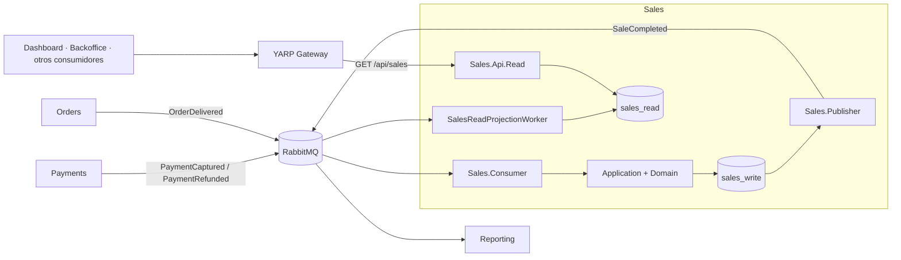
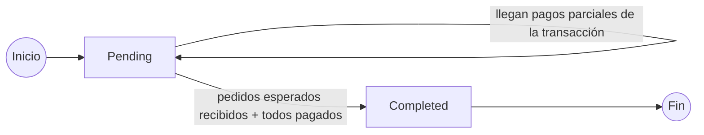
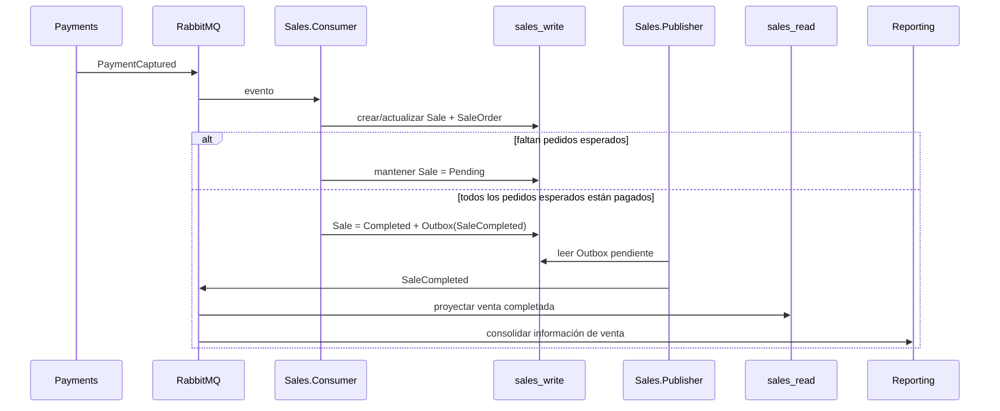
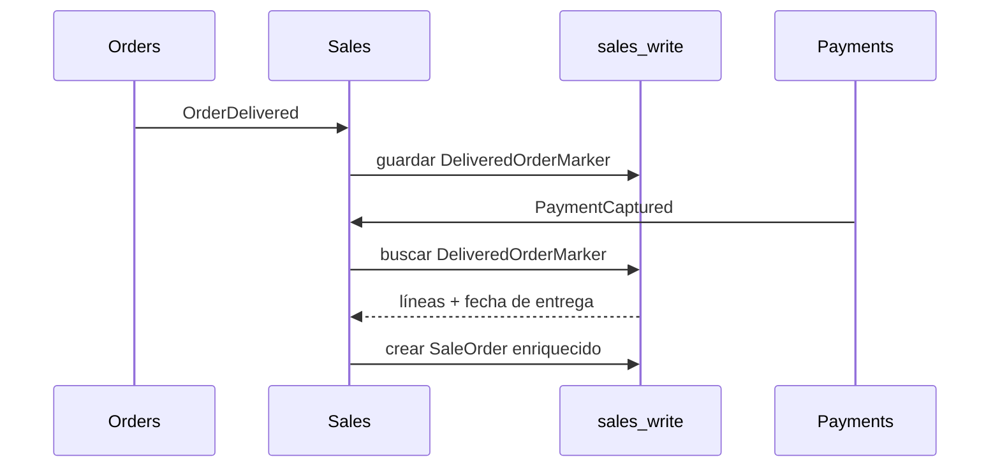
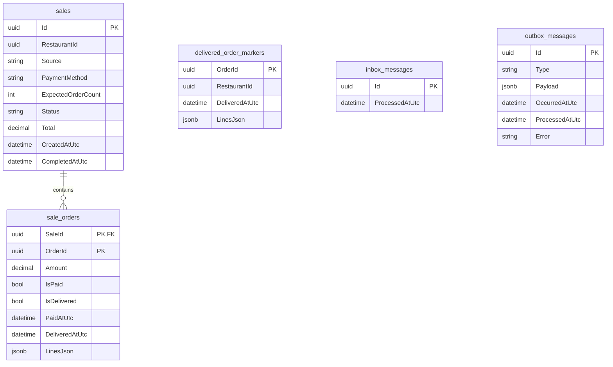
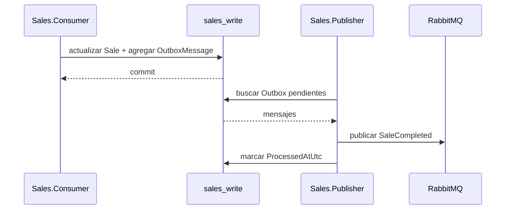

# Sales

El servicio **Sales** consolida la actividad de cobro de la plataforma Restaurantes en una entidad de venta independiente del pedido individual.

Su función principal es transformar eventos procedentes de **Payments** y **Orders** en una venta consolidada, soportando tanto pagos asociados a un único pedido como transacciones que agrupan varios pedidos. Una vez que la venta reúne todos los pedidos esperados y todos están pagados, Sales publica el evento `SaleCompleted` y mantiene una proyección de lectura optimizada para consulta.

A diferencia de otros bounded contexts, Sales **no expone una API de escritura**. Su camino de escritura es completamente **event-driven**: recibe eventos mediante RabbitMQ, actualiza su modelo transaccional y publica nuevos eventos mediante Transactional Outbox.


## Responsabilidad del servicio

Sales es responsable de:

- consolidar cobros capturados en una entidad `Sale`;
- agrupar uno o varios pedidos bajo una misma transacción de pago;
- determinar cuándo una venta puede considerarse completada;
- mantener la relación entre venta y pedidos incluidos;
- conservar snapshots de las líneas de pedidos entregados cuando están disponibles;
- procesar reembolsos recibidos desde Payments;
- evitar reprocesamiento de eventos mediante Inbox;
- publicar `SaleCompleted` mediante Transactional Outbox;
- mantener una base de lectura independiente para consultas;
- exponer las ventas completadas mediante una API Read;
- alimentar otros bounded contexts, especialmente Reporting, mediante eventos.

Sales **no captura pagos**, **no modifica pedidos** y **no calcula el estado operativo de cocina o sala**. Esas responsabilidades pertenecen respectivamente a Payments, Orders y los demás servicios de la plataforma.

## Proyectos

El bounded context está dividido en siete proyectos:

```text
src/Services/Sales/
├── Restaurantes.Sales.Api.Read
├── Restaurantes.Sales.Application
├── Restaurantes.Sales.Consumer
├── Restaurantes.Sales.Contracts
├── Restaurantes.Sales.Domain
├── Restaurantes.Sales.Infrastructure
└── Restaurantes.Sales.Publisher
```

| Proyecto | Responsabilidad |
| --- | --- |
| `Restaurantes.Sales.Domain` | Modelo `Sale` / `SaleOrder` y regla de completado de la venta. |
| `Restaurantes.Sales.Application` | Orquestación de eventos de Payments y Orders y puertos de persistencia. |
| `Restaurantes.Sales.Contracts` | Contratos públicos del servicio: `SaleCompleted`, `SaleResponse` y snapshots de líneas. |
| `Restaurantes.Sales.Infrastructure` | EF Core, PostgreSQL, stores, Outbox, Inbox y modelos Read/Write. |
| `Restaurantes.Sales.Consumer` | Consumo de eventos externos y construcción de la proyección Read. |
| `Restaurantes.Sales.Publisher` | Publicación de eventos pendientes desde Outbox hacia RabbitMQ. |
| `Restaurantes.Sales.Api.Read` | Consultas de ventas completadas. |

## Arquitectura interna



La separación es deliberada:

- `sales_write` conserva el estado transaccional y la coordinación de eventos;
- `sales_read` contiene únicamente ventas completadas en un formato optimizado para consulta;
- la API Read nunca necesita reconstruir el agregado de escritura;
- el procesamiento asíncrono puede escalar independientemente de las consultas.

## Modelo de dominio

El agregado principal es `Sale`.

Una venta contiene:

- identificador de venta;
- restaurante;
- origen de la operación;
- método de pago;
- número esperado de pedidos;
- estado;
- total consolidado;
- fecha de creación;
- fecha de completado;
- pedidos incluidos en la transacción.

Cada pedido asociado se representa mediante `SaleOrder` y conserva:

- `OrderId`;
- importe del pedido;
- estado pagado / no pagado;
- estado entregado / no entregado;
- timestamps de pago y entrega;
- snapshot serializado de líneas cuando está disponible.

### Estados



Actualmente el agregado utiliza dos estados principales:

| Estado | Significado |
| --- | --- |
| `Pending` | La transacción todavía no contiene todos los pedidos esperados o existe algún pedido no pagado. |
| `Completed` | Se han recibido al menos todos los pedidos esperados y todos están pagados. |

La condición implementada actualmente para completar la venta es:

```text
Orders.Count >= ExpectedOrderCount
AND
todos los SaleOrder tienen IsPaid = true
```

La entrega del pedido **no es una condición obligatoria** para completar la venta. `OrderDelivered` se utiliza para conservar información de entrega y snapshots de líneas cuando están disponibles.

## Identidad de la venta y transacciones multipedido

Sales permite que una misma transacción de pago represente uno o varios pedidos.

Cuando recibe `PaymentCaptured`, el identificador de la venta se determina así:

```text
PaymentTransactionId válido
    -> SaleId = PaymentTransactionId

sin PaymentTransactionId
    -> SaleId = PaymentId
```

El evento también informa `TransactionOrderCount`, que Sales utiliza como `ExpectedOrderCount`.

Ejemplo conceptual:

```text
PaymentTransactionId: TX-001
ExpectedOrderCount: 3

Sale TX-001
├── Order A -> Paid
├── Order B -> Paid
└── Order C -> Paid

=> Sale Completed
```

Esto evita tratar necesariamente cada pedido como una venta independiente cuando una única operación de cobro cubre varios pedidos.

Si llegan varios eventos para la misma transacción, `ExpectedOrderCount` conserva el mayor valor recibido.

## Flujo de consolidación



## Eventos de integración

### Eventos consumidos

Sales consume eventos procedentes de Payments y Orders mediante la queue:

```text
sales.checkout-process
```

### `PaymentCaptured`

Origen:

```text
payments.events
```

Sales utiliza este evento para:

1. obtener o crear la venta;
2. determinar el `SaleId`;
3. actualizar `ExpectedOrderCount`;
4. registrar el pedido como pagado;
5. asociar importe, método de pago y origen;
6. incorporar información de entrega previamente recibida, si existe;
7. comprobar si la venta ya puede completarse.

### `PaymentRefunded`

Sales localiza la venta a partir del `OrderId` y marca el `SaleOrder` correspondiente como no pagado.

En la implementación actual, una venta que ya se encuentre en estado `Completed` **no se reabre** ni publica un evento de reversión.

### `OrderDelivered`

Cuando Orders publica la entrega de un pedido, Sales guarda un `DeliveredOrderMarker` con:

- `OrderId`;
- restaurante;
- `DeliveredAtUtc`;
- snapshot de líneas no canceladas.

Este almacenamiento desacopla el orden de llegada de eventos.

Por ejemplo, si `OrderDelivered` llega antes de `PaymentCaptured`, Sales puede recuperar posteriormente el snapshot del pedido cuando procese el cobro.



## Snapshot de líneas

`OrderDelivered` contiene información suficiente para construir un snapshot comercial de las líneas no canceladas.

Cada `SaleLineSnapshot` conserva:

- `ProductId`;
- `ProductName`;
- `UnitPrice`;
- `Quantity`;
- `CategoryName`;
- `PreparationStationCode`.

Estas líneas se serializan como JSONB en el modelo transaccional y posteriormente pueden formar parte de `SaleCompleted`.

El objetivo es que una venta histórica no dependa de consultar nuevamente Catalog para conocer el nombre o precio que tenía un producto en el momento de la operación.

> [!NOTE]
> Una venta puede completarse antes de recibir `OrderDelivered`. En ese caso, `SaleCompleted` puede publicarse sin las líneas que todavía no estaban disponibles.

### Eventos publicados

#### `SaleCompleted`

Exchange:

```text
sales.events
```

Routing key:

```text
sale.completed.v1
```

El contrato contiene:

```text
SaleId
RestaurantId
Source
PaymentMethod
Total
CompletedAtUtc
OrderIds[]
Lines[]
```

`SaleCompleted` representa que Sales ha consolidado correctamente una transacción de venta.

Entre sus consumidores se encuentra **Reporting**, que utiliza este evento junto con sus propias proyecciones de Orders y Payments para construir información agregada del dashboard.

## Persistencia

Sales utiliza dos bases de datos PostgreSQL lógicamente independientes:

```text
sales_write
sales_read
```

En desarrollo ambas pueden residir dentro de la misma instancia PostgreSQL. La separación lógica permite moverlas posteriormente a infraestructura física diferente sin modificar las responsabilidades del servicio.

### `sales_write`

Es la fuente de verdad transaccional de Sales.

| Tabla | Función |
| --- | --- |
| `sales` | Cabecera de la venta y estado de consolidación. |
| `sale_orders` | Pedidos incluidos en cada venta. |
| `delivered_order_markers` | Cache local de pedidos entregados y snapshots de líneas. |
| `inbox_messages` | Mensajes externos ya procesados para idempotencia. |
| `outbox_messages` | Eventos de integración pendientes o publicados. |

Relaciones principales:



Restricciones e índices relevantes:

- clave compuesta `SaleId + OrderId` en `sale_orders`;
- índice único sobre `sale_orders.OrderId`, impidiendo que un mismo pedido pertenezca a dos ventas;
- índice `RestaurantId + CompletedAtUtc` en `sales`;
- índice `ProcessedAtUtc + OccurredAtUtc` para procesar eficientemente el Outbox;
- importes almacenados como `numeric(12,2)`;
- snapshots y payloads almacenados como `jsonb`.

### `sales_read`

Contiene una proyección desnormalizada de ventas completadas.

| Tabla | Función |
| --- | --- |
| `sales` | Vista optimizada para la API Read. |
| `inbox_messages` | Mensajes `SaleCompleted` ya proyectados. |

La proyección contiene:

- identificador de venta;
- restaurante;
- origen;
- método de pago;
- total;
- estado;
- cantidad de pedidos;
- fecha de completado;
- `OrderIds` serializados en JSONB;
- líneas serializadas en JSONB.

La base Read no necesita hacer joins con el modelo transaccional para responder a las consultas actuales.

## Transactional Outbox

Cuando una venta pasa a `Completed`, `SaleCommandService` agrega `SaleCompleted` al Outbox antes de guardar los cambios.



`Sales.Publisher`:

- consulta mensajes con `ProcessedAtUtc = null`;
- publica por orden de `OccurredAtUtc`;
- procesa lotes de hasta 50 mensajes;
- utiliza mensajes persistentes de RabbitMQ;
- marca cada mensaje como procesado después de publicarlo.

Esto evita depender de una publicación directa en RabbitMQ dentro de la misma operación lógica que modifica la base de datos.

## Inbox e idempotencia

Sales aplica idempotencia en dos niveles independientes.

### Inbox de escritura

`CheckoutProcessWorker` exige que cada mensaje recibido incluya un `MessageId` GUID.

Antes de aplicar el evento, `SaleCommandService` consulta:

```text
inbox_messages
```

Si el `MessageId` ya existe, el evento se considera procesado y no vuelve a modificar la venta.

### Inbox de lectura

`SalesReadProjectionWorker` mantiene su propio `inbox_messages` dentro de `sales_read`.

De esta forma un `SaleCompleted` duplicado no vuelve a aplicar la proyección.

El diseño es compatible con entrega **at-least-once** desde RabbitMQ.

## RabbitMQ

Topología principal:

```text
Exchange: sales.events
DLX:      sales.dead-letter
DLQ:      sales.dead-letter.messages
```

Queues propias:

| Queue | Eventos | Uso |
| --- | --- | --- |
| `sales.checkout-process` | `PaymentCaptured`, `PaymentRefunded`, `OrderDelivered` | Construcción y actualización del modelo transaccional. |
| `sales.read-model` | `SaleCompleted` | Construcción de `sales_read`. |

Bindings externos:

```text
payments.events
├── payment.captured.v1
└── payment.refunded.v1

orders.events
└── order.delivered.v1
```

Evento propio:

```text
sales.events
└── sale.completed.v1
```

Los mensajes inválidos o de tipo no soportado se rechazan sin requeue y terminan en la Dead Letter Exchange configurada para las queues. Los errores transitorios se rechazan con requeue para permitir un nuevo intento.

## API Read

Sales expone únicamente operaciones de consulta.

Ruta base:

```text
/api/sales
```

| Método | Endpoint | Operación |
| --- | --- | --- |
| `GET` | `/api/sales` | Últimas ventas completadas. |
| `GET` | `/api/sales?restaurantId={id}` | Filtrar por restaurante. |
| `GET` | `/api/sales?date={yyyy-MM-dd}` | Filtrar por fecha. |
| `GET` | `/api/sales?restaurantId={id}&date={yyyy-MM-dd}` | Filtrar por restaurante y fecha. |
| `GET` | `/api/sales/{id}` | Obtener una venta por identificador. |

La consulta de listado:

- utiliza `AsNoTracking()`;
- ordena por `CompletedAtUtc` descendente;
- devuelve como máximo 100 registros;
- consulta exclusivamente `sales_read`.

La API consulta exclusivamente `sales_read`.

## Gateways

Sales se publica a través de los gateways YARP únicamente para operaciones de lectura.

Las rutas `GET /api/sales` y `GET /api/sales/{id}` se dirigen a `Sales.Api.Read`. No existe una ruta de escritura para Sales porque el servicio construye su estado a partir de eventos de integración.

## Seguridad

`Sales.Api.Read` no configura actualmente autenticación JWT ni autorización por restaurante. Los endpoints `GET /api/sales` y `GET /api/sales/{id}` se exponen sin una comprobación de permisos dentro del servicio en la implementación actual.

El gateway define el enrutamiento hacia Sales, pero no sustituye una regla de autorización dentro del bounded context.

## Separación entre Sales y Reporting

Sales y Reporting tienen responsabilidades distintas.

### Sales

Responde a la pregunta:

> **¿Qué transacción comercial se completó y qué pedidos forman parte de ella?**

Mantiene una representación compacta de la venta consolidada.

### Reporting

Responde a preguntas analíticas:

- ventas por restaurante;
- ventas por fecha;
- productos y categorías;
- estado operativo;
- métricas agregadas;
- información necesaria para el Dashboard.

Reporting consume `SaleCompleted`, pero también mantiene sus propias proyecciones de Orders y Payments.

Esto evita convertir Sales en una base de datos analítica y permite que consultas pesadas de oficina evolucionen dentro de Reporting sin cargar el flujo transaccional de Sales.

## Ausencia deliberada de API Write

No existe actualmente:

```text
Restaurantes.Sales.Api.Write
```

Esto es intencional en el diseño actual.

Sales no recibe comandos de usuario para crear ventas. Una venta se deriva de hechos ocurridos en otros bounded contexts:

```text
Payments confirma un cobro
Orders confirma una entrega
            ↓
        Sales consolida
```

Por tanto, la entrada transaccional del servicio son **eventos de integración**, no endpoints HTTP de escritura.

Esta decisión reduce la posibilidad de crear una venta que no tenga correspondencia con un pago real registrado en Payments.

## Relación con otros servicios

| Servicio | Relación |
| --- | --- |
| `Payments` | Publica `PaymentCaptured` y `PaymentRefunded`, utilizados para construir y actualizar ventas. |
| `Orders` | Publica `OrderDelivered`, utilizado para enriquecer la venta con fecha de entrega y snapshots de líneas. |
| `Reporting` | Consume `SaleCompleted` para mantener proyecciones y métricas orientadas a consulta. |
| `Identity` | Proporciona la identidad y permisos utilizados por los clientes que acceden a las APIs a través de la plataforma. |

Sales no consulta directamente las bases de datos de estos servicios. La integración se realiza mediante contratos y eventos.

## Configuración

### API Read

```text
ConnectionStrings:SalesRead
```

### Consumer

```text
ConnectionStrings:SalesWrite
ConnectionStrings:SalesRead
RabbitMq:HostName
RabbitMq:Port
RabbitMq:UserName
RabbitMq:Password
RabbitMq:VirtualHost
```

### Publisher

```text
ConnectionStrings:SalesWrite
RabbitMq:HostName
RabbitMq:Port
RabbitMq:UserName
RabbitMq:Password
RabbitMq:VirtualHost
```

## Migraciones

Las migraciones EF Core de `sales_write` y `sales_read` se aplican actualmente al iniciar los procesos correspondientes mediante `Database.MigrateAsync()`.

## Desarrollo local

URL configurada actualmente para la API:

| Componente | URL |
| --- | --- |
| Sales Read API | `http://localhost:5162` |

Bases locales:

```text
sales_write
sales_read
```

La infraestructura local utiliza PostgreSQL y RabbitMQ definidos en el `docker-compose.yml` de la raíz del repositorio.

Antes de utilizar las herramientas locales:

```bash
dotnet tool restore
```

## Health checks

Los procesos HTTP utilizan la configuración común de `Restaurantes.ServiceDefaults` y exponen los endpoints de salud definidos por la solución.

```text
/health
/alive
```

Estos endpoints permiten comprobar disponibilidad y liveness sin ejecutar consultas funcionales sobre la API.

## Decisiones de diseño

### Escritura completamente event-driven

Sales no expone `Api.Write`. Las ventas se derivan de hechos confirmados por Payments y Orders, evitando crear ventas manualmente sin correspondencia con una operación real.

### Read / Write separados

`sales_write` mantiene la coordinación transaccional de eventos, mientras que `sales_read` conserva una proyección específica para consulta. Esto permite escalar ambos tipos de carga de forma independiente.

### Snapshots comerciales

Los datos históricos de líneas se conservan como snapshots para que una venta no dependa de cambios posteriores en Catalog.

### Inbox y Outbox

Inbox protege el procesamiento frente a entregas repetidas y Transactional Outbox desacopla la confirmación de la venta de la disponibilidad inmediata de RabbitMQ.

## Despliegue y escalado

Sales está dividido en tres procesos ejecutables independientes:

```text
Sales.Consumer
Sales.Publisher
Sales.Api.Read
```

Esto permite escalar de forma diferente:

- consumo de eventos;
- publicación de Outbox;
- consultas HTTP.

### Bases de datos

En una instalación pequeña:

```text
PostgreSQL instance
├── sales_write
└── sales_read
```

puede ser suficiente y reduce coste operacional.

En cloud, si la carga lo requiere, ambas bases pueden alojarse en recursos distintos:

```text
RabbitMQ
   │
   ▼
Sales.Consumer ──────> PostgreSQL Write
                          sales_write

Sales.Consumer ──────> PostgreSQL Read
                          sales_read
                              ▲
                              │
                       Sales.Api.Read
```

La ventaja principal es que una carga elevada de consulta no necesita competir por CPU, memoria, conexiones o I/O con el procesamiento transaccional de eventos.

Esto sigue el mismo principio utilizado en el resto de la solución: **las cargas de lectura de oficina y reporting no deberían degradar los procesos que mantienen la operación del negocio**.

### Alojamiento cloud

La implementación no depende de un proveedor cloud concreto. Los procesos pueden desplegarse en Azure, AWS, GCP, Kubernetes o infraestructura propia, siempre que se proporcionen servicios compatibles con:

- .NET;
- PostgreSQL;
- RabbitMQ;
- conectividad HTTP.
